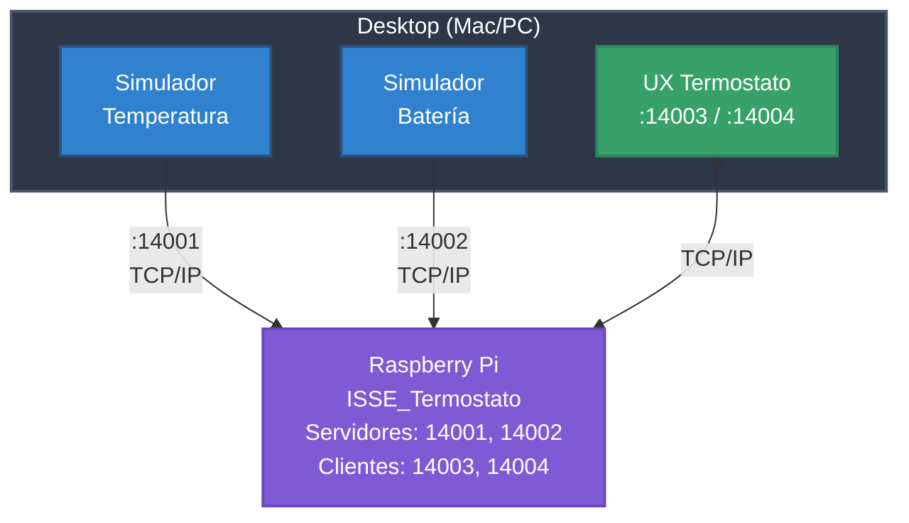

# ISSE_Simuladores

Simuladores HIL (Hardware-in-the-Loop) para testing del sistema ISSE_Termostato en Raspberry Pi.

## Descripción

Conjunto de aplicaciones desktop PyQt6 que simulan sensores y proporcionan interfaz de usuario para testing sin hardware físico.

## Arquitectura



## Productos

| Producto | Descripción | Puerto |
|----------|-------------|--------|
| **Simulador Temperatura** | Simula sensor de temperatura | 14001 |
| **Simulador Batería** | Simula sensor con carga/descarga | 14002 |
| **UX Termostato** | Interfaz de usuario del termostato | 14003/14004 |

## Requisitos

- Python 3.12+
- PyQt6
- pyqtgraph

## Instalación

```bash
git clone https://github.com/vvalotto/ISSE_Simuladores.git
cd ISSE_Simuladores
python -m venv venv
source venv/bin/activate  # En Windows: venv\Scripts\activate
pip install -r requirements.txt
```

## Uso

```bash
# Simulador de Temperatura
python simulador_temperatura/run.py

# Simulador de Batería
python simulador_bateria/run.py

# UX Termostato
python ux_termostato/run.py
```

## Configuración

Editar `config.json` para ajustar IP de Raspberry Pi y parámetros de simulación.

## Estructura

```
ISSE_Simuladores/
├── simulador_temperatura/    # Producto 1
├── simulador_bateria/        # Producto 2
├── ux_termostato/            # Producto 3
├── compartido/               # Código reutilizable
├── config.json               # Configuración de red
└── requirements.txt          # Dependencias
```

## Quality Gates

Cada producto mantiene estándares de calidad:
- Complejidad Ciclomática promedio ≤ 10
- Índice de Mantenibilidad > 20
- Pylint Score ≥ 8.0

## Autor

Victor Valotto - Diciembre 2025

## Licencia

Proyecto académico - ISSE
