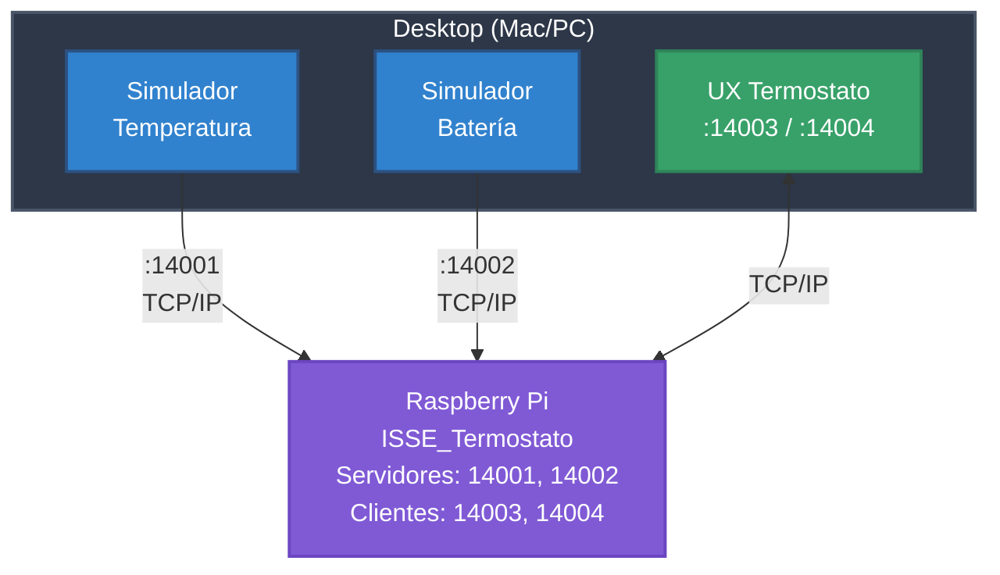

# ISSE_Simuladores

Simuladores HIL (Hardware-in-the-Loop) para testing del sistema ISSE_Termostato en Raspberry Pi.

## Descripción

Conjunto de aplicaciones desktop PyQt6 que simulan sensores y proporcionan interfaz de usuario para testing sin hardware físico.

## Arquitectura


```mermaid
graph TB
    subgraph Desktop["Desktop (Mac/PC)"]
        ST["Simulador<br/>Temperatura"]
        SB["Simulador<br/>Batería"]
        UX["UX Termostato<br/>:14003 / :14004"]
    end

    RPI["Raspberry Pi<br/>ISSE_Termostato<br/>Servidores: 14001, 14002<br/>Clientes: 14003, 14004"]

    ST -->|":14001<br/>TCP/IP"| RPI
    SB -->|":14002<br/>TCP/IP"| RPI
    UX <-->|"TCP/IP"| RPI

    style Desktop fill:#2d3748,stroke:#4a5568,stroke-width:2px,color:#fff
    style ST fill:#3182ce,stroke:#2c5282,stroke-width:2px,color:#fff
    style SB fill:#3182ce,stroke:#2c5282,stroke-width:2px,color:#fff
    style UX fill:#38a169,stroke:#2f855a,stroke-width:2px,color:#fff
    style RPI fill:#805ad5,stroke:#6b46c1,stroke-width:2px,color:#fff
```

## Productos

| Producto | Descripción | Puerto |
|----------|-------------|--------|
| **Simulador Temperatura** | Simula sensor de temperatura | 14001 |
| **Simulador Batería** | Simula sensor con carga/descarga | 14002 |
| **UX Termostato** | Interfaz de usuario del termostato | 14003/14004 |

## Requisitos

- Python 3.12+
- PyQt6
- pyqtgraph

## Instalación

```bash
git clone https://github.com/vvalotto/ISSE_Simuladores.git
cd ISSE_Simuladores
python -m venv venv
source venv/bin/activate  # En Windows: venv\Scripts\activate
pip install -r requirements.txt
```

## Uso

```bash
# Simulador de Temperatura
python simulador_temperatura/run.py

# Simulador de Batería
python simulador_bateria/run.py

# UX Termostato
python ux_termostato/run.py
```

## Configuración

Editar `config.json` para ajustar IP de Raspberry Pi y parámetros de simulación.

## Estructura

```
ISSE_Simuladores/
├── simulador_temperatura/    # Producto 1
├── simulador_bateria/        # Producto 2
├── ux_termostato/            # Producto 3
├── compartido/               # Código reutilizable
├── config.json               # Configuración de red
└── requirements.txt          # Dependencias
```

## Quality Gates

Cada producto mantiene estándares de calidad:
- Complejidad Ciclomática promedio ≤ 10
- Índice de Mantenibilidad > 20
- Pylint Score ≥ 8.0

## Documentación

Toda la documentación técnica está disponible en la [Wiki del proyecto](../../wiki).

### 📚 Índice de Documentación

#### 📋 Documentación de Proyecto

**Architecture Decision Records (ADR):**
- [ADR-005: Arquitectura Referencia Simuladores](../../wiki/ADR-005-Arquitectura-Referencia-Simuladores)

**Especificaciones Técnicas:**
- [Especificación de Comunicaciones](../../wiki/Especificacion-Comunicaciones)

**Documentos de Diseño:**
- [Diseño de Simuladores](../../wiki/Diseno-Simuladores)

**Guías:**
- [Guía de Estructura Jira](../../wiki/Guia-Estructura-Jira)

---

#### 🔧 Módulo Compartido

**Arquitectura:**
- [Arquitectura del Módulo Compartido](../../wiki/Compartido-Arquitectura)

**Architecture Decision Records:**
- [ADR-001: Separación de Socket Clients](../../wiki/ADR-001-Separacion-Socket-Clients)
- [ADR-002: Refactorización Socket Server](../../wiki/ADR-002-Refactorizacion-Socket-Server)
- [ADR-003: Arquitectura Widgets Compartidos](../../wiki/ADR-003-Arquitectura-Widgets-Compartidos)

**Informes de Calidad:**
- [Informe de Calidad Final](../../wiki/Compartido-Informe-Calidad)
- [Informe de Diseño](../../wiki/Compartido-Informe-Diseno)

---

#### 🌡️ Simulador de Temperatura

**Documentación General:**
- [README del Simulador](../../wiki/Temperatura-README)

**Arquitectura:**
- [Arquitectura del Simulador](../../wiki/Temperatura-Arquitectura)

**Architecture Decision Records:**
- [ADR-001: Arquitectura de Presentación](../../wiki/Temperatura-ADR-001-Arquitectura-Presentacion)

**Informes de Calidad:**
- [Informe de Calidad Final](../../wiki/Temperatura-Informe-Calidad)
- [Hallazgos de Desarrollo](../../wiki/Temperatura-Hallazgos)

---

#### 🔋 Simulador de Batería

**Documentación General:**
- [README del Simulador](../../wiki/Bateria-README)

**Arquitectura:**
- [Arquitectura del Simulador](../../wiki/Bateria-Arquitectura)

**Informes de Calidad:**
- [Informe de Calidad Final](../../wiki/Bateria-Informe-Calidad)
- [Informe de Diseño](../../wiki/Bateria-Informe-Diseno)

---

#### 🖥️ UX Termostato

**Arquitectura:**
- [Arquitectura del UX Termostato](../../wiki/UX-Arquitectura)

**Historias de Usuario:**
- [Catálogo de Historias de Usuario](../../wiki/UX-Historias-Usuario)

**Informes de Calidad:**
- [Informe de Calidad Final](../../wiki/UX-Informe-Calidad)
- [Hallazgos de Desarrollo](../../wiki/UX-Hallazgos)

---

## Autor

Victor Valotto - Enero 2016

## Licencia

Proyecto académico - ISSE
