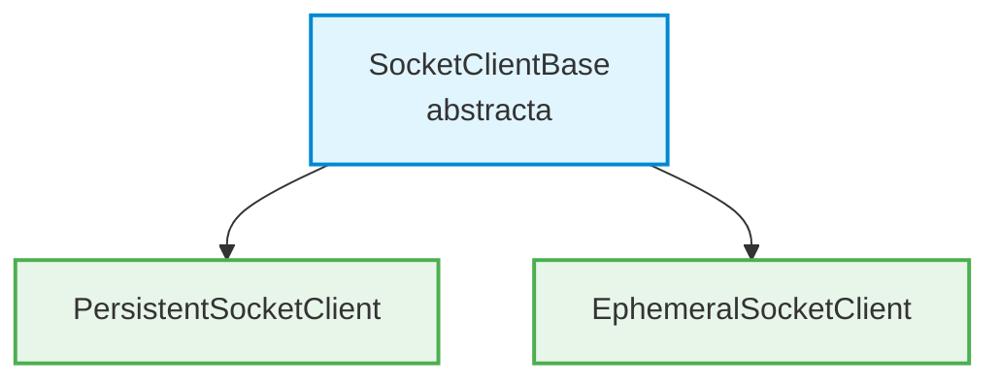
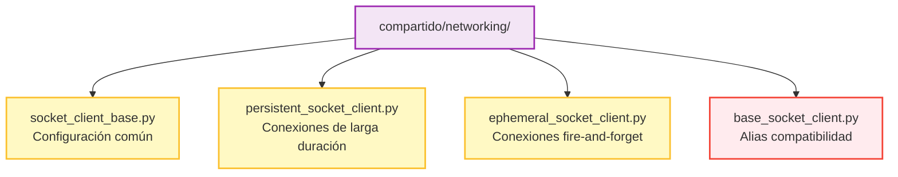

# ADR-001: Separación de BaseSocketClient en clases cohesivas

## Contexto

La clase `BaseSocketClient` original fue diseñada como una clase base única para todos los clientes TCP del sistema. Sin embargo, un análisis de cohesión y del Principio de Responsabilidad Única (SRP) reveló problemas de diseño.

### Problema identificado

La clase mezclaba dos patrones de conexión incompatibles:

```python
# Patrón persistente: usa self._socket (estado de instancia)
def send_data(self, data: str) -> bool:
    with self._lock:
        if not self._connected or self._socket is None:
            return False
        self._socket.sendall(data.encode(self.ENCODING))

# Patrón efímero: crea socket nuevo, ignora estado de instancia
def _send_and_close_thread(self, data: str) -> None:
    with socket.socket(...) as sock:  # Socket diferente
        sock.connect((self._host, self._port))
        sock.sendall(data.encode(self.ENCODING))
```

### Análisis de violaciones

| Problema | Descripción |
|----------|-------------|
| **Violación SRP** | La clase tenía múltiples razones para cambiar: lógica de conexión persistente, lógica de conexión efímera, threading |
| **Cohesión baja (LCOM alto)** | `send_and_close()` no usaba `_socket` ni `_connected` - funcionalmente una función estática |
| **Semántica ambigua** | La señal `connected` significaba cosas diferentes según el contexto |
| **Ciclos de vida incompatibles** | Conexión persistente vs efímera tienen estados y comportamientos distintos |

---

## Decisión

Separar `BaseSocketClient` en una jerarquía de tres clases con responsabilidades únicas:



### Arquitectura resultante



---

## Diseño detallado

### SocketClientBase

Responsabilidad: **Configuración común y manejo de errores**.

```python
class SocketClientBase(QObject):
    """Clase base abstracta."""

    # Señal común
    error_occurred = pyqtSignal(str)

    # Constantes
    BUFFER_SIZE = 4096
    DEFAULT_TIMEOUT = 5.0
    ENCODING = "utf-8"

    # Métodos comunes
    def _create_socket(self) -> socket.socket
    def _handle_connection_error(self, error: Exception) -> None
```

### PersistentSocketClient

Responsabilidad: **Gestionar conexiones de larga duración**.

Caso de uso: UX Termostato recibiendo estado desde ISSE_Termostato.

```python
class PersistentSocketClient(SocketClientBase):
    """Conectar → usar múltiples veces → desconectar."""

    # Señales
    connected = pyqtSignal()
    disconnected = pyqtSignal()
    data_received = pyqtSignal(str)

    # Estado
    _socket: Optional[socket.socket]
    _connected: bool
    _lock: threading.Lock

    # API
    def connect_to_server(self) -> None
    def send_data(self, data: str) -> bool
    def send_data_async(self, data: str) -> None
    def receive_data(self, timeout: float = None) -> Optional[str]
    def disconnect(self) -> None
    def is_connected(self) -> bool
```

### EphemeralSocketClient

Responsabilidad: **Gestionar conexiones atómicas (fire-and-forget)**.

Caso de uso: Simuladores enviando valores periódicamente.

```python
class EphemeralSocketClient(SocketClientBase):
    """Conectar + enviar + cerrar en operación atómica."""

    # Señales
    data_sent = pyqtSignal()

    # Sin estado de conexión

    # API
    def send(self, data: str) -> bool
    def send_async(self, data: str) -> None
```

---

## Mapeo a casos de uso del sistema

| Componente | Clase a usar | Puerto | Patrón |
|------------|--------------|--------|--------|
| Simulador Temperatura | `EphemeralSocketClient` | 12000 | Envía `<float>`, cierra |
| Simulador Batería | `EphemeralSocketClient` | 11000 | Envía `<float>`, cierra |
| UX → Seteo Temp | `EphemeralSocketClient` | 13000 | Envía comando, cierra |
| UX → Selector | `EphemeralSocketClient` | 14000 | Envía modo, cierra |
| UX ← Visualizador | `PersistentSocketClient` | 14001/14002 | Recibe estado continuo |

---

## Consecuencias

### Positivas

1. **SRP cumplido**: Cada clase tiene una única razón para cambiar
2. **Cohesión alta**: Todos los métodos de cada clase operan sobre el mismo estado
3. **Semántica clara**: `data_sent` vs `connected` son inequívocos
4. **Testabilidad mejorada**: Tests más focalizados y simples
5. **Extensibilidad**: Fácil agregar comportamiento específico a cada tipo

### Negativas

1. **Más archivos**: 4 archivos en lugar de 1
2. **Curva de aprendizaje**: Desarrolladores deben elegir la clase correcta

### Mitigaciones

- Alias `BaseSocketClient = PersistentSocketClient` para compatibilidad
- Documentación clara en docstrings y este ADR
- Nombres descriptivos que indican el caso de uso

---

## Métricas de cohesión

### Antes (BaseSocketClient)

| Métrica | Valor | Evaluación |
|---------|-------|------------|
| LCOM | Alto | `send_and_close` no usa estado de instancia |
| Razones para cambiar | 3+ | Conexión, envío persistente, envío efímero |
| Métodos por responsabilidad | Mezclados | 11 métodos, 2 patrones |

### Después

| Clase | LCOM | Razones para cambiar | Cohesión |
|-------|------|---------------------|----------|
| `SocketClientBase` | 0 | 1 (configuración) | Alta |
| `PersistentSocketClient` | 0 | 1 (conexión persistente) | Alta |
| `EphemeralSocketClient` | 0 | 1 (envío efímero) | Alta |

---

## Tests

- **34 tests unitarios** verifican el comportamiento
- **2 tests de integración** (skipped sin servidor)
- Cobertura de compatibilidad hacia atrás incluida

```bash
cd compartido && pytest tests/ -v
```

---

## Referencias

- [SOLID Principles](https://en.wikipedia.org/wiki/SOLID)
- `docs/spec_001_comunicaciones.md` - Protocolo TCP del sistema
- `compartido/networking/` - Implementación
