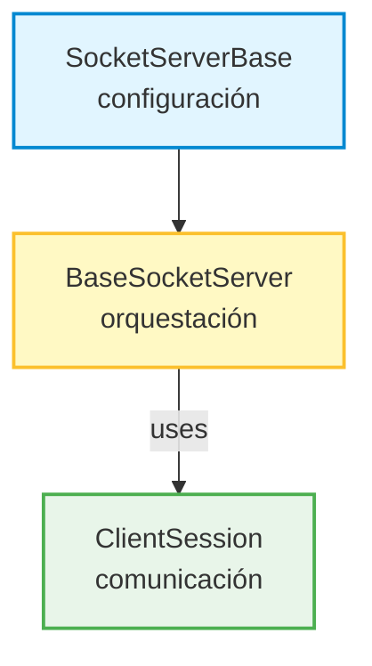
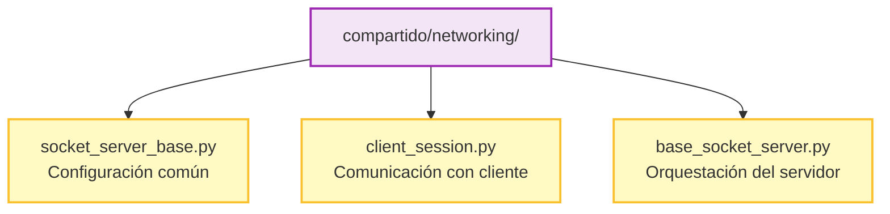
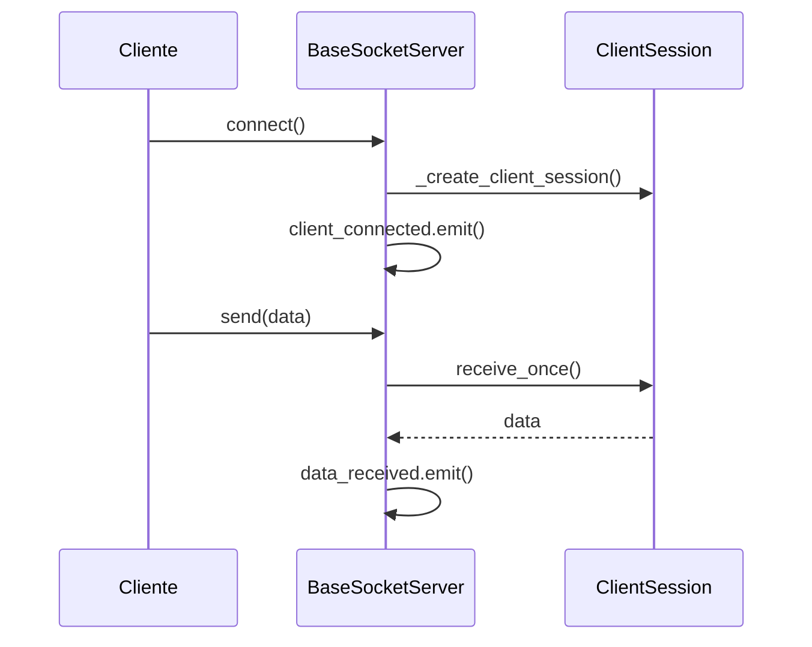

# ADR-002: Refactorización de BaseSocketServer aplicando SRP y DIP

## Contexto

Tras implementar `BaseSocketServer` para la tarea ST-14, un análisis de calidad de diseño reveló violaciones a los principios SOLID, específicamente SRP (Single Responsibility Principle) y DIP (Dependency Inversion Principle).

### Problema identificado

La clase original tenía **4 responsabilidades mezcladas**:

```python
class BaseSocketServer(QObject):
    # Responsabilidad 1: Gestión del socket servidor
    self._server_socket.bind((self._host, self._port))
    self._server_socket.listen(self.BACKLOG)

    # Responsabilidad 2: Gestión de hilos
    threading.Thread(target=self._accept_loop, daemon=True)

    # Responsabilidad 3: Comunicación con clientes (dentro de _handle_client)
    data = client_socket.recv(self.BUFFER_SIZE)
    decoded = data.decode(self.ENCODING)

    # Responsabilidad 4: Notificación de eventos
    self.data_received.emit(decoded)
```

### Análisis de violaciones

| Principio | Problema | Impacto |
|-----------|----------|---------|
| **SRP** | 4 razones para cambiar la clase | Mantenibilidad reducida |
| **DIP** | `socket.socket()` instanciado directamente | Difícil de testear/extender |
| **Cohesión** | Métodos con responsabilidades diferentes | LCOM alto |

---

## Decisión

Separar `BaseSocketServer` en una jerarquía de tres clases con responsabilidades únicas, aplicando composición y patrones Template Method/Factory Method para cumplir con DIP.

### Arquitectura resultante



### Estructura de archivos



---

## Diseño detallado

### SocketServerBase

**Responsabilidad:** Configuración común y factory de sockets.

```python
class SocketServerBase(QObject):
    """Clase base abstracta para servidores TCP."""

    # Señal común
    error_occurred = pyqtSignal(str)

    # Constantes
    BUFFER_SIZE = 4096
    ENCODING = "utf-8"
    BACKLOG = 5

    # Template Method (DIP)
    def _create_server_socket(self) -> socket.socket:
        """Puede ser sobrescrito para personalizar el socket."""
        sock = socket.socket(socket.AF_INET, socket.SOCK_STREAM)
        sock.setsockopt(socket.SOL_SOCKET, socket.SO_REUSEADDR, 1)
        return sock

    # Manejo de errores
    def _handle_bind_error(self, error: Exception) -> None
    def _handle_client_error(self, client_addr: str, error: Exception) -> None
```

### ClientSession

**Responsabilidad:** Manejar la comunicación con un cliente individual.

```python
class ClientSession(QObject):
    """Encapsula la comunicación con un cliente TCP conectado."""

    # Señales
    data_received = pyqtSignal(str)
    disconnected = pyqtSignal()
    error_occurred = pyqtSignal(str)

    # Estado
    _socket: socket.socket
    _active: bool

    # API
    def receive_once(self, timeout: float = None) -> Optional[str]
    def is_active(self) -> bool
    def close(self) -> None
```

**Justificación de la separación:**
- Encapsula la lógica de recepción de datos
- Permite reutilizar en diferentes tipos de servidores
- Facilita testing unitario aislado
- Un cambio en el protocolo de recepción solo afecta esta clase

### BaseSocketServer

**Responsabilidad:** Orquestar conexiones y gestionar ciclo de vida de sesiones.

```python
class BaseSocketServer(SocketServerBase):
    """Servidor TCP que acepta múltiples clientes."""

    # Señales específicas
    started = pyqtSignal()
    stopped = pyqtSignal()
    client_connected = pyqtSignal(str)
    client_disconnected = pyqtSignal(str)
    data_received = pyqtSignal(str)

    # Estado
    _sessions: Dict[str, ClientSession]
    _session_threads: Dict[str, threading.Thread]

    # API pública
    def start(self) -> bool
    def stop(self) -> None
    def is_running(self) -> bool
    def get_client_count(self) -> int

    # Factory Method (DIP)
    def _create_client_session(self, socket, addr) -> ClientSession:
        """Puede ser sobrescrito para usar sesiones personalizadas."""
        return ClientSession(socket, addr)
```

---

## Aplicación de principios SOLID

### S - Single Responsibility Principle ✅

| Clase | Responsabilidad Única | Razón para Cambiar |
|-------|----------------------|-------------------|
| `SocketServerBase` | Configuración TCP | Cambios en opciones de socket |
| `ClientSession` | Recepción de datos | Cambios en protocolo |
| `BaseSocketServer` | Orquestación | Cambios en gestión de conexiones |

### O - Open/Closed Principle ✅

Las clases son extensibles sin modificación:

```python
# Ejemplo: Servidor con sesiones personalizadas
class JsonServer(BaseSocketServer):
    def _create_client_session(self, socket, addr):
        return JsonClientSession(socket, addr)

# Ejemplo: Servidor con configuración SSL
class SecureServer(BaseSocketServer):
    def _create_server_socket(self):
        sock = super()._create_server_socket()
        return ssl.wrap_socket(sock, ...)
```

### L - Liskov Substitution Principle ✅

- `BaseSocketServer` sustituible donde se espera `SocketServerBase`
- Subclases de `ClientSession` funcionan sin romper comportamiento

### I - Interface Segregation Principle ✅

Interfaces mínimas y cohesivas:

| Clase | Métodos Públicos |
|-------|------------------|
| `SocketServerBase` | 2 (host, port) |
| `ClientSession` | 4 (address, is_active, receive_once, close) |
| `BaseSocketServer` | 4 (start, stop, is_running, get_client_count) |

### D - Dependency Inversion Principle ✅

**Antes (violación):**
```python
# Dependencia directa de implementación concreta
self._server_socket = socket.socket(socket.AF_INET, socket.SOCK_STREAM)
session = ClientSession(client_socket, client_addr)  # No extensible
```

**Después (cumple):**
```python
# Template Method - permite sobrescribir creación de socket
self._server_socket = self._create_server_socket()

# Factory Method - permite inyectar tipos de sesión
session = self._create_client_session(client_socket, client_addr)
```

---

## Métricas de calidad

### Cohesión (LCOM)

| Clase | LCOM | Evaluación |
|-------|------|------------|
| `SocketServerBase` | 0 | ✅ Alta cohesión |
| `ClientSession` | 0 | ✅ Alta cohesión |
| `BaseSocketServer` | 0 | ✅ Alta cohesión |

### Acoplamiento

| Clase | Aferente (Ca) | Eferente (Ce) | Inestabilidad (I) |
|-------|---------------|---------------|-------------------|
| `SocketServerBase` | 1 | 2 | 0.67 |
| `ClientSession` | 1 | 2 | 0.67 |
| `BaseSocketServer` | 0 | 4 | 1.0 (hoja) |

### Complejidad

| Métrica | Antes | Después |
|---------|-------|---------|
| Complejidad ciclomática promedio | 2.11 | **1.91** |
| Método más complejo | B (7) | **B (8)** |
| Índice de mantenibilidad | A (68) | **A (67-100)** |

---

## Consecuencias

### Positivas

1. **SRP cumplido:** Cada clase tiene una única razón para cambiar
2. **DIP cumplido:** Dependencias invertidas vía Template/Factory methods
3. **Testabilidad mejorada:** `ClientSession` testeable de forma aislada
4. **Extensibilidad:** Fácil crear servidores especializados
5. **Cohesión alta:** LCOM = 0 en todas las clases

### Negativas

1. **Más archivos:** 3 archivos en lugar de 1
2. **Indirección:** El flujo de datos pasa por más clases
3. **Complejidad conceptual:** Requiere entender la composición

### Mitigaciones

- Documentación clara en docstrings
- Tests exhaustivos (30 tests para servidor)
- Nombres descriptivos que indican responsabilidad

---

## Tests

| Clase | Tests | Cobertura |
|-------|-------|-----------|
| `SocketServerBase` | 4 | Inicialización, factory |
| `ClientSession` | 6 | Recepción, cierre, señales |
| `BaseSocketServer` | 18 | Start/stop, clientes, datos |
| **Total servidor** | **30** | - |

```bash
cd compartido && pytest tests/test_base_socket_server.py -v
```

---

## Diagrama de secuencia



---

## Referencias

- **adr_001_separacion_socket_clients.md:** Separación de Socket Clients
- **Principios SOLID:** Robert C. Martin
- **Patrones aplicados:** Template Method, Factory Method
- **Código fuente:** `compartido/networking/`
