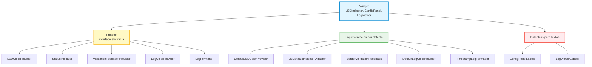

# ADR-003: Arquitectura de Widgets Compartidos aplicando DIP

## Contexto

El proyecto ISSE_Simuladores requiere widgets PyQt6 reutilizables en tres aplicaciones de escritorio. Estos widgets deben ser:

- **Configurables:** Diferentes aplicaciones pueden necesitar distintas apariencias o comportamientos
- **Testeables:** Deben poder probarse de forma aislada sin Qt real en algunos casos
- **Extensibles:** Nuevos temas, formatos o validaciones sin modificar código existente
- **Mantenibles:** Cambios en una parte no afectan otras

### Widgets implementados

| Widget | Tarea | Responsabilidad |
|--------|-------|-----------------|
| `LEDIndicator` | ST-15 | Indicador visual on/off con animación |
| `ConfigPanel` | ST-16 | Panel de configuración IP/Puerto con validación |
| `LogViewer` | ST-17 | Visor de logs con colores por nivel |

### Problema inicial

En la primera implementación de `ConfigPanel`, se identificaron violaciones a SOLID:

```python
# Violación DIP: Dependencia directa de LEDIndicator
self._led = LEDIndicator(color=LEDColor.GREEN, size=16)

# Violación OCP: Estilos hardcodeados
self._ip_input.setStyleSheet("border: 2px solid red;")

# Baja cohesión: Textos dispersos en el código
self._connect_button.setText("Conectar")
```

---

## Decisión

Aplicar el **Dependency Inversion Principle (DIP)** como arquitectura base para todos los widgets compartidos, utilizando:

1. **Protocol** para definir interfaces abstractas
2. **Inyección de dependencias** con defaults razonables
3. **Dataclasses** para configuración de textos UI
4. **Composición sobre herencia**

### Arquitectura resultante



---

## Diseño detallado

### 1. Patrón Protocol (Interfaz abstracta)

Python `Protocol` define interfaces sin requerir herencia explícita (duck typing estructural).

```python
from typing import Protocol

class LogColorProvider(Protocol):
    """Protocolo para proveedores de colores de log."""

    def get_color(self, level: LogLevel) -> QColor:
        """Retorna el color para un nivel de log."""
        ...
```

**Ventajas:**
- No requiere que las implementaciones hereden de una clase base
- Permite verificación estática de tipos con mypy
- Facilita mocking en tests

### 2. Patrón Adapter (StatusIndicator)

`LEDStatusIndicator` adapta `LEDIndicator` al protocolo `StatusIndicator`:

```python
class StatusIndicator(Protocol):
    """Protocolo genérico para indicadores de estado."""
    def get_widget(self) -> QWidget: ...
    def set_state(self, active: bool) -> None: ...

class LEDStatusIndicator:
    """Adapter que envuelve LEDIndicator."""

    def __init__(self, color: LEDColor = LEDColor.GREEN, ...):
        self._led = LEDIndicator(color=color, ...)

    def get_widget(self) -> QWidget:
        return self._led

    def set_state(self, active: bool) -> None:
        if active:
            self._led.turn_on()
        else:
            self._led.turn_off()
```

**Beneficio:** `ConfigPanel` depende de `StatusIndicator` (abstracción), no de `LEDIndicator` (implementación).

### 3. Patrón Strategy (Formatters y ColorProviders)

Permite intercambiar algoritmos en runtime:

```python
class LogFormatter(Protocol):
    def format(self, message: str, level: LogLevel, timestamp: datetime) -> str: ...

class TimestampLogFormatter:
    """Formateador con timestamp y nivel opcional."""

    def __init__(self, time_format: str = "%H:%M:%S", show_level: bool = True):
        self._time_format = time_format
        self._show_level = show_level

    def format(self, message: str, level: LogLevel, timestamp: datetime) -> str:
        time_str = timestamp.strftime(self._time_format)
        if self._show_level:
            return f"[{time_str}] [{level.value.upper()}] {message}"
        return f"[{time_str}] {message}"
```

**Uso:**
```python
# Formato simple
viewer = LogViewer(formatter=TimestampLogFormatter(show_level=False))

# Formato personalizado
class JsonLogFormatter:
    def format(self, message, level, timestamp):
        return json.dumps({"msg": message, "level": level.value})

viewer = LogViewer(formatter=JsonLogFormatter())
```

### 4. Dataclasses para textos UI

Centraliza todos los textos configurables:

```python
@dataclass(frozen=True)
class ConfigPanelLabels:
    """Textos configurables para ConfigPanel."""
    ip_label: str = "Dirección IP:"
    port_label: str = "Puerto:"
    connect_button: str = "Conectar"
    disconnect_button: str = "Desconectar"
    invalid_ip_message: str = "Dirección IP inválida"
    invalid_port_message: str = "Puerto debe ser entre 1 y 65535"
```

**Beneficios:**
- Inmutabilidad (`frozen=True`)
- Valores por defecto razonables
- Fácil internacionalización futura
- Documentación implícita de textos configurables

### 5. Inyección con defaults razonables

Todos los widgets aceptan dependencias opcionales:

```python
class LogViewer(QWidget):
    def __init__(
        self,
        color_provider: LogColorProvider | None = None,
        formatter: LogFormatter | None = None,
        labels: LogViewerLabels | None = None,
        max_lines: int = 1000,
        auto_scroll: bool = True,
        parent: QWidget | None = None
    ):
        self._color_provider = color_provider or DefaultLogColorProvider()
        self._formatter = formatter or TimestampLogFormatter()
        self._labels = labels or LogViewerLabels()
```

**Principio:** El widget funciona sin configuración, pero es completamente extensible.

### 6. Señales PyQt6 (Observer Pattern)

Los widgets emiten señales para notificar eventos:

```python
class LogViewer(QWidget):
    log_added = pyqtSignal(str, LogLevel)   # (mensaje formateado, nivel)
    logs_cleared = pyqtSignal()

class ConfigPanel(QWidget):
    connection_requested = pyqtSignal(str, int)  # (ip, puerto)
    disconnection_requested = pyqtSignal()
    validation_changed = pyqtSignal(bool)        # (es_valido)
```

**Beneficio:** Desacopla el widget de quién consume sus eventos.

---

## Aplicación de principios SOLID

### S - Single Responsibility Principle

| Módulo | Responsabilidad única |
|--------|----------------------|
| `log_color_provider.py` | Colores por nivel de log |
| `log_formatter.py` | Formateo de mensajes |
| `log_viewer.py` | Visualización y gestión de logs |
| `status_indicator.py` | Abstracción de indicadores visuales |
| `validation_feedback.py` | Feedback visual de validación |

### O - Open/Closed Principle

Extensible sin modificación:

```python
# Tema oscuro - sin tocar DefaultLogColorProvider
class DarkThemeLogColors:
    _COLORS = {
        LogLevel.INFO: QColor(200, 200, 200),
        LogLevel.WARNING: QColor(255, 200, 0),
        ...
    }
    def get_color(self, level: LogLevel) -> QColor:
        return self._COLORS.get(level, ...)

viewer = LogViewer(color_provider=DarkThemeLogColors())
```

### L - Liskov Substitution Principle

Cualquier implementación de un Protocol puede sustituir a otra:

```python
# Ambos son LogColorProvider válidos
viewer1 = LogViewer(color_provider=DefaultLogColorProvider())
viewer2 = LogViewer(color_provider=DarkThemeLogColors())
# Comportamiento idéntico garantizado por el protocolo
```

### I - Interface Segregation Principle

Interfaces mínimas y específicas:

| Protocol | Métodos |
|----------|---------|
| `LEDColorProvider` | 1: `get_colors()` |
| `StatusIndicator` | 2: `get_widget()`, `set_state()` |
| `ValidationFeedbackProvider` | 2: `show_valid()`, `show_invalid()` |
| `LogColorProvider` | 1: `get_color()` |
| `LogFormatter` | 1: `format()` |

### D - Dependency Inversion Principle

**Antes:**
```python
# ConfigPanel dependía de implementación concreta
self._led = LEDIndicator(...)  # Acoplamiento alto
```

**Después:**
```python
# ConfigPanel depende de abstracción
def __init__(self, status_indicator: StatusIndicator | None = None):
    self._status_indicator = status_indicator or LEDStatusIndicator()
```

---

## Métricas de calidad

### Quality Gates (compartido/widgets)

| Métrica | Valor | Umbral | Estado |
|---------|-------|--------|--------|
| Complejidad ciclomática promedio | 1.35 | ≤ 10 | PASS |
| Índice de mantenibilidad promedio | 83.67 | > 20 | PASS |
| Pylint score | 10.00 | ≥ 8.0 | PASS |

**Calificación: A** (3/3 gates)

### Estadísticas de código

| Métrica | Valor |
|---------|-------|
| Total LOC | 1489 |
| SLOC (código efectivo) | 630 |
| Archivos Python | 10 |
| Total funciones | 112 |

---

## Estructura de archivos

```mermaid
graph TD
    A[compartido/widgets/] --> B1[led_indicator.py<br/>Widget LED con animación]
    A --> B2[led_color_provider.py<br/>Protocol + Default para colores LED]
    A --> B3[config_panel.py<br/>Panel de configuración]
    A --> B4[config_panel_labels.py<br/>Dataclass de textos]
    A --> B5[status_indicator.py<br/>Protocol + Adapter]
    A --> B6[validation_feedback.py<br/>Protocol + BorderValidationFeedback]
    A --> B7[log_viewer.py<br/>Widget visor de logs]
    A --> B8[log_color_provider.py<br/>Protocol + Default para colores log]
    A --> B9[log_formatter.py<br/>Protocol + TimestampLogFormatter]

    style A fill:#f3e5f5,stroke:#9c27b0,stroke-width:2px
    style B1 fill:#fff9c4,stroke:#fbc02d,stroke-width:2px
    style B2 fill:#fff9c4,stroke:#fbc02d,stroke-width:2px
    style B3 fill:#fff9c4,stroke:#fbc02d,stroke-width:2px
    style B4 fill:#fff9c4,stroke:#fbc02d,stroke-width:2px
    style B5 fill:#fff9c4,stroke:#fbc02d,stroke-width:2px
    style B6 fill:#fff9c4,stroke:#fbc02d,stroke-width:2px
    style B7 fill:#fff9c4,stroke:#fbc02d,stroke-width:2px
    style B8 fill:#fff9c4,stroke:#fbc02d,stroke-width:2px
    style B9 fill:#fff9c4,stroke:#fbc02d,stroke-width:2px
```



---

## Consecuencias

### Positivas

1. **DIP cumplido:** Todos los widgets dependen de abstracciones
2. **Testabilidad:** Fácil inyectar mocks para tests unitarios
3. **Extensibilidad:** Nuevos temas/formatos sin modificar widgets
4. **Reutilización:** Widgets funcionan en cualquier aplicación del proyecto
5. **Mantenibilidad alta:** MI > 80 en todos los módulos
6. **Cohesión alta:** Módulos pequeños con responsabilidad única

### Negativas

1. **Más archivos:** 10 archivos vs 3 en diseño monolítico
2. **Indirección:** Requiere entender Protocols e inyección
3. **Curva de aprendizaje:** Patrones pueden ser nuevos para algunos

### Mitigaciones

- Docstrings completos con ejemplos de uso
- Defaults razonables eliminan necesidad de configuración
- Tests exhaustivos (44 tests solo para LogViewer)
- Este ADR como documentación de arquitectura

---

## Tests

| Widget | Tests | Cobertura |
|--------|-------|-----------|
| LEDIndicator | 11 | Colores, animación, estados |
| ConfigPanel | 23 | Validación, conexión, feedback |
| LogViewer | 44 | Colores, formato, scroll, límites |
| **Total widgets** | **78+** | - |

```bash
cd compartido && pytest tests/ -v
```

---

## Referencias

- **adr_001_separacion_socket_clients.md:** Separación de Socket Clients
- **adr_002_refactorizacion_socket_server.md:** Refactorización de BaseSocketServer
- **Principios SOLID:** Robert C. Martin
- **Patrones aplicados:** Protocol, Adapter, Strategy, Observer
- **Python typing.Protocol:** PEP 544
- **Código fuente:** `compartido/widgets/`
