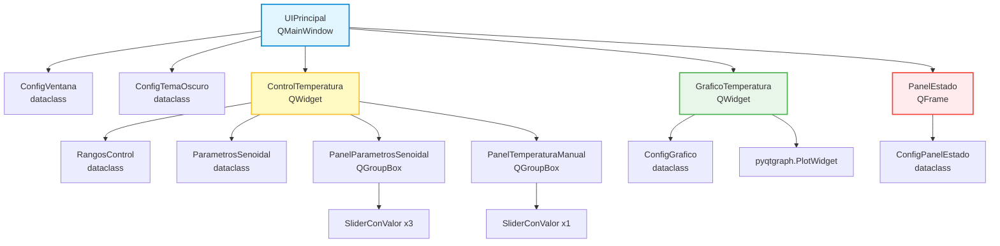
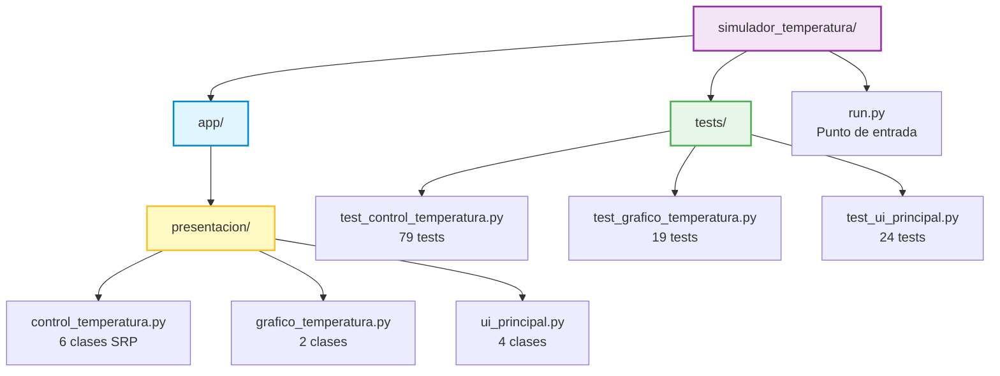

# ADR-004: Arquitectura de Presentacion del Simulador de Temperatura

## Contexto

El Simulador de Temperatura requiere una interfaz grafica PyQt6 que permita:

- **Controlar parametros:** Ajustar temperatura base, amplitud y periodo de la variacion senoidal
- **Modo manual:** Establecer temperatura fija sin variacion
- **Visualizar:** Grafico en tiempo real de la temperatura generada
- **Monitorear:** Estado de conexion y temperatura actual

### Widgets requeridos

| Widget | Ticket | Responsabilidad |
|--------|--------|-----------------|
| `ControlTemperatura` | ST-39 | Controles de parametros y modo |
| `GraficoTemperatura` | ST-40 | Grafico temporal con pyqtgraph |
| `UIPrincipal` | ST-41 | Ventana principal integradora |

### Problema inicial

Se identificaron riesgos de violaciones SOLID en el diseno inicial:

```python
# Riesgo DIP: Valores hardcodeados
self._slider.setRange(-10, 50)  # Limites fijos

# Riesgo SRP: Clase con multiples responsabilidades
class ControlTemperatura:
    # Sliders + Validacion + Signals + Layout = Baja cohesion

# Riesgo OCP: Colores no configurables
label.setStyleSheet("color: #4fc3f7;")  # Hardcoded
```

---

## Decision

Aplicar arquitectura basada en **composicion de widgets** con:

1. **Dataclasses inmutables** para toda configuracion
2. **Separacion por responsabilidad** (un widget = una tarea)
3. **Inyeccion de dependencias** con defaults razonables
4. **Signals directos** sin metodos relay innecesarios

### Arquitectura resultante



---

## Diseno detallado

### 1. Dataclasses para configuracion (OCP + DIP)

Toda configuracion es inyectable y tiene defaults razonables:

```python
@dataclass(frozen=True)
class RangosControl:
    """Rangos configurables para los controles."""
    temp_min: float = -10.0
    temp_max: float = 50.0
    amplitud_min: float = 0.0
    amplitud_max: float = 20.0
    periodo_min: float = 10.0
    periodo_max: float = 300.0

@dataclass(frozen=True)
class ConfigGrafico:
    """Configuracion del grafico de temperatura."""
    ventana_segundos: int = 60
    temp_min_display: float = -10.0
    temp_max_display: float = 50.0
    max_puntos: int = 600
    color_linea: str = "#4fc3f7"
    color_referencia: str = "#ff5252"

@dataclass(frozen=True)
class ConfigPanelEstado:
    """Configuracion del panel de estado."""
    titulo: str = "Estado Actual"
    texto_conectado: str = "Conectado"
    texto_desconectado: str = "Desconectado"
    color_temperatura: str = "#4fc3f7"
    color_conectado: str = "#81c784"
    color_desconectado: str = "#e57373"
```

**Beneficios:**
- Inmutabilidad (`frozen=True`)
- Valores por defecto eliminan configuracion obligatoria
- Extensible sin modificar widgets existentes

### 2. Widgets atomicos con responsabilidad unica (SRP)

| Widget | Responsabilidad unica |
|--------|----------------------|
| `SliderConValor` | Slider + label de valor |
| `PanelParametrosSenoidal` | Controles modo senoidal |
| `PanelTemperaturaManual` | Control modo manual |
| `PanelEstado` | Display de estado |
| `GraficoTemperatura` | Visualizacion temporal |
| `ControlTemperatura` | Composicion de paneles |
| `UIPrincipal` | Composicion de ventana |

### 3. Composicion sobre herencia

```python
class ControlTemperatura(QWidget):
    """Compositor de paneles de control."""

    def __init__(self, rangos: Optional[RangosControl] = None, ...):
        self._rangos = rangos or RangosControl()

        # Composicion de widgets especializados
        self._panel_senoidal = PanelParametrosSenoidal(...)
        self._panel_manual = PanelTemperaturaManual(...)
        self._stack = QStackedWidget()
```

### 4. Signals directos sin relay (Simplicidad)

**Antes (relay innecesario):**
```python
def _setup_conexiones(self):
    self._control.parametros_cambiados.connect(self._on_parametros)

def _on_parametros(self, params):
    self.parametros_cambiados.emit(params)  # Solo hace emit
```

**Despues (conexion directa):**
```python
def _setup_conexiones(self):
    # Conexion directa al signal de salida
    self._control.parametros_cambiados.connect(
        self.parametros_cambiados.emit
    )
```

### 5. Metodo factory para evitar duplicacion (DRY)

En `GraficoTemperatura`, el codigo de crear lineas de referencia estaba duplicado 4 veces:

**Antes:**
```python
self._linea_min = pg.InfiniteLine(
    pos=temp_min, angle=0,
    pen=pg.mkPen(color=self._config.color_referencia, width=1, ...)
)
# Codigo repetido 4 veces
```

**Despues:**
```python
def _crear_linea_referencia(self, posicion: float) -> pg.InfiniteLine:
    """Factory method para lineas de referencia."""
    return pg.InfiniteLine(
        pos=posicion, angle=0,
        pen=pg.mkPen(
            color=self._config.color_referencia,
            width=1,
            style=pg.QtCore.Qt.PenStyle.DashLine,
        ),
    )

# Uso
self._linea_min = self._crear_linea_referencia(temp_min)
```

---

## Aplicacion de principios SOLID

### S - Single Responsibility Principle

Cada clase tiene una unica razon para cambiar:

```
SliderConValor        → Cambios en UI de slider
PanelParametrosSenoidal → Cambios en controles senoidales
PanelTemperaturaManual  → Cambios en control manual
ConfigGrafico         → Cambios en parametros de grafico
GraficoTemperatura    → Cambios en visualizacion
PanelEstado           → Cambios en display de estado
ConfigPanelEstado     → Cambios en textos/colores de estado
UIPrincipal           → Cambios en layout general
```

### O - Open/Closed Principle

Extensible sin modificacion mediante dataclasses:

```python
# Tema personalizado sin tocar UIPrincipal
tema_claro = ConfigTemaOscuro(
    color_fondo="#ffffff",
    color_texto="#000000"
)
ventana = UIPrincipal(tema=tema_claro)

# Grafico con mas puntos sin tocar GraficoTemperatura
config = ConfigGrafico(max_puntos=1200, ventana_segundos=120)
grafico = GraficoTemperatura(config=config)
```

### L - Liskov Substitution Principle

Los dataclasses con valores por defecto permiten sustitucion:

```python
# Ambos son usos validos
ventana1 = UIPrincipal()  # Defaults
ventana2 = UIPrincipal(config=ConfigVentana(titulo="Custom"))
# Comportamiento consistente garantizado
```

### I - Interface Segregation Principle

Interfaces minimas en signals:

| Signal | Parametros |
|--------|------------|
| `valor_cambiado` | `float` |
| `parametros_cambiados` | `ParametrosSenoidal` |
| `temperatura_cambiada` | `float` |
| `modo_cambiado` | `bool` |
| `punto_agregado` | `float, float` |

### D - Dependency Inversion Principle

Widgets dependen de abstracciones (dataclasses), no de valores concretos:

```python
class GraficoTemperatura(QWidget):
    def __init__(self, config: Optional[ConfigGrafico] = None, ...):
        self._config = config or ConfigGrafico()  # Abstraccion inyectada
        # Usa self._config.color_linea, no "#4fc3f7"
```

---

## Diagrama de Signals

```
┌─────────────────┐
│ SliderConValor  │
│                 │──valor_cambiado(float)──┐
└─────────────────┘                         │
                                            ▼
┌─────────────────────────┐    ┌────────────────────────┐
│ PanelParametrosSenoidal │    │ PanelTemperaturaManual │
│                         │    │                        │
└───────────┬─────────────┘    └───────────┬────────────┘
            │                              │
            │ parametros_cambiados         │ temperatura_cambiada
            ▼                              ▼
┌─────────────────────────────────────────────────────────┐
│                   ControlTemperatura                     │
│                                                          │
│  parametros_senoidal_cambiados(ParametrosSenoidal)       │
│  temperatura_manual_cambiada(float)                      │
│  modo_cambiado(bool)                                     │
└───────────────────────────┬─────────────────────────────┘
                            │ conexion directa (.emit)
                            ▼
┌─────────────────────────────────────────────────────────┐
│                      UIPrincipal                         │
│                                                          │
│  parametros_cambiados(ParametrosSenoidal)                │
│  temperatura_manual_cambiada(float)                      │
└─────────────────────────────────────────────────────────┘
```

---

## Metricas de calidad

### Quality Gates (simulador_temperatura/app)

| Metrica | Valor | Umbral | Estado |
|---------|-------|--------|--------|
| Complejidad ciclomatica promedio | 1.42 | <= 10 | PASS |
| Indice de mantenibilidad promedio | 71.30 | > 20 | PASS |
| Pylint score | 9.53 | >= 8.0 | PASS |

**Calificacion: A** (3/3 gates)

### Estadisticas de codigo

| Metrica | Valor |
|---------|-------|
| Total LOC | 1590 |
| SLOC (codigo efectivo) | 941 |
| Archivos Python | 15 |
| Tests unitarios | 141 |

---

## Estructura de archivos



---

## Consecuencias

### Positivas

1. **Alta cohesion:** Cada widget tiene responsabilidad unica
2. **Bajo acoplamiento:** Dependencias via dataclasses inyectables
3. **Extensibilidad:** Nuevos temas/configuraciones sin modificar codigo
4. **Testabilidad:** 141 tests con pytest-qt
5. **Mantenibilidad:** MI > 70, Pylint > 9.5
6. **Consistencia:** Sigue patrones de ../compartido/docs/decisiones/adr_003_arquitectura_widgets_compartidos.md (widgets compartidos)

### Negativas

1. **Mas clases:** 12 clases vs diseno monolitico
2. **Indirection:** Dataclasses agregan nivel de abstraccion

### Mitigaciones

- Dataclasses con defaults eliminan configuracion obligatoria
- `__init__.py` exporta solo clases publicas necesarias
- Tests exhaustivos documentan comportamiento esperado

---

## Tests

| Modulo | Tests | Cobertura |
|--------|-------|-----------|
| `test_control_temperatura.py` | 79 | Sliders, paneles, signals, modos |
| `test_grafico_temperatura.py` | 19 | Buffer, puntos, referencias |
| `test_ui_principal.py` | 24 | Ventana, componentes, signals |
| **Total presentacion** | **122** | - |

```bash
cd simulador_temperatura && pytest tests/ -v
```

---

## Referencias

- **../compartido/docs/decisiones/adr_003_arquitectura_widgets_compartidos.md:** Arquitectura de Widgets Compartidos
- **Principios SOLID:** Robert C. Martin
- **Patrones aplicados:** Composition, Factory Method, Observer (Signals)
- **Tickets:** ST-39, ST-40, ST-41
- **Codigo fuente:** `simulador_temperatura/app/presentacion/`
