# ADR-005: Arquitectura de Referencia para Simuladores HIL

## Contexto

Los simuladores HIL (Hardware-in-the-Loop) del proyecto ISSE_Termostato son aplicaciones PyQt6 que:
- Generan datos simulados de sensores (temperatura, batería)
- Se comunican vía TCP con el sistema embebido en Raspberry Pi
- Requieren UI interactiva con actualización en tiempo real
- Deben mantener alta calidad de código (Pylint ≥8.0, CC ≤10, MI >20)

**Problema:** Las aplicaciones PyQt6 tienden a convertirse en código monolítico con:
- Lógica de negocio mezclada con UI
- Dependencias circulares entre componentes
- Dificultad para testing (especialmente de lógica sin UI)
- Baja mantenibilidad a medida que crecen

**Necesidad:** Una arquitectura que garantice:
- Separación clara de responsabilidades
- Testabilidad (unit tests sin levantar UI)
- Bajo acoplamiento entre componentes
- Consistencia entre productos del mismo tipo

---

## Decisión

Adoptamos una **Arquitectura en Capas con MVC + Factory/Coordinator Pattern** como estándar para todos los simuladores HIL.

### Estructura de Capas

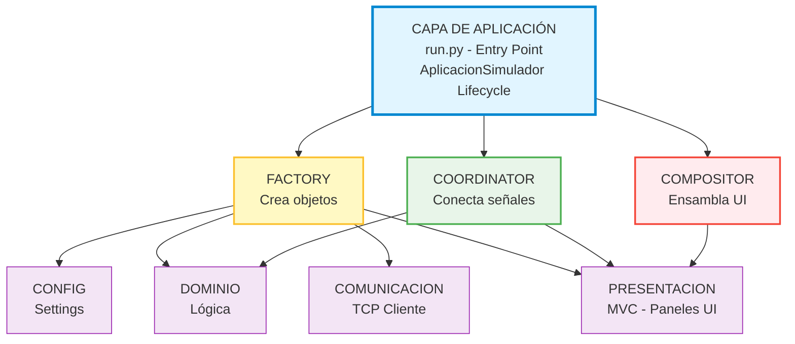

---

## Patrones de Diseño

### 1. MVC (Model-View-Controller)

**Aplicación:** Cada panel de la UI (Conexión, Control, Estado, Gráfico)

#### Componentes

**Model (Modelo)**
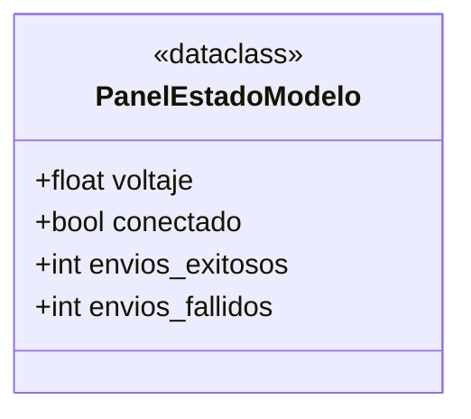
- **Responsabilidad:** Solo datos, sin lógica
- **Características:**
  - Dataclass inmutable (frozen=True opcional)
  - Representa estado en un instante
  - Sin dependencias de PyQt

**View (Vista)**
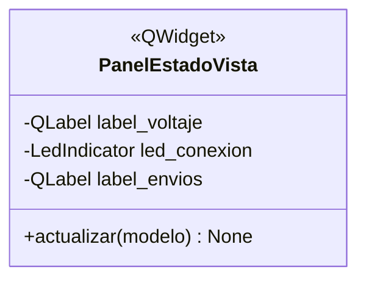
- **Responsabilidad:** Solo UI, sin lógica
- **Características:**
  - Widgets PyQt6 puros
  - Método `actualizar(modelo)` que renderiza
  - No emite señales de negocio (solo UI events)

**Controller (Controlador)**
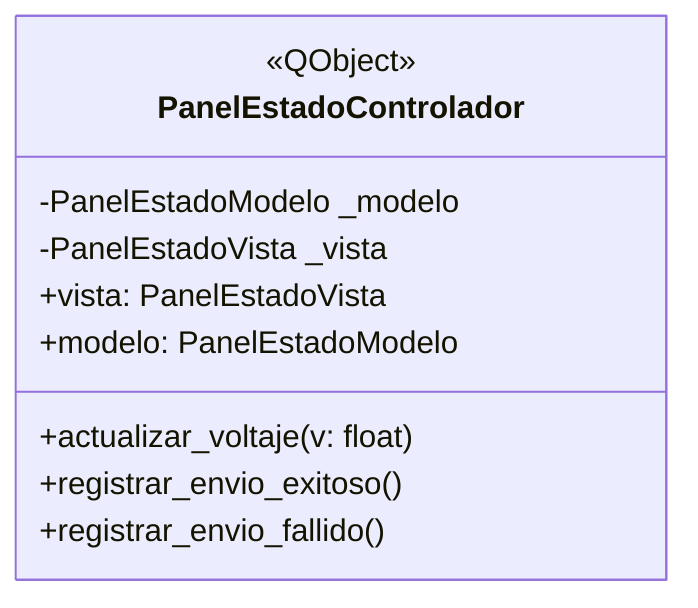
- **Responsabilidad:** Coordinar modelo ↔ vista, emitir señales
- **Características:**
  - Hereda de QObject (no QWidget)
  - Actualiza modelo → llama vista.actualizar()
  - Emite señales para otros componentes
  - Contiene lógica de presentación

#### Flujo MVC

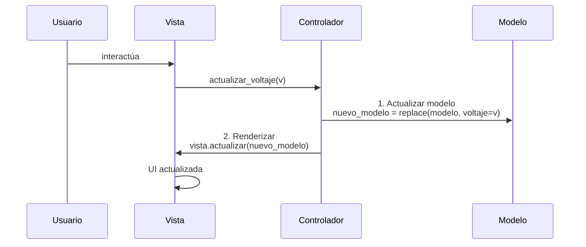

#### Beneficios
- Modelo testable sin PyQt (pure Python)
- Vista testable con pytest-qt (solo UI)
- Controlador testable con mocks
- Reemplazo fácil de vista (ej: GUI → CLI)

---

### 2. Factory Pattern

**Implementación:** `ComponenteFactory` en `app/factory.py`

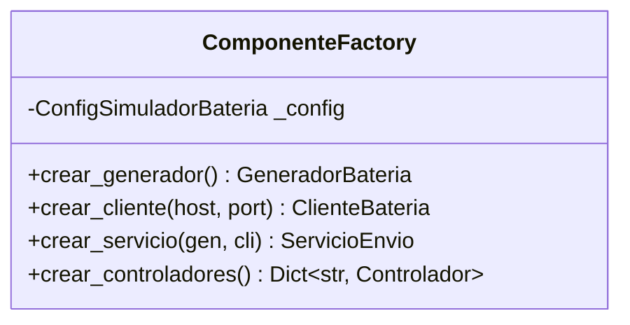

#### Responsabilidades
1. **Centralizar creación** de componentes
2. **Inyectar configuración** consistente
3. **Facilitar testing** con factory mock

#### Ejemplo de uso

```python
# En run.py
factory = ComponenteFactory(config)

# Crear componentes de dominio
generador = factory.crear_generador()

# Crear controladores MVC
controladores = factory.crear_controladores()
ctrl_estado = controladores['estado']
ctrl_control = controladores['control']
ctrl_conexion = controladores['conexion']
```

#### Ventajas
- Un solo punto para cambiar configuración
- Fácil mockear en tests (factory.crear_X = lambda: mock)
- Reduce duplicación de código de inicialización

---

### 3. Coordinator Pattern

**Implementación:** `SimuladorCoordinator` en `app/coordinator.py`

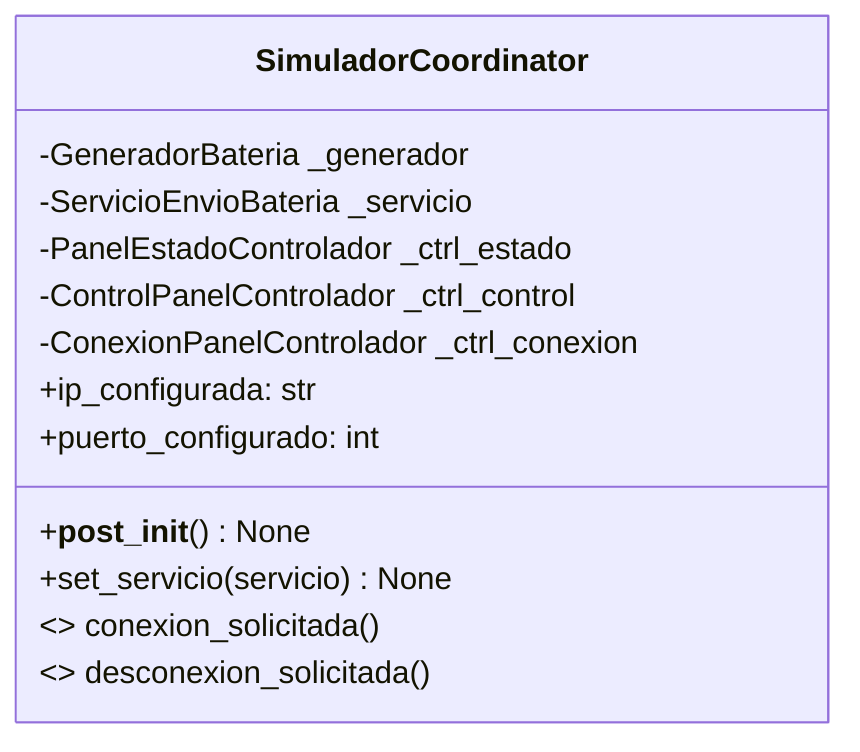

#### Responsabilidades
1. **Conectar señales PyQt** entre componentes
2. **Desacoplar componentes** (no se conocen directamente)
3. **Gestionar ciclo de vida** de conexiones

#### Conexiones típicas

```python
def __post_init__(self):
    # Generador → Controlador Estado (actualizar UI)
    self._generador.voltaje_cambiado.connect(
        self._ctrl_estado.actualizar_voltaje
    )

    # Controlador Control → Generador (cambio desde UI)
    self._ctrl_control.voltaje_cambiado.connect(
        self._generador.set_voltaje
    )

    # Controlador Conexión → Coordinator (solicitudes)
    self._ctrl_conexion.conectar_solicitado.connect(
        self._on_conexion_solicitada
    )

    # Servicio → Controlador Estado (envíos exitosos/fallidos)
    if self._servicio:
        self._servicio.envio_exitoso.connect(
            self._ctrl_estado.registrar_envio_exitoso
        )
```

#### Ventajas
- Componentes no se conocen entre sí
- Fácil agregar/quitar conexiones
- Testing: solo conectar lo necesario

---

### 4. Compositor Pattern

**Implementación:** `UIPrincipalCompositor` en `app/presentacion/ui_compositor.py`

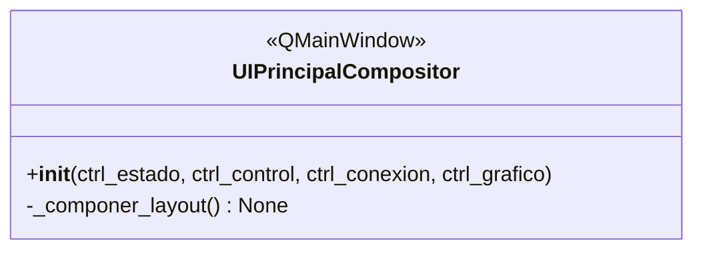

#### Responsabilidades
1. **Ensamblar vistas** de controladores en layout
2. **Sin lógica de negocio** (solo composición visual)
3. **Configurar ventana** (título, tamaño, tema)

#### Ejemplo de composición

```python
def _componer_layout(self):
    layout = QVBoxLayout()

    # Agregar vistas de controladores
    layout.addWidget(self._ctrl_estado.vista)
    layout.addWidget(self._ctrl_control.vista)

    if self._ctrl_grafico:
        layout.addWidget(self._ctrl_grafico.vista)

    layout.addWidget(self._ctrl_conexion.vista)

    central = QWidget()
    central.setLayout(layout)
    self.setCentralWidget(central)
```

#### Ventajas
- UI es pura composición
- Fácil reorganizar layout
- Controladores no conocen el layout

---

## Separación en Capas

### Capa de Dominio (`app/dominio/`)

**Responsabilidad:** Lógica de negocio pura, sin dependencias externas

```
dominio/
├── estado_bateria.py       # Modelo de datos inmutable
└── generador_bateria.py    # Generador con QTimer
```

**Características:**
- Sin imports de comunicación ni presentación
- Solo QObject/QTimer de PyQt (por señales)
- Testable sin dependencias externas

**Ejemplo:**
```python
@dataclass(frozen=True)
class EstadoBateria:
    """Modelo de datos inmutable."""
    voltaje: float
    timestamp: datetime

    def to_string(self) -> str:
        return f"{self.voltaje:.2f}"
```

### Capa de Comunicación (`app/comunicacion/`)

**Responsabilidad:** Conexiones TCP, envío/recepción de datos

```
comunicacion/
├── cliente_bateria.py      # Wrapper de EphemeralSocketClient
└── servicio_envio.py       # Integra generador + cliente
```

**Características:**
- Usa `compartido/networking/`
- Convierte tipos de dominio a bytes
- Emite señales de resultado (éxito/error)

**Ejemplo:**
```python
class ClienteBateria(QObject):
    """Cliente TCP que envía voltaje."""

    def enviar_estado(self, estado: EstadoBateria) -> bool:
        mensaje = f"{estado.voltaje:.2f}"
        return self._cliente.send(mensaje)
```

### Capa de Presentación (`app/presentacion/`)

**Responsabilidad:** UI con patrón MVC

```
presentacion/
├── ui_compositor.py        # Compositor de layout
└── paneles/
    ├── base.py             # Clases base MVC
    ├── estado/             # Panel Estado MVC
    ├── control/            # Panel Control MVC
    └── conexion/           # Panel Conexión MVC
```

**Estructura MVC de cada panel:**
```
panel_nombre/
├── modelo.py              # Dataclass con estado del panel
├── vista.py               # QWidget puro (UI)
└── controlador.py         # QObject que coordina
```

---

## Principios Arquitectónicos

### 1. Dependency Inversion Principle (DIP)

**Capas de alto nivel NO dependen de capas de bajo nivel.**

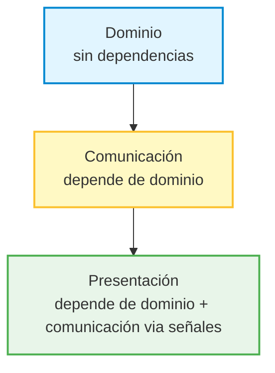

### 2. Single Responsibility Principle (SRP)

Cada componente tiene UNA responsabilidad:
- **Factory:** crear objetos
- **Coordinator:** conectar señales
- **Compositor:** ensamblar UI
- **Modelo MVC:** datos
- **Vista MVC:** UI
- **Controlador MVC:** lógica de presentación

### 3. Open/Closed Principle (OCP)

**Abierto a extensión, cerrado a modificación.**

Ejemplo: Agregar nuevo panel
```python
# NO modificar Compositor, solo extender
nuevo_ctrl = factory.crear_panel_nuevo()
compositor = UIPrincipalCompositor(
    ctrl_estado,
    ctrl_control,
    ctrl_conexion,
    ctrl_nuevo  # Nueva extensión
)
```

### 4. Separation of Concerns

**Cada capa tiene una preocupación clara:**
- Dominio: ¿Qué datos genero?
- Comunicación: ¿Cómo los envío?
- Presentación: ¿Cómo los muestro?

---

## Diagrama de Secuencia: Flujo Completo

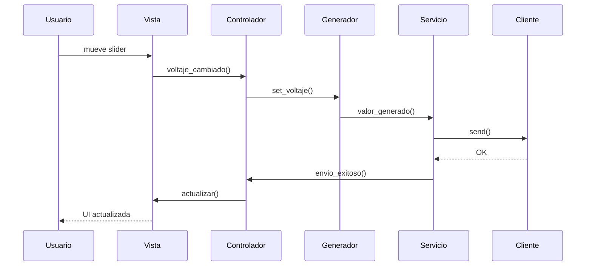

---

## Diagrama de Componentes

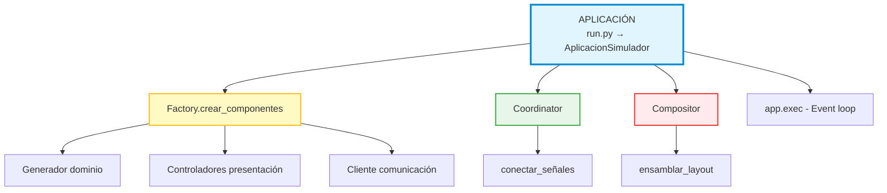

---

## Consecuencias

### Beneficios

✅ **Testabilidad**
- Lógica de dominio sin PyQt
- Mocking fácil en Factory
- Tests de UI aislados

✅ **Mantenibilidad**
- SRP: cada clase tiene una responsabilidad
- Fácil localizar código por capa
- Cambios localizados (bajo ripple effect)

✅ **Reusabilidad**
- Modelos MVC reutilizables entre paneles
- Factory pattern facilita variaciones
- Widgets compartidos en `compartido/`

✅ **Escalabilidad**
- Agregar paneles: crear nuevo MVC
- Agregar funcionalidad: inyectar en Factory
- Sin refactorización masiva

✅ **Consistencia**
- Mismo patrón en todos los simuladores
- Predecible para nuevos desarrolladores
- Calidad medible y comparable

### Trade-offs

⚠️ **Complejidad inicial**
- Más archivos que enfoque monolítico
- Curva de aprendizaje de patrones
- Setup inicial más largo

⚠️ **Boilerplate**
- Cada panel requiere 3 archivos (modelo, vista, controlador)
- Factory y Coordinator requieren configuración
- Más indirección (signals en vez de llamadas directas)

⚠️ **Overhead de señales**
- Conexiones PyQt pueden ser difíciles de debuggear
- Flujo no lineal (basado en eventos)
- Requiere disciplina en naming

### Mitigaciones

🔧 **Documentación exhaustiva**
- ADR como este
- Diagramas de arquitectura por producto
- CLAUDE.md con patrones

🔧 **Herramientas de calidad**
- Pylint para detectar violaciones
- Tests exigen cumplir arquitectura
- Quality gates automáticos

🔧 **Convenciones estrictas**
- Naming consistente (Panel*Modelo, Panel*Vista, etc.)
- Estructura de carpetas idéntica
- Fixtures de test reutilizables

---

## Aplicabilidad a ux_termostato

El simulador `ux_termostato` actualmente **NO** sigue esta arquitectura. Para aplicarla:

### Paso 1: Identificar componentes

**Dominio:**
- Estado del termostato (temperatura ambiente, deseada, modo)
- Comandos (aumentar, disminuir, cambiar display)

**Comunicación:**
- Cliente para enviar comandos (:13000, :14000)
- Servidor para recibir datos (:14001, :14002)

**Presentación:**
- Panel de visualización (temperatura actual)
- Panel de control (setpoint)
- Panel de display (selector ambiente/deseada)
- Panel de estado batería

### Paso 2: Diseñar MVC por panel

```
presentacion/paneles/
├── visualizacion/
│   ├── modelo.py          # temp_ambiente, temp_deseada
│   ├── vista.py           # Labels + display
│   └── controlador.py     # Actualizar desde servidor
├── control_setpoint/
│   ├── modelo.py          # setpoint, rango
│   ├── vista.py           # Botones +/-
│   └── controlador.py     # Enviar comandos
└── selector_display/
    ├── modelo.py          # modo_actual
    ├── vista.py           # Radio buttons
    └── controlador.py     # Enviar selector
```

### Paso 3: Crear Factory

```python
class ComponenteFactoryUX:
    def crear_servidor_temperatura(self) -> ServidorTemperatura
    def crear_servidor_bateria(self) -> ServidorBateria
    def crear_cliente_comandos(self) -> ClienteComandos
    def crear_controladores(self) -> Dict[str, Controlador]
```

### Paso 4: Crear Coordinator

```python
class UXCoordinator:
    def __init__(self, servidores, cliente, controladores):
        # Conectar servidor → controladores (datos entrantes)
        servidor_temp.dato_recibido.connect(ctrl_viz.actualizar)

        # Conectar controladores → cliente (comandos salientes)
        ctrl_setpoint.comando_emitido.connect(cliente.enviar)
```

### Paso 5: Refactorizar run.py

```python
def main():
    factory = ComponenteFactoryUX(config)

    # Crear componentes
    servidores = factory.crear_servidores()
    cliente = factory.crear_cliente_comandos()
    controladores = factory.crear_controladores()

    # Conectar
    coordinator = UXCoordinator(servidores, cliente, controladores)

    # Ensamblar UI
    compositor = UIUXCompositor(controladores)

    # Iniciar servidores
    for servidor in servidores:
        servidor.iniciar()

    compositor.show()
    app.exec()
```

---

## Referencias

- [CLAUDE.md](../CLAUDE.md) - Guía general del proyecto
- [simulador_bateria/docs/arquitectura.md](../simulador_bateria/docs/arquitectura.md) - Implementación detallada
- [simulador_temperatura/docs/arquitectura.md](../simulador_temperatura/docs/arquitectura.md) - Implementación detallada
- [ADR-001: Separación Socket Clients](../compartido/docs/decisiones/adr_001_separacion_socket_clients.md)
- [ADR-002: Refactorización Socket Server](../compartido/docs/decisiones/adr_002_refactorizacion_socket_server.md)

---

## Notas

Este documento describe la arquitectura **tal como está implementada** en simulador_temperatura y simulador_bateria. No es una propuesta teórica, sino un extracto de arquitectura probada en producción con:

- ✅ 275+ tests unitarios por producto
- ✅ Coverage ~96%
- ✅ Pylint 9.5+/10
- ✅ CC < 2, MI > 70

La aplicación de esta arquitectura a `ux_termostato` es un proyecto de refactorización que debe realizarse en fases incrementales, validando tests en cada paso.

---

**Versión:** 1.0
**Última actualización:** 2026-01-16
**Estado del documento:** Completo - Listo para refactorización de ux_termostato
