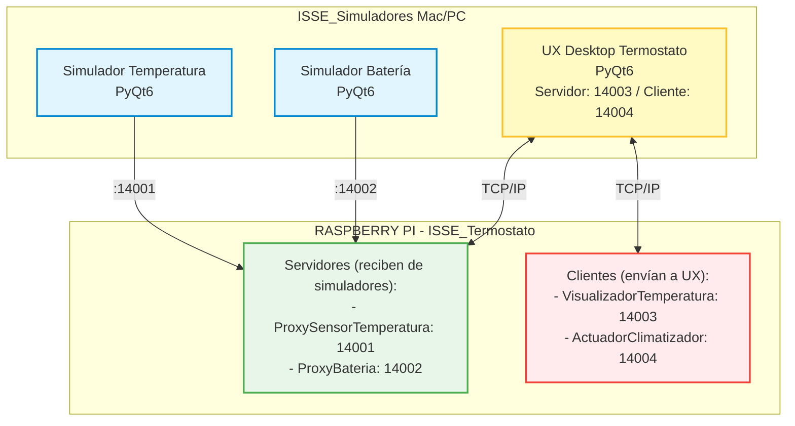

# Documento de Diseño: Proyecto ISSE_Simuladores

## Información del Proyecto

## 1. Descripción General

### 1.1 Propósito

Desarrollar un conjunto de simuladores desktop que permitan realizar testing HIL (Hardware-in-the-Loop) del sistema ISSE_Termostato ejecutándose en Raspberry Pi, sin necesidad de hardware físico de sensores.

### 1.2 Productos de Software

El proyecto contiene **3 productos independientes**:

| Producto | Descripción | Comunicación |
|----------|-------------|--------------|
| **Simulador Temperatura** | Simula sensor de temperatura | Cliente TCP → Puerto 14001 |
| **Simulador Batería** | Simula sensor de batería | Cliente TCP → Puerto 14002 |
| **UX Termostato** | Interfaz de usuario del termostato | Servidor 14003 / Cliente 14004 |

### 1.3 Arquitectura HIL



---

## 2. Creación del Proyecto en PyCharm

### 2.1 Pasos para Crear el Proyecto

1. **Abrir PyCharm** → File → New Project

2. **Configurar proyecto:**
   - **Location:** `/Users/victor/PycharmProjects/ISSE_Simuladores`
   - **Python Interpreter:** Python 3.12+
   - **Create a main.py welcome script:** No (desmarcar)

3. **Crear estructura de carpetas** (ver sección 3)

4. **Configurar Virtual Environment:**
   ```bash
   cd /Users/victor/PycharmProjects/ISSE_Simuladores
   python -m venv venv
   source venv/bin/activate
   pip install -r requirements.txt
   ```

5. **Configurar PyCharm:**
   - Settings → Project → Python Interpreter → Seleccionar venv
   - Settings → Project → Project Structure → Marcar carpetas como Sources

### 2.2 Configuración de Git

```bash
cd /Users/victor/PycharmProjects/ISSE_Simuladores
git init
git remote add origin https://github.com/vvalotto/ISSE_Simuladores.git
```

---

## 3. Estructura del Proyecto

```
ISSE_Simuladores/
│
├── README.md                           # Documentación principal
├── requirements.txt                    # Dependencias globales
├── config.json                         # Configuración de red compartida
├── .env.example                        # Variables de entorno de ejemplo
├── .gitignore
│
├── docs/                               # Documentación general
│   ├── arquitectura.md
│   ├── protocolo_comunicacion.md
│   └── manual_usuario.md
│
├── simulador_temperatura/              # PRODUCTO 1
│   ├── run.py                          # Punto de entrada
│   ├── pytest.ini
│   ├── app/
│   │   ├── __init__.py
│   │   ├── configuracion/
│   │   │   ├── __init__.py
│   │   │   ├── config.py               # Configuración del producto
│   │   │   └── configurador.py         # Singleton
│   │   ├── servicios/
│   │   │   ├── __init__.py
│   │   │   └── ui_principal.py         # Ventana PyQt6
│   │   ├── general/
│   │   │   ├── __init__.py
│   │   │   └── generador_temperatura.py # Lógica de simulación
│   │   └── datos/
│   │       ├── __init__.py
│   │       └── socket_client.py        # Cliente TCP
│   ├── tests/
│   │   ├── __init__.py
│   │   ├── test_generador.py
│   │   └── test_socket.py
│   └── quality/
│       ├── requirements.txt
│       ├── scripts/
│       │   ├── calculate_metrics.py
│       │   ├── validate_gates.py
│       │   └── generate_report.py
│       └── reports/
│
├── simulador_bateria/                  # PRODUCTO 2
│   ├── run.py
│   ├── pytest.ini
│   ├── app/
│   │   ├── __init__.py
│   │   ├── configuracion/
│   │   │   ├── __init__.py
│   │   │   ├── config.py
│   │   │   └── configurador.py
│   │   ├── servicios/
│   │   │   ├── __init__.py
│   │   │   └── ui_principal.py
│   │   ├── general/
│   │   │   ├── __init__.py
│   │   │   ├── simulador_descarga.py   # Lógica de descarga
│   │   │   └── simulador_carga.py      # Lógica de carga
│   │   └── datos/
│   │       ├── __init__.py
│   │       └── socket_client.py
│   ├── tests/
│   │   ├── __init__.py
│   │   ├── test_simulador.py
│   │   └── test_socket.py
│   └── quality/
│       ├── requirements.txt
│       ├── scripts/
│       │   ├── calculate_metrics.py
│       │   ├── validate_gates.py
│       │   └── generate_report.py
│       └── reports/
│
├── ux_termostato/                      # PRODUCTO 3
│   ├── run.py
│   ├── pytest.ini
│   ├── app/
│   │   ├── __init__.py
│   │   ├── configuracion/
│   │   │   ├── __init__.py
│   │   │   ├── config.py
│   │   │   └── configurador.py
│   │   ├── servicios/
│   │   │   ├── __init__.py
│   │   │   └── ui_principal.py         # Ventana principal
│   │   ├── general/
│   │   │   ├── __init__.py
│   │   │   └── estado_termostato.py    # Modelo de estado
│   │   ├── datos/
│   │   │   ├── __init__.py
│   │   │   ├── socket_server.py        # Servidor TCP (recibe)
│   │   │   └── socket_client.py        # Cliente TCP (envía)
│   │   └── widgets/
│   │       ├── __init__.py
│   │       ├── display_lcd.py
│   │       ├── clima_indicator.py
│   │       ├── led_indicator.py
│   │       └── temperature_chart.py
│   ├── tests/
│   │   ├── __init__.py
│   │   ├── test_estado.py
│   │   ├── test_widgets.py
│   │   └── test_networking.py
│   └── quality/
│       ├── requirements.txt
│       ├── scripts/
│       │   ├── calculate_metrics.py
│       │   ├── validate_gates.py
│       │   └── generate_report.py
│       └── reports/
│
├── compartido/                         # Código reutilizable
│   ├── __init__.py
│   ├── widgets/
│   │   ├── __init__.py
│   │   ├── led_indicator.py
│   │   ├── config_panel.py
│   │   └── log_viewer.py
│   ├── networking/
│   │   ├── __init__.py
│   │   ├── base_socket_client.py
│   │   └── base_socket_server.py
│   └── estilos/
│       └── dark_theme.qss
│
└── assets/
    └── icons/
        ├── temperatura.png
        ├── bateria.png
        └── termostato.png
```

---

## 4. Dependencias

### 4.1 Dependencias Globales

**Archivo:** `requirements.txt`

```
# UI Framework
PyQt6==6.7.0
PyQt6-Qt6==6.7.0
PyQt6-sip==13.6.0

# Gráficos
pyqtgraph==0.13.3

# Utilidades
python-dotenv==1.0.0

# Testing
pytest==8.0.0
pytest-qt==4.2.0

# Calidad (para quality/)
radon>=6.0.1
pylint>=3.0.0
pytest-cov>=4.1.0
```

### 4.2 Dependencias de Quality (por producto)

**Archivo:** `<producto>/quality/requirements.txt`

```
radon>=6.0.1
pylint>=3.0.0
pytest>=8.0.0
pytest-cov>=4.1.0
```

---

## 5. Configuración Compartida

### 5.1 Configuración de Red

**Archivo:** `config.json`

```json
{
  "version": "1.0.0",
  "raspberry": {
    "ip": "192.168.1.50",
    "puertos": {
      "sensor_temperatura": 14001,
      "sensor_bateria": 14002,
      "visualizador": 14003,
      "control": 14004
    }
  },
  "simulador_temperatura": {
    "intervalo_envio": 2,
    "temperatura_inicial": 22.0,
    "rango_min": -10.0,
    "rango_max": 40.0,
    "ruido_amplitud": 0.3
  },
  "simulador_bateria": {
    "intervalo_envio": 5,
    "voltaje_max": 4.2,
    "voltaje_min": 3.0,
    "voltaje_inicial": 3.7,
    "tasa_descarga": 0.01,
    "tasa_carga": 0.02
  },
  "ux_termostato": {
    "intervalo_actualizacion": 1000,
    "rango_temp_min": 15.0,
    "rango_temp_max": 35.0,
    "step_temperatura": 0.5,
    "historico_minutos": 10
  }
}
```

### 5.2 Variables de Entorno

**Archivo:** `.env.example`

```bash
# Configuración de red
RASPBERRY_IP=192.168.1.50

# Puertos
PUERTO_TEMPERATURA=14001
PUERTO_BATERIA=14002
PUERTO_VISUALIZADOR=14003
PUERTO_CONTROL=14004

# Modo desarrollo
DEBUG=true
```

---

## 6. Agentes de Calidad

### 6.1 Descripción General

Cada producto tiene su propio ambiente de calidad (`quality/`) con:
- Scripts de análisis de métricas
- Validación de puertas de calidad
- Generación de reportes

### 6.2 Quality Gates (Puertas de Calidad)

| Gate | Métrica | Umbral | Descripción |
|------|---------|--------|-------------|
| **Complejidad** | CC Promedio | ≤ 10 | Complejidad ciclomática |
| **Mantenibilidad** | MI Promedio | > 20 | Índice de mantenibilidad |
| **Pylint** | Score | ≥ 8.0 | Puntuación de calidad |

### 6.3 Grados de Calidad

| Grado | Gates Pasados | Descripción |
|-------|---------------|-------------|
| **A** | 3/3 | Excelente - Sin issues bloqueantes |
| **B** | 2/3 | Bueno - 1 issue bloqueante |
| **C** | 1/3 | Regular - 2 issues bloqueantes |
| **F** | 0/3 | Falla - 3 issues bloqueantes |

### 6.4 Scripts de Calidad

#### A. calculate_metrics.py

**Propósito:** Calcular métricas de calidad del código.

**Métricas calculadas:**
- **Tamaño:** LOC, SLOC, comentarios, líneas en blanco
- **Complejidad:** CC promedio, máximo, distribución por grado
- **Mantenibilidad:** MI promedio, mínimo, módulos bajo umbral
- **Pylint:** Score, errores, warnings, refactor, convención

**Uso:**
```bash
cd simulador_temperatura
python quality/scripts/calculate_metrics.py app
```

**Salida:** JSON en `quality/reports/quality_YYYYMMDD_HHMMSS.json`

#### B. validate_gates.py

**Propósito:** Validar que las métricas cumplan los umbrales.

**Uso:**
```bash
python quality/scripts/validate_gates.py quality/reports/quality_YYYYMMDD_HHMMSS.json
```

**Salida:** Estado PASS/FAIL de cada gate + recomendaciones si hay fallas.

#### C. generate_report.py

**Propósito:** Generar reporte Markdown legible.

**Uso:**
```bash
python quality/scripts/generate_report.py quality/reports/quality_YYYYMMDD_HHMMSS.json
```

**Salida:** Markdown en `quality/reports/quality_report_YYYYMMDD_HHMMSS.md`

### 6.5 Flujo de Calidad

```
┌─────────────────────────────────────────────────────────┐
│ FLUJO DE CALIDAD POR PRODUCTO                           │
└─────────────────────────────────────────────────────────┘

1. Desarrollador modifica código en app/

2. Ejecutar análisis de métricas:
   $ python quality/scripts/calculate_metrics.py app

   → Genera: quality/reports/quality_YYYYMMDD_HHMMSS.json
   → Imprime resumen en consola
   → Return code: 0 (OK), 1 (issues), 2 (error)

3. Validar quality gates:
   $ python quality/scripts/validate_gates.py quality/reports/quality_*.json

   → Muestra estado de cada gate
   → Si hay fallas: muestra recomendaciones
   → Return code: 0 (PASS), 1 (FAIL)

4. Generar reporte (opcional):
   $ python quality/scripts/generate_report.py quality/reports/quality_*.json

   → Genera: quality/reports/quality_report_YYYYMMDD_HHMMSS.md

5. Si hay issues bloqueantes:
   → Refactorizar código según recomendaciones
   → Volver al paso 2
```

### 6.6 Configuración de Quality Gates

**Archivo:** `<producto>/.claude/settings.json`

```json
{
  "quality_gates": {
    "max_complexity": 10,
    "min_maintainability": 20,
    "min_pylint_score": 8.0
  }
}
```

---

## 7. Protocolo de Comunicación

### 7.1 Simuladores → Raspberry (Texto plano)

**Formato:**
```
<valor_float>\n
```

**Ejemplos:**
```
# Temperatura
23.5\n

# Batería (voltaje)
3.85\n

# Valores especiales
ERROR\n      # Simula falla del sensor
-999.0\n     # Sensor desconectado
```

### 7.2 Raspberry → UX Desktop (JSON)

**Formato:**
```json
{
  "timestamp": 1703001234,
  "temp_actual": 22.5,
  "temp_deseada": 24.0,
  "estado_climatizador": "calentando",
  "falla_sensor": false,
  "bateria_baja": false,
  "nivel_bateria": 75,
  "tiempo_en_estado": 120
}
```

### 7.3 UX Desktop → Raspberry (JSON)

**Comandos:**
```json
// Cambiar temperatura deseada
{
  "comando": "set_temp_deseada",
  "valor": 25.0,
  "timestamp": 1703001234
}

// Encender/Apagar
{
  "comando": "power",
  "estado": "on",
  "timestamp": 1703001234
}

// Cambiar modo display
{
  "comando": "set_modo_display",
  "modo": "deseada",
  "timestamp": 1703001234
}
```

---

## 8. Estilo Visual

### 8.1 Tema Oscuro

**Archivo:** `compartido/estilos/dark_theme.qss`

```css
/* Tema oscuro para simular dispositivo embebido */

QMainWindow {
    background-color: #1e293b;
}

QLabel {
    color: #e2e8f0;
    font-size: 14px;
}

QPushButton {
    background-color: #334155;
    color: white;
    border: none;
    border-radius: 8px;
    padding: 10px;
    font-size: 14px;
}

QPushButton:hover {
    background-color: #475569;
}

QPushButton:pressed {
    background-color: #1e293b;
}

/* Botón subir - rojo */
QPushButton#btnSubir {
    background-color: #dc2626;
}

/* Botón bajar - azul */
QPushButton#btnBajar {
    background-color: #2563eb;
}

/* Display LCD */
QWidget#displayLCD {
    background-color: #065f46;
    border: 2px solid #047857;
    border-radius: 12px;
}

/* Slider */
QSlider::groove:horizontal {
    background: #334155;
    height: 8px;
    border-radius: 4px;
}

QSlider::handle:horizontal {
    background: #3b82f6;
    width: 20px;
    margin: -6px 0;
    border-radius: 10px;
}

/* Log viewer */
QTextEdit {
    background-color: #0f172a;
    color: #94a3b8;
    border: 1px solid #334155;
    font-family: 'Courier New', monospace;
    font-size: 12px;
}
```

---

## 9. Testing

### 9.1 Estructura de Tests por Producto

```
<producto>/tests/
├── __init__.py
├── test_<modulo>.py          # Tests unitarios
├── test_socket.py            # Tests de comunicación
└── conftest.py               # Fixtures compartidos
```

### 9.2 Ejecutar Tests

```bash
# Tests de un producto
cd simulador_temperatura
pytest tests/ -v

# Tests con cobertura
pytest tests/ --cov=app --cov-report=html

# Tests de todos los productos
cd ISSE_Simuladores
pytest simulador_temperatura/tests/ simulador_bateria/tests/ ux_termostato/tests/ -v
```

### 9.3 Configuración pytest

**Archivo:** `<producto>/pytest.ini`

```ini
[pytest]
testpaths = tests
python_files = test_*.py
python_classes = Test*
python_functions = test_*
addopts = -v --tb=short
```

---

## 10. Referencias

- **Repositorio ISSE_Termostato:** https://github.com/vvalotto/ISSE_Termostato
- **Documentación PyQt6:** https://www.riverbankcomputing.com/static/Docs/PyQt6/
- **Python Socket:** https://docs.python.org/3/library/socket.html
- **Radon (métricas):** https://radon.readthedocs.io/
- **Pylint:** https://pylint.pycqa.org/

---
