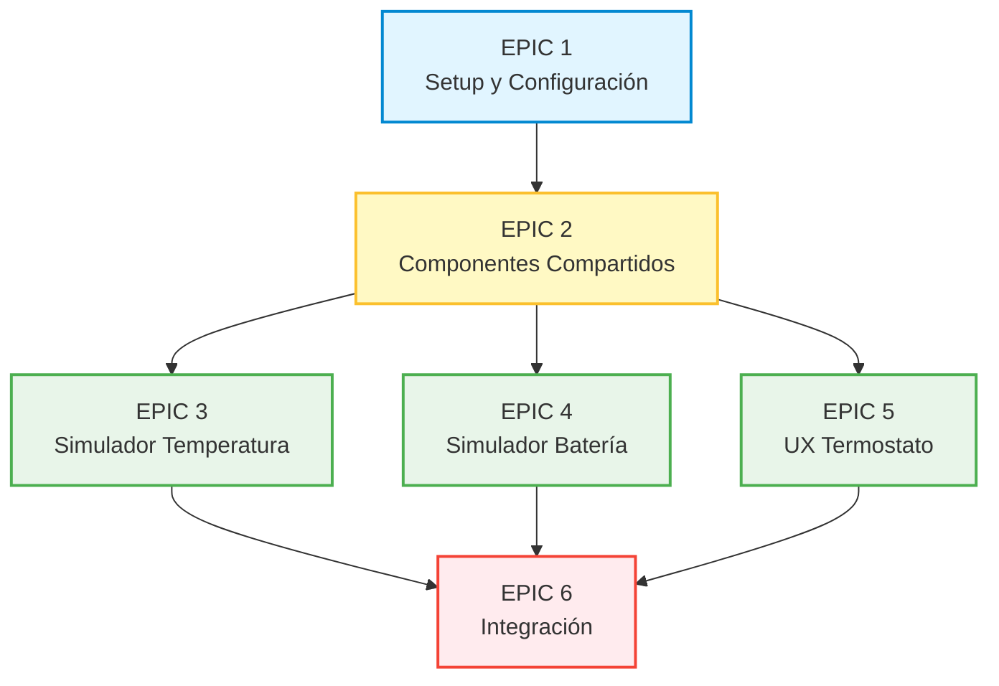

# Estructura de Issues para Jira - Proyecto Simuladores Termostato

## EPIC 1: Setup y Configuración del Proyecto (ST-1)

**Descripción:** Configurar la estructura base del proyecto, dependencias, archivos de configuración y herramientas de calidad.

### Historias de Usuario:

| ID | Historia de Usuario |
|----|---------------------|
| HU-1.1 | Como desarrollador, quiero tener la estructura de carpetas del proyecto definida para organizar el código de los 3 productos y componentes compartidos. |
| HU-1.2 | Como desarrollador, quiero tener un archivo requirements.txt con todas las dependencias para instalar el entorno de desarrollo fácilmente. |
| HU-1.3 | Como desarrollador, quiero tener un archivo config.json centralizado para configurar IPs, puertos y parámetros sin modificar código. |
| HU-1.4 | Como desarrollador, quiero tener un archivo .env.example para documentar las variables de entorno necesarias. |
| HU-1.5 | Como desarrollador, quiero tener pytest.ini configurado en cada producto para ejecutar tests de forma consistente. |
| HU-1.6 | Como desarrollador, quiero tener los scripts de quality (calculate_metrics, validate_gates, generate_report) para medir y validar la calidad del código. |

---

## EPIC 2: Componentes Compartidos (ST-6)

**Descripción:** Implementar los componentes de código reutilizables: clases base de networking y widgets PyQt6.

### Historias de Usuario:

| ID | Historia de Usuario |
|----|---------------------|
| HU-2.1 | Como desarrollador, quiero tener una clase base BaseSocketClient para reutilizar la lógica de conexión TCP en los simuladores. |
| HU-2.2 | Como desarrollador, quiero tener una clase base BaseSocketServer para reutilizar la lógica de servidor TCP en el UX. |
| HU-2.3 | Como desarrollador, quiero tener un widget LEDIndicator reutilizable para mostrar estados binarios (on/off, error/ok) en las interfaces. |
| HU-2.4 | Como desarrollador, quiero tener un widget ConfigPanel reutilizable para permitir configuración de IP y puerto en las interfaces. |
| HU-2.5 | Como desarrollador, quiero tener un widget LogViewer reutilizable para mostrar logs de comunicación en tiempo real. |
| HU-2.6 | Como desarrollador, quiero tener un tema oscuro (dark_theme.qss) para aplicar una apariencia consistente que simule dispositivos embebidos. |

---

## EPIC 3: Simulador de Temperatura (ST-2)

**Descripción:** Desarrollar el simulador de sensor de temperatura con interfaz PyQt6 y comunicación TCP al puerto 14001.

### Historias de Usuario:

| ID | Historia de Usuario |
|----|---------------------|
| HU-3.1 | Como desarrollador, quiero tener la estructura de carpetas del simulador_temperatura para organizar configuración, servicios, lógica y datos. |
| HU-3.2 | Como desarrollador, quiero tener un módulo de configuración (config.py + configurador.py) para gestionar parámetros del simulador. |
| HU-3.3 | Como tester HIL, quiero poder generar valores de temperatura simulados con variación senoidal y ruido para probar el termostato sin hardware real. |
| HU-3.4 | Como tester HIL, quiero que el simulador envíe valores de temperatura por TCP al puerto 14001 para que el termostato los reciba. |
| HU-3.5 | Como usuario, quiero una interfaz gráfica con slider de temperatura y gráfico en tiempo real para controlar y visualizar la simulación. |
| HU-3.6 | Como usuario, quiero poder conectar/desconectar el simulador al termostato con un botón para controlar cuándo se envían datos. |
| HU-3.7 | Como desarrollador, quiero tener tests unitarios del generador y socket para asegurar el correcto funcionamiento. |
| HU-3.8 | Como desarrollador, quiero validar que el código cumple los quality gates para mantener la calidad del producto. |

---

## EPIC 4: Simulador de Batería (ST-3)

**Descripción:** Desarrollar el simulador de sensor de batería con interfaz simple (slider manual) y comunicación TCP al puerto 11000. Arquitectura MVC siguiendo el patrón del simulador de temperatura.

### Fase 1: Dominio y Configuración

| ID | Historia de Usuario |
|----|---------------------|
| SB-1 | Como desarrollador, quiero tener la estructura MVC del simulador_bateria (dominio/, comunicacion/, presentacion/paneles/, factory.py, coordinator.py) para mantener consistencia arquitectónica con simulador_temperatura. |
| SB-2 | Como desarrollador, quiero tener ConfigSimuladorBateria con parámetros (voltaje_min=0, voltaje_max=5, voltaje_inicial=4.2, intervalo_envio_ms) para configurar el simulador. |
| SB-3 | Como desarrollador, quiero tener GeneradorBateria que genere valores de voltaje en rango 0-5V controlado por slider para simular el sensor ADC. |
| SB-4 | Como desarrollador, quiero tener EstadoBateria (dataclass) con voltaje, timestamp y porcentaje_calculado para representar el estado actual. |

### Fase 2: Comunicación

| ID | Historia de Usuario |
|----|---------------------|
| SB-5 | Como desarrollador, quiero tener ClienteBateria que envíe voltaje al puerto 11000 usando EphemeralSocketClient para comunicar con el termostato. |
| SB-6 | Como desarrollador, quiero tener ServicioEnvioBateria que conecte GeneradorBateria con ClienteBateria para automatizar el envío periódico. |

### Fase 3: Presentación MVC

| ID | Historia de Usuario |
|----|---------------------|
| SB-7 | Como usuario, quiero un Panel Estado que muestre el voltaje actual (ej: "3.7V") y porcentaje equivalente para ver el estado de la batería simulada. |
| SB-8 | Como usuario, quiero un Panel Control con slider de voltaje (0-5V) para controlar manualmente el nivel de batería. |
| SB-9 | Como usuario, quiero un Panel Conexión con campos IP/Puerto y botón Conectar/Desconectar para controlar la comunicación TCP. |

### Fase 4: Orquestación

| ID | Historia de Usuario |
|----|---------------------|
| SB-10 | Como desarrollador, quiero ComponenteFactory que cree GeneradorBateria, ClienteBateria, ServicioEnvio y controladores MVC para centralizar la creación de componentes. |
| SB-11 | Como desarrollador, quiero SimuladorCoordinator que conecte señales entre Generador ↔ Controladores ↔ Servicio para desacoplar el ciclo de vida del wiring. |
| SB-12 | Como desarrollador, quiero UIPrincipalCompositor que componga los 3 paneles en la ventana principal para separar layout de lógica. |

### Fase 5: Calidad

| ID | Historia de Usuario |
|----|---------------------|
| SB-13 | Como desarrollador, quiero tests unitarios para dominio, comunicación y controladores MVC para asegurar funcionamiento correcto. |
| SB-14 | Como desarrollador, quiero validar quality gates (pylint ≥8.0, CC ≤10, MI >20) para mantener calidad del código.

---

## EPIC 5: UX Termostato (ST-4)

**Descripción:** Desarrollar la interfaz de usuario desktop que replica el display del termostato, recibe datos y envía comandos.

### Historias de Usuario:

| ID | Historia de Usuario |
|----|---------------------|
| HU-5.1 | Como desarrollador, quiero tener la estructura de carpetas del ux_termostato para organizar configuración, servicios, widgets y datos. |
| HU-5.2 | Como desarrollador, quiero tener un módulo de configuración con parámetros de visualización y rangos de temperatura. |
| HU-5.3 | Como desarrollador, quiero tener un modelo de estado (dataclass) para representar el estado actual del termostato. |
| HU-5.4 | Como usuario, quiero ver un display LCD que muestre la temperatura actual/deseada para visualizar el estado del termostato. |
| HU-5.5 | Como usuario, quiero ver un indicador visual del estado del climatizador (calentando/enfriando/standby) para saber qué está haciendo el sistema. |
| HU-5.6 | Como usuario, quiero ver LEDs de estado (falla sensor, batería baja) para identificar problemas rápidamente. |
| HU-5.7 | Como usuario, quiero ver un gráfico histórico de temperatura para analizar el comportamiento del sistema en el tiempo. |
| HU-5.8 | Como tester HIL, quiero que el UX reciba datos JSON del termostato por TCP (puerto 14003) para visualizar el estado real. |
| HU-5.9 | Como usuario, quiero poder enviar comandos al termostato (cambiar temperatura, encender/apagar) por TCP (puerto 14004) para controlarlo remotamente. |
| HU-5.10 | Como usuario, quiero una interfaz principal que integre todos los widgets para tener una vista completa del termostato. |
| HU-5.11 | Como desarrollador, quiero tener tests unitarios de widgets y networking para asegurar el correcto funcionamiento. |
| HU-5.12 | Como desarrollador, quiero validar que el código cumple los quality gates para mantener la calidad del producto. |

---

## EPIC 6: Integración y Refinamiento (ST-5)

**Descripción:** Integrar los tres productos, validar comunicación con Raspberry Pi y aplicar refinamientos finales.

### Historias de Usuario:

| ID | Historia de Usuario |
|----|---------------------|
| HU-6.1 | Como tester HIL, quiero ejecutar tests de integración entre los 3 productos desktop para validar la comunicación completa. |
| HU-6.2 | Como tester HIL, quiero validar la comunicación real con ISSE_Termostato en Raspberry Pi para asegurar compatibilidad. |
| HU-6.3 | Como tester HIL, quiero ejecutar escenarios HIL completos (cambios temperatura, batería baja, falla sensor) para validar el sistema end-to-end. |
| HU-6.4 | Como usuario, quiero que todas las aplicaciones tengan un estilo visual consistente para una experiencia unificada. |
| HU-6.5 | Como desarrollador, quiero documentación de arquitectura para entender la estructura del sistema. |
| HU-6.6 | Como desarrollador, quiero documentación del protocolo de comunicación para implementar nuevos clientes/servidores. |
| HU-6.7 | Como usuario, quiero un manual de usuario para aprender a usar los simuladores. |
| HU-6.8 | Como desarrollador, quiero validar quality gates en todos los productos para asegurar calidad global. |
| HU-6.9 | Como usuario, quiero un README.md completo para instalar y comenzar a usar el proyecto rápidamente. |
| HU-6.10 | Como desarrollador, quiero tener un release v1.0 tagueado para marcar la primera versión estable. |

---

## Resumen

| Epic | Key | Nombre | Historias |
|------|-----|--------|-----------|
| EPIC 1 | ST-1 | Setup y Configuración del Proyecto | 6 |
| EPIC 2 | ST-6 | Componentes Compartidos | 6 |
| EPIC 3 | ST-2 | Simulador de Temperatura | 8 |
| EPIC 4 | ST-3 | Simulador de Batería | 14 |
| EPIC 5 | ST-4 | UX Termostato | 12 |
| EPIC 6 | ST-5 | Integración y Refinamiento | 10 |
| **TOTAL** | | | **56 historias** |

---

## Dependencias entre Epics

- EPIC 1 debe completarse primero (setup del proyecto)
- EPIC 2 depende de EPIC 1 (necesita estructura de carpetas)
- EPIC 3, 4 y 5 dependen de EPIC 2 (usan componentes compartidos)
- EPIC 3, 4 y 5 pueden desarrollarse en paralelo
- EPIC 6 requiere que EPIC 3, 4 y 5 estén completados

---

## Roles

| Rol | Descripción |
|-----|-------------|
| **Desarrollador** | Quien implementa y mantiene el código |
| **Tester HIL** | Quien ejecuta pruebas Hardware-in-the-Loop |
| **Usuario** | Quien usa las aplicaciones de simulación |

---

## Criterios de Aceptación Globales

Cada historia debe cumplir:
1. Funcionalidad implementada y verificada
2. Tests unitarios pasando (si aplica)
3. Quality gates en grado A o B
4. Código documentado

---

## Historial de Cambios

| Fecha | Cambio |
|-------|--------|
| 2025-12-29 | Versión inicial con 51 historias |
| 2026-01-12 | EPIC 4 (Simulador Batería): Rediseño completo con arquitectura MVC. Eliminadas HU-4.3 y HU-4.4 (modos automáticos). Agregadas 14 historias organizadas en 5 fases (SB-1 a SB-14). UI simplificada a slider manual + panel estado + panel conexión. Puerto corregido de 14002 a 11000. |
