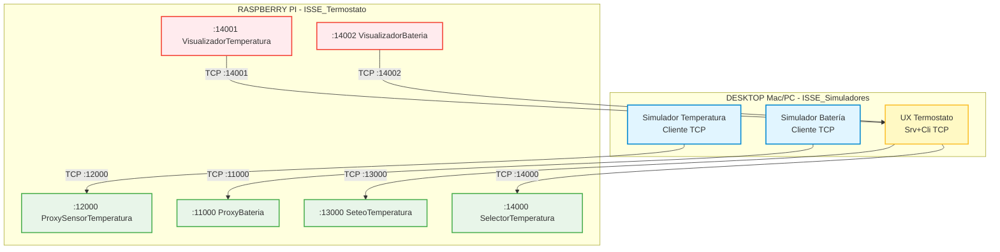
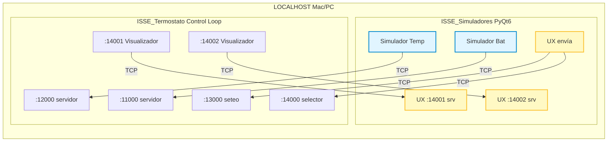
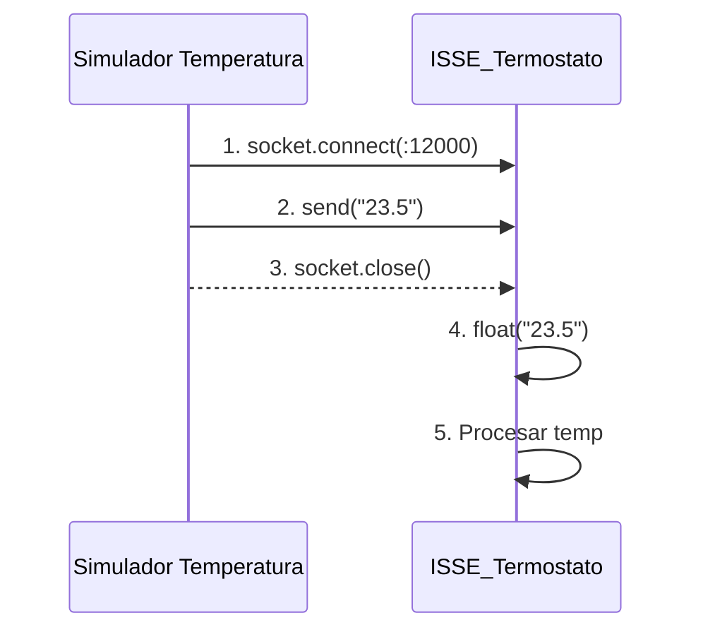
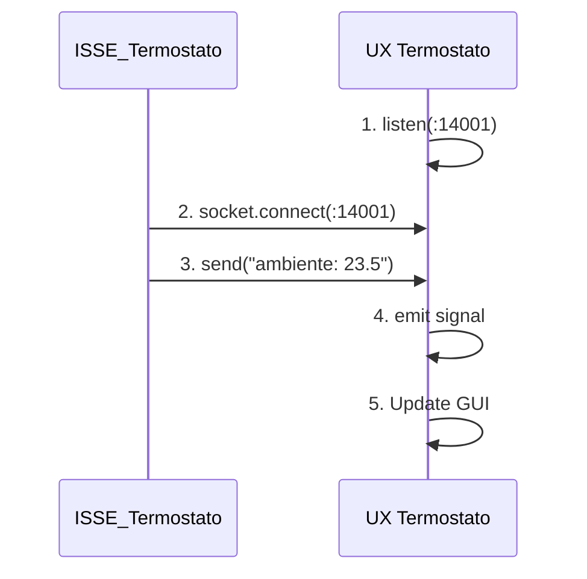
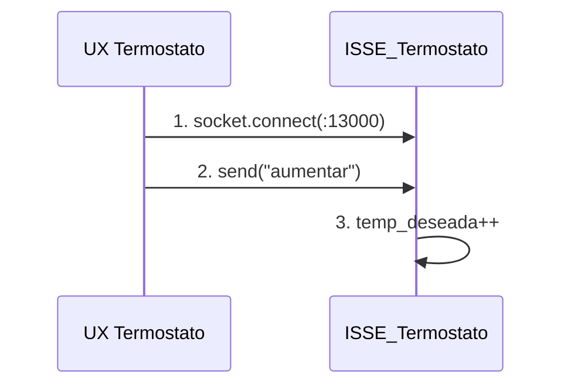

# Especificación de Comunicaciones e Integración

## Sistema HIL: ISSE_Simuladores ↔ ISSE_Termostato

## 1. Visión General

Este documento especifica el protocolo de comunicación TCP entre las aplicaciones de simulación (ISSE_Simuladores) y el sistema de control del termostato (ISSE_Termostato).

### 1.1 Arquitectura del Sistema



### 1.2 Roles de Comunicación

| Componente | Rol | Descripción |
|------------|-----|-------------|
| Simulador Temperatura | **Cliente** | Envía valores de temperatura simulados |
| Simulador Batería | **Cliente** | Envía valores de voltaje simulados |
| UX Termostato | **Servidor + Cliente** | Recibe estado, envía comandos |
| ISSE_Termostato | **Servidor + Cliente** | Recibe datos, envía estado |

---

## 2. Configuración de Puertos

### 2.1 Esquema de Puertos Actual (ISSE_Termostato)

```json
{
  "puertos": {
    "bateria": 11000,
    "temperatura": 12000,
    "seteo_temperatura": 13000,
    "selector_temperatura": 14000
  }
}
```

### 2.2 Matriz de Comunicación

| Puerto | Nombre | Dirección | Protocolo | Servidor | Cliente |
|--------|--------|-----------|-----------|----------|---------|
| 11000 | Batería | Simulador → Termostato | `<float>` | ISSE_Termostato | Simulador Batería |
| 12000 | Temperatura | Simulador → Termostato | `<float>` | ISSE_Termostato | Simulador Temperatura |
| 13000 | Seteo Temp | UX → Termostato | `<comando>` | ISSE_Termostato | UX Termostato |
| 14000 | Selector | UX → Termostato | `<modo>` | ISSE_Termostato | UX Termostato |
| 14001 | Vis. Temp | Termostato → UX | `<estado>` | UX Termostato | ISSE_Termostato |
| 14002 | Vis. Batería | Termostato → UX | `<estado>` | UX Termostato | ISSE_Termostato |

---

## 3. Protocolo de Mensajes

### 3.1 Simulador Temperatura → ISSE_Termostato (Puerto 12000)

**Tipo:** Cliente TCP conecta a servidor
**Formato:** Texto plano UTF-8
**Estructura:** `<valor_float>`

```
Ejemplos válidos:
23.5
-5.0
18.75
0.0
```

**Comportamiento:**
- El cliente crea una conexión nueva por cada envío
- Envía el valor y cierra la conexión
- El servidor espera con `accept()` bloqueante
- Convierte el dato recibido a `float`

**Código de referencia (servidor):**
```python
# ISSE_Termostato/agentes_sensores/proxy_sensor_temperatura.py
datos = conexion.recv(4096)
temperatura = float(datos.decode("utf-8"))
```

### 3.2 Simulador Batería → ISSE_Termostato (Puerto 11000)

**Tipo:** Cliente TCP conecta a servidor
**Formato:** Texto plano UTF-8
**Estructura:** `<valor_float>` (voltaje en V)

```
Ejemplos válidos:
4.2     # Batería llena
3.7     # Batería media
3.0     # Batería baja
2.5     # Batería crítica
```

**Rango esperado:** 0.0V - 5.0V (sensor ADC)

### 3.3 UX Termostato → ISSE_Termostato: Seteo (Puerto 13000)

**Tipo:** Cliente TCP conecta a servidor
**Formato:** Texto plano UTF-8
**Comandos válidos:**

| Comando | Acción |
|---------|--------|
| `aumentar` | Incrementa temperatura deseada +1°C |
| `disminuir` | Decrementa temperatura deseada -1°C |

**Código de referencia (servidor):**
```python
# ISSE_Termostato/agentes_sensores/proxy_seteo_temperatura.py
datos = conexion.recv(4096)
diferencia = str(datos.decode("utf-8"))  # "aumentar" o "disminuir"
```

### 3.4 UX Termostato → ISSE_Termostato: Selector (Puerto 14000)

**Tipo:** Cliente TCP conecta a servidor
**Formato:** Texto plano UTF-8
**Modos válidos:**

| Modo | Display muestra |
|------|-----------------|
| `ambiente` | Temperatura actual sensada |
| `deseada` | Temperatura objetivo configurada |

**Comportamiento especial:**
- El servidor mantiene conexión persistente
- Usa timeouts no-bloqueantes (1.0s accept, 0.1s recv)
- Recuerda el último estado si no hay datos nuevos

### 3.5 ISSE_Termostato → UX Termostato: Visualización (Puertos 14001, 14002)

**Tipo:** ISSE_Termostato actúa como cliente
**Formato:** Texto plano UTF-8
**Estructura:** `<etiqueta>: <valor>`

**Puerto 14001 - Temperatura:**
```
ambiente: 23.5
deseada: 25.0
```

**Puerto 14002 - Batería:**
```
75.5
```

---

## 4. Características Técnicas

### 4.1 Opciones de Socket

```python
# Permite reutilizar puerto inmediatamente después de cerrar
servidor.setsockopt(socket.SOL_SOCKET, socket.SO_REUSEADDR, 1)
```

### 4.2 Timeouts

| Componente | Accept Timeout | Recv Timeout |
|------------|----------------|--------------|
| ProxySensorTemperatura | Bloqueante | Bloqueante |
| ProxyBateria | Bloqueante | Bloqueante |
| SeteoTemperatura | 2.0s | 5.0s |
| SelectorTemperatura | 1.0s | 0.1s |

### 4.3 Manejo de Errores

**Excepciones a capturar:**
- `ConnectionError` - Conexión rechazada o perdida
- `socket.timeout` - Timeout expirado
- `OSError` - Error de sistema (puerto en uso, etc.)
- `ValueError` - Conversión de datos fallida

### 4.4 Encoding

- **Codificación:** UTF-8
- **Envío:** `bytes(mensaje.encode("utf-8"))` o `bytes(mensaje.encode())`
- **Recepción:** `datos.decode("utf-8")`

---

## 5. Configuración para Pruebas Locales

### 5.1 Escenario de Prueba

Para desarrollo y testing, ambos sistemas corren en la misma máquina:



### 5.2 Configuración Local

**Archivo:** `config.json` (ISSE_Simuladores)
```json
{
  "raspberry_pi": {
    "ip": "127.0.0.1"
  },
  "puertos": {
    "temperatura": 12000,
    "bateria": 11000,
    "seteo_temperatura": 13000,
    "selector_temperatura": 14000,
    "visualizador_temperatura": 14001,
    "visualizador_bateria": 14002
  }
}
```

**Archivo:** `.env` (ISSE_Simuladores)
```bash
RASPBERRY_IP=127.0.0.1
DEBUG=true
```

### 5.3 Orden de Inicio

1. **Primero:** Iniciar ISSE_Termostato (crea los servidores)
   ```bash
   cd /Users/victor/PycharmProjects/ISSE_Termostato
   python main.py
   ```

2. **Segundo:** Iniciar servidores UX (puertos 14001, 14002)
   ```bash
   cd /Users/victor/PycharmProjects/simapp_termostato
   python ux_termostato/run.py
   ```

3. **Tercero:** Iniciar simuladores (clientes)
   ```bash
   python simulador_temperatura/run.py
   python simulador_bateria/run.py
   ```

### 5.4 Verificación de Puertos

```bash
# Ver puertos en uso
lsof -i :11000
lsof -i :12000
lsof -i :13000
lsof -i :14000
lsof -i :14001
lsof -i :14002

# Netcat para pruebas manuales
echo "23.5" | nc localhost 12000  # Enviar temperatura
nc -l 14001                        # Escuchar visualizador
```

---

## 6. Implementación en ISSE_Simuladores

### 6.1 BaseSocketClient (compartido/networking/)

Clase base para todos los clientes TCP:

```python
class BaseSocketClient(QObject):
    """Cliente TCP base con señales PyQt6."""

    # Señales
    connected = pyqtSignal()
    disconnected = pyqtSignal()
    error_occurred = pyqtSignal(str)

    def __init__(self, host: str, port: int):
        self._host = host
        self._port = port
        self._socket = None

    def connect_to_server(self) -> bool:
        """Conecta al servidor."""
        pass

    def send_data(self, data: str) -> bool:
        """Envía datos al servidor."""
        pass

    def disconnect(self):
        """Cierra la conexión."""
        pass
```

### 6.2 BaseSocketServer (compartido/networking/)

Clase base para servidores TCP (UX Termostato):

```python
class BaseSocketServer(QObject):
    """Servidor TCP base con señales PyQt6."""

    # Señales
    client_connected = pyqtSignal(str)
    client_disconnected = pyqtSignal()
    data_received = pyqtSignal(str)
    error_occurred = pyqtSignal(str)

    def __init__(self, host: str, port: int):
        self._host = host
        self._port = port
        self._server_socket = None
        self._running = False

    def start(self):
        """Inicia el servidor en hilo separado."""
        pass

    def stop(self):
        """Detiene el servidor."""
        pass
```

### 6.3 Clientes Específicos

| Clase | Hereda de | Puerto | Función |
|-------|-----------|--------|---------|
| `TemperatureClient` | `BaseSocketClient` | 12000 | Envía `<float>` |
| `BatteryClient` | `BaseSocketClient` | 11000 | Envía `<float>` |
| `SeteoClient` | `BaseSocketClient` | 13000 | Envía `aumentar/disminuir` |
| `SelectorClient` | `BaseSocketClient` | 14000 | Envía `ambiente/deseada` |

### 6.4 Servidores Específicos

| Clase | Hereda de | Puerto | Función |
|-------|-----------|--------|---------|
| `TemperatureVisualizerServer` | `BaseSocketServer` | 14001 | Recibe estado temp |
| `BatteryVisualizerServer` | `BaseSocketServer` | 14002 | Recibe estado batería |

---

## 7. Flujos de Comunicación

### 7.1 Flujo: Envío de Temperatura Simulada



### 7.2 Flujo: Recepción de Estado en UX



### 7.3 Flujo: Comando desde UX



---

## 8. Consideraciones de Integración

### 8.1 Threading

- Los sockets **no deben bloquear** el hilo principal de PyQt6
- Usar `QThread` o `threading.Thread` para operaciones de red
- Comunicar resultados vía señales PyQt6

### 8.2 Reconexión

- Los simuladores deben manejar desconexiones gracefully
- Implementar lógica de reconexión con backoff exponencial
- Mostrar estado de conexión en la UI (LED indicator)

### 8.3 Validación

- Validar datos antes de enviar (rango, tipo)
- Manejar datos corruptos en recepción
- Loggear errores de comunicación

### 8.4 Testing

- Usar mocks de socket para tests unitarios
- Tests de integración con servidor real
- Simular latencia y pérdida de conexión

---

## 9. Referencias

- **ISSE_Termostato:** `/Users/victor/PycharmProjects/ISSE_Termostato/`
- **ISSE_Simuladores:** `/Users/victor/PycharmProjects/simapp_termostato/`
- **Configuración Termostato:** `ISSE_Termostato/termostato.json`
- **Configuración Simuladores:** `simapp_termostato/config.json`

---

## Historial de Cambios

| Versión | Fecha | Descripción |
|---------|-------|-------------|
| 1.0 | 2025-12-30 | Versión inicial basada en análisis de ISSE_Termostato |
