# Arquitectura del Simulador de Batería

## Visión General

El Simulador de Batería es un cliente TCP que genera valores de voltaje simulados (modo manual por slider) y los envía al servidor ISSE_Termostato en el puerto 11000. Implementa una arquitectura en capas con patrones MVC, Factory y Coordinator.

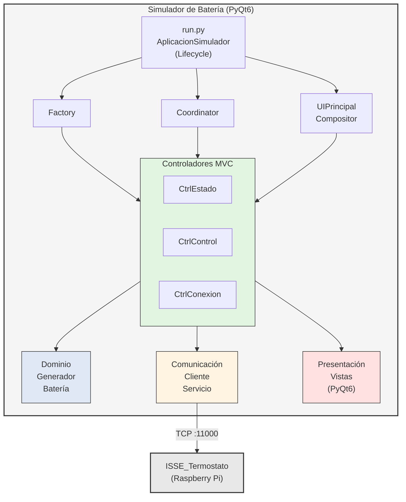

---

## Estructura de Módulos

```
simulador_bateria/
├── run.py                          # Entry point + AplicacionSimulador
├── app/
│   ├── factory.py                  # ComponenteFactory
│   ├── coordinator.py              # SimuladorCoordinator
│   │
│   ├── configuracion/              # Capa de configuración
│   │   ├── config.py               # ConfigManager, ConfigSimuladorBateria
│   │   └── constantes.py           # Valores por defecto
│   │
│   ├── dominio/                    # Capa de lógica de negocio
│   │   ├── estado_bateria.py       # Modelo de datos (dataclass)
│   │   └── generador_bateria.py    # Generador de valores (modo manual)
│   │
│   ├── comunicacion/               # Capa de comunicación TCP
│   │   ├── cliente_bateria.py      # Cliente TCP
│   │   └── servicio_envio.py       # Integración gen+cliente
│   │
│   └── presentacion/               # Capa de presentación (UI)
│       ├── ui_compositor.py        # UIPrincipalCompositor
│       │
│       └── paneles/                # Arquitectura MVC
│           ├── base.py             # ModeloBase, VistaBase, ControladorBase
│           ├── estado/             # Panel Estado
│           │   ├── modelo.py       # PanelEstadoModelo
│           │   ├── vista.py        # PanelEstadoVista
│           │   └── controlador.py  # PanelEstadoControlador
│           ├── control/            # Panel Control Voltaje
│           │   ├── modelo.py       # ControlPanelModelo
│           │   ├── vista.py        # ControlPanelVista
│           │   └── controlador.py  # ControlPanelControlador
│           └── conexion/           # Panel Conexión
│               ├── modelo.py       # ConexionPanelModelo
│               ├── vista.py        # ConexionPanelVista
│               └── controlador.py  # ConexionPanelControlador
│
├── tests/                          # Tests unitarios (275 tests, 96% coverage)
├── quality/                        # Scripts de calidad
└── docs/                           # Documentación
```

---

## Patrones de Diseño

### 1. Factory Pattern

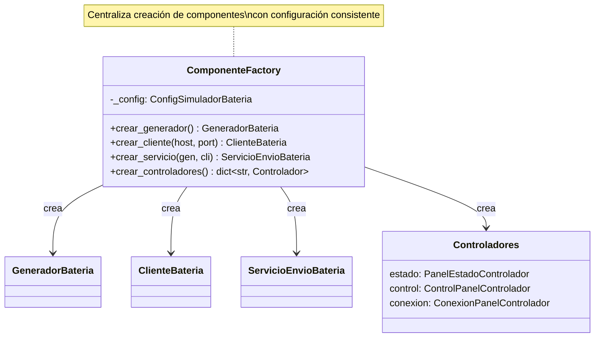

**Responsabilidad:** Centraliza la creación de todos los componentes, permitiendo configuración consistente y facilitando testing con mocks.

### 2. Coordinator Pattern

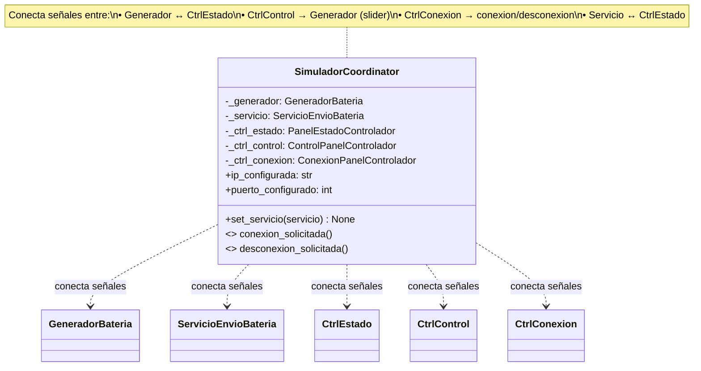

**Responsabilidad:** Gestiona todas las conexiones de señales PyQt6 entre componentes, desacoplando la lógica de conexión del ciclo de vida.

**Diferencia con simulador_temperatura:** No hay panel gráfico, el control es solo manual (slider).

### 3. Compositor Pattern

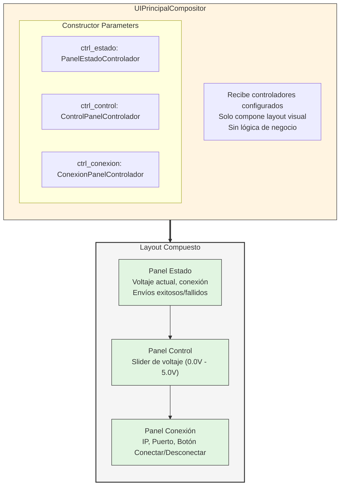

### 4. MVC Pattern (Model-View-Controller)

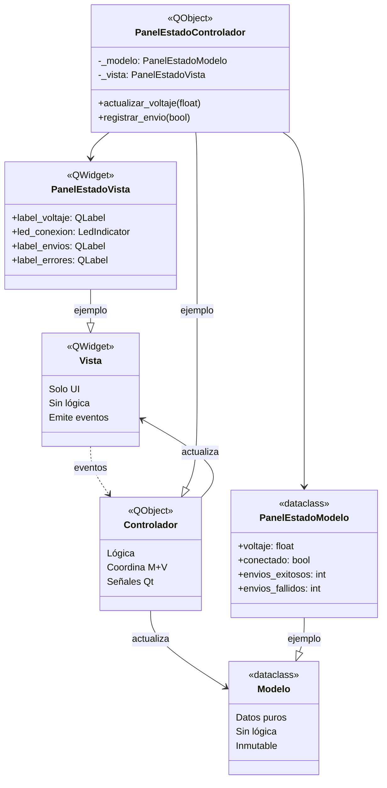

---

## Diagrama de Clases: Capa de Dominio

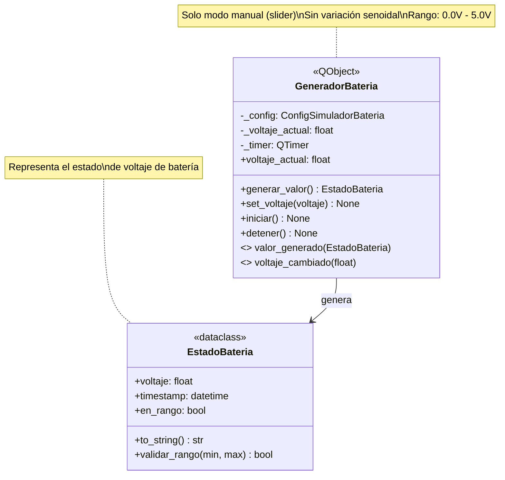

**Diferencias con simulador_temperatura:**
- No hay `VariacionSenoidal` (no hay modo automático)
- Solo control manual por slider
- Rango: 0.0V - 5.0V (voltaje de batería)

---

## Diagrama de Clases: Capa de Comunicación

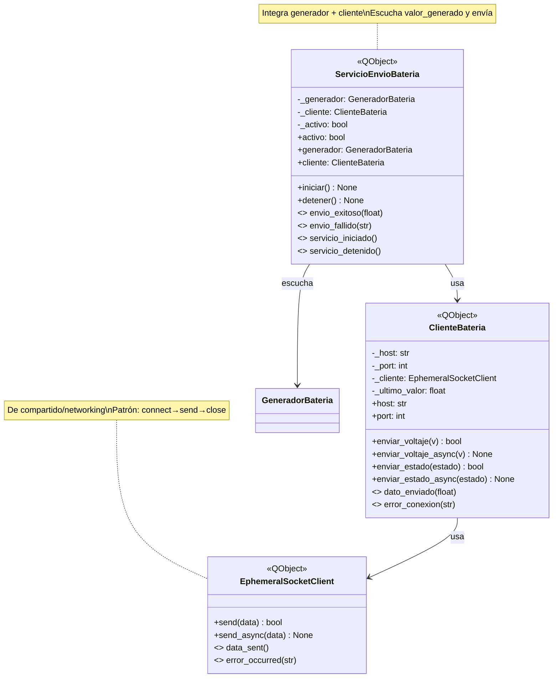

**Protocolo:** Puerto 11000, formato `"<voltaje>"` (ej: `"4.20"`), patrón efímero.

---

## Diagrama de Clases: Capa de Presentación (MVC)

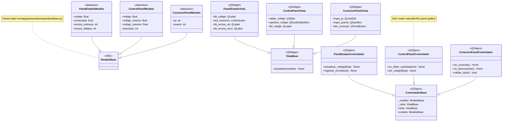

**Nota:** No hay panel gráfico (a diferencia del simulador_temperatura).

---

## Diagrama de Secuencia: Inicio de Aplicación

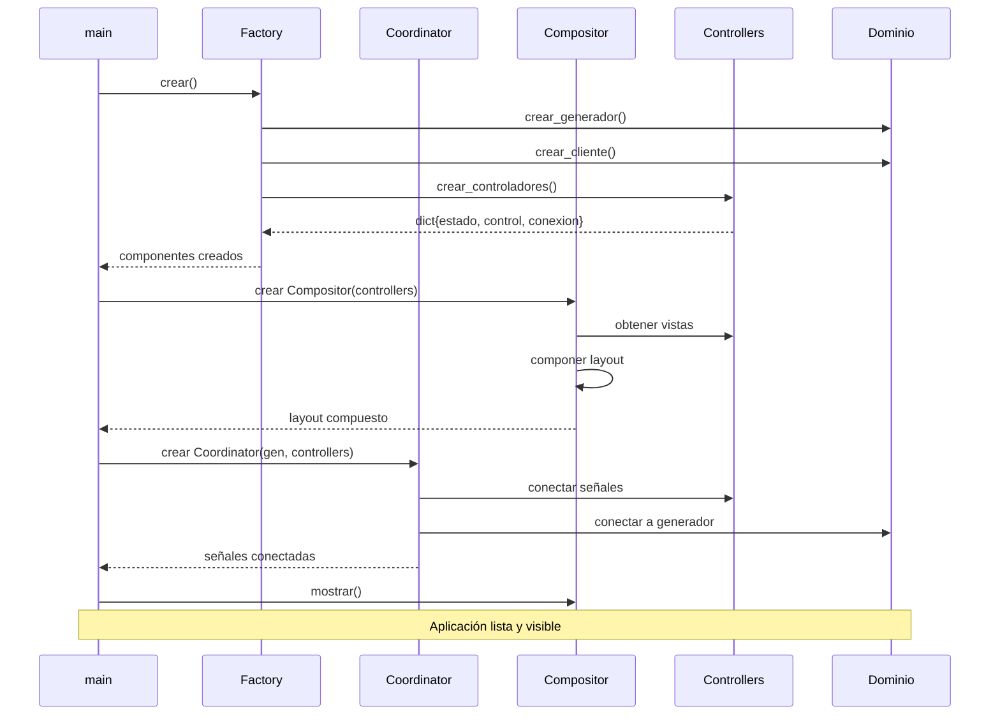

---

## Diagrama de Secuencia: Flujo de Conexión

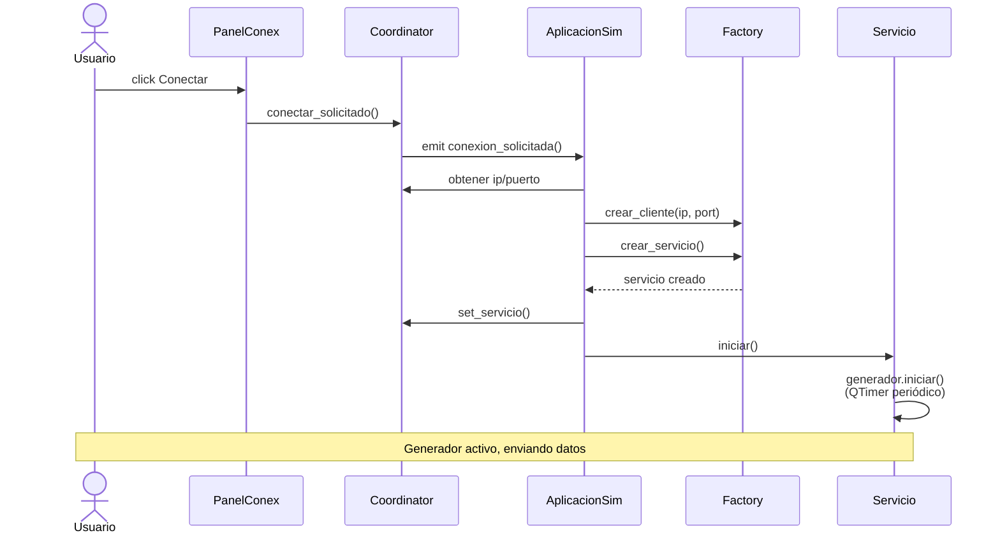

---

## Diagrama de Secuencia: Envío Automático

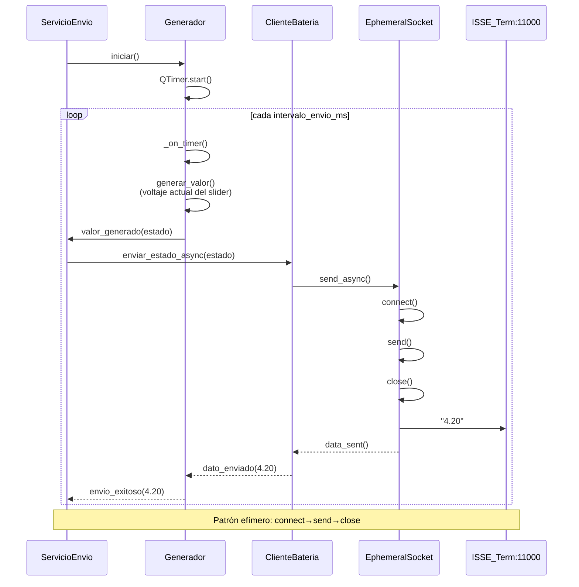

---

## Diagrama de Secuencia: Control Manual de Voltaje

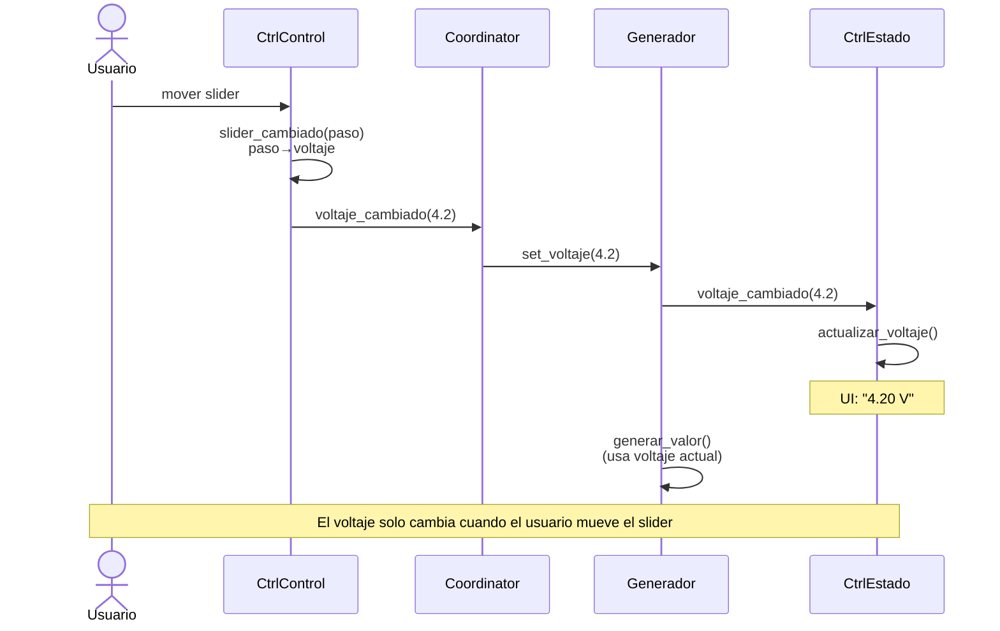

---

## Protocolo de Comunicación

### Formato del Mensaje

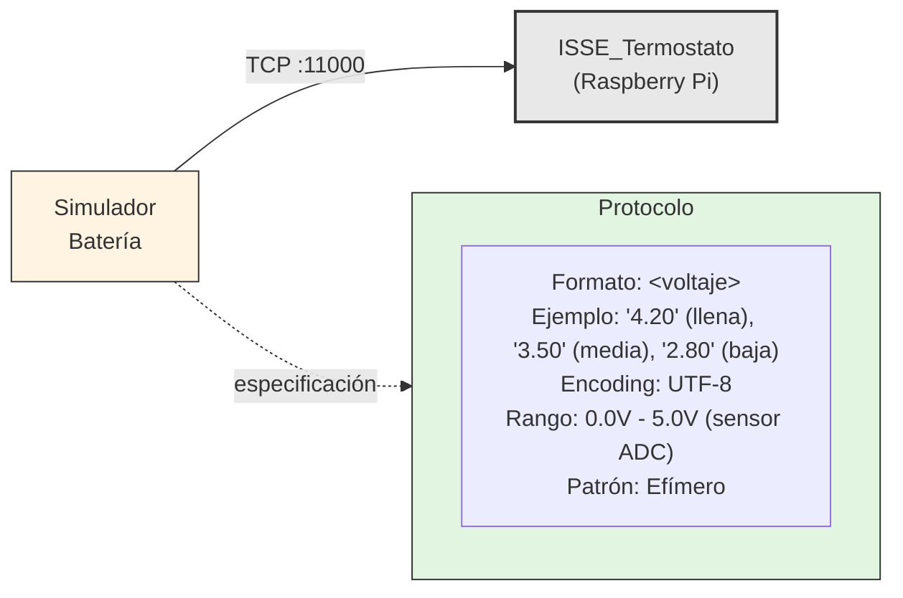

---

## Señales Qt (Observer Pattern)

| Componente | Señal | Parámetro | Descripción |
|------------|-------|-----------|-------------|
| `GeneradorBateria` | `valor_generado` | `EstadoBateria` | Nuevo valor generado |
| `GeneradorBateria` | `voltaje_cambiado` | `float` | Voltaje cambió |
| `ClienteBateria` | `dato_enviado` | `float` | Envío exitoso |
| `ClienteBateria` | `error_conexion` | `str` | Error de conexión |
| `ServicioEnvioBateria` | `envio_exitoso` | `float` | Dato enviado OK |
| `ServicioEnvioBateria` | `envio_fallido` | `str` | Error en envío |
| `ServicioEnvioBateria` | `servicio_iniciado` | - | Servicio iniciado |
| `ServicioEnvioBateria` | `servicio_detenido` | - | Servicio detenido |
| `SimuladorCoordinator` | `conexion_solicitada` | - | Usuario solicita conectar |
| `SimuladorCoordinator` | `desconexion_solicitada` | - | Usuario solicita desconectar |
| `ControlPanelControlador` | `voltaje_cambiado` | `float` | Slider modificado |
| `ConexionPanelControlador` | `conectar_solicitado` | - | Botón conectar pulsado |
| `ConexionPanelControlador` | `desconectar_solicitado` | - | Botón desconectar pulsado |

---

## Dependencias entre Módulos

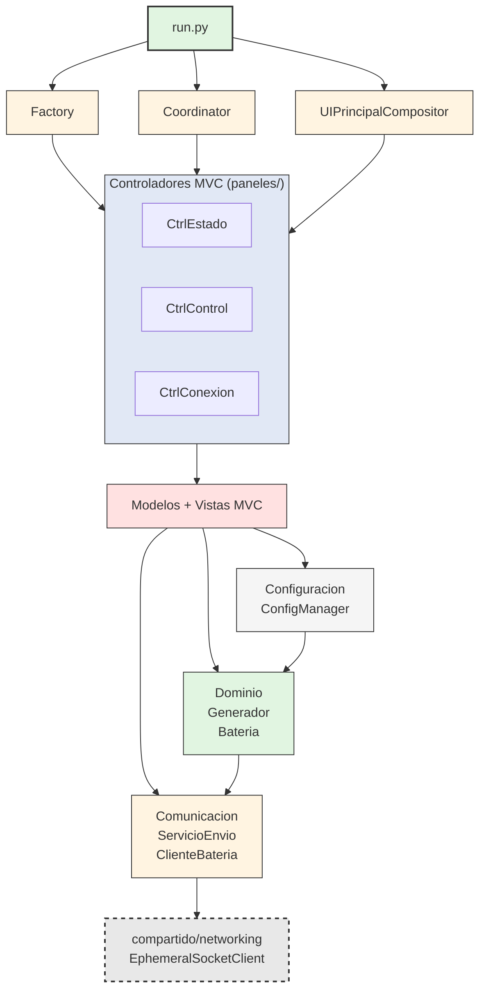

---

## Métricas de Calidad

| Métrica | Valor | Umbral | Estado |
|---------|-------|--------|--------|
| **Complejidad Ciclomática** | 1.40 | ≤ 10 | ✅ OK |
| **Índice Mantenibilidad** | 80.98 | > 20 | ✅ OK |
| **Pylint Score** | 9.94/10 | ≥ 8.0 | ✅ OK |
| **Coverage** | 96% | - | ✅ Excelente |
| **Tests** | 275 | - | ✅ Pasando |
| **Archivos Python** | 19 | - | - |
| **Funciones** | 69 | - | - |
| **SLOC** | 453 | - | - |

### Evaluación SOLID

| Principio | Calificación | Estado |
|-----------|--------------|--------|
| **Single Responsibility** | 10/10 | ✅ Excelente |
| **Open/Closed** | 9/10 | ✅ Muy bueno |
| **Liskov Substitution** | 10/10 | ✅ Excelente |
| **Interface Segregation** | 10/10 | ✅ Excelente |
| **Dependency Inversion** | 9/10 | ✅ Muy bueno |
| **TOTAL SOLID** | **9.6/10** | ✅ Sobresaliente |

---

## Comparación con Simulador de Temperatura

| Aspecto | Simulador Temperatura | Simulador Batería |
|---------|----------------------|-------------------|
| **Puerto TCP** | 12000 | 11000 |
| **Modos** | Manual + Automático (senoidal) | Solo Manual |
| **Rango** | -40°C a 85°C | 0.0V - 5.0V |
| **Componente dominio** | VariacionSenoidal | (No aplica) |
| **Panel Gráfico** | ✅ Sí (pyqtgraph) | ❌ No |
| **Paneles MVC** | 4 (Estado, Control, Gráfico, Conexión) | 3 (Estado, Control, Conexión) |
| **Control UI** | Sliders + Radio (Manual/Auto) | Solo Slider |
| **Arquitectura** | MVC + Factory/Coordinator | MVC + Factory/Coordinator |
| **Tests** | 283 | 275 |
| **Coverage** | ~95% | 96% |
| **Pylint** | 9.52 | 9.94 |
| **CC** | 1.36 | 1.40 |
| **MI** | 70.10 | 80.98 |

**Conclusión:** Ambos simuladores comparten la misma arquitectura base (MVC + Factory/Coordinator), con el simulador de batería siendo más simple al no tener modo automático ni gráfico. El simulador de batería tiene mejores métricas de calidad (Pylint 9.94, MI 80.98).

---

## Decisiones de Diseño

### ¿Por qué solo modo manual sin variación automática?

**Alternativas consideradas:**

1. **Modo automático con variación senoidal** - Similar al simulador_temperatura
2. **Modo manual con slider** - Solo control directo del usuario (seleccionada)
3. **Modo híbrido** - Manual + patrones de descarga predefinidos

**Decisión:** Opción 2 - Solo modo manual con slider

**Justificación:**

- **Naturaleza del sensor**: El voltaje de batería cambia lentamente en el sistema real (horas/días, no segundos)
- **Uso en testing**: Los casos de prueba requieren voltajes específicos controlados (batería llena 5.0V, media 3.5V, baja 2.8V)
- **Simplicidad**: No se requiere simular patrones de descarga complejos para validar el termostato
- **Consistencia con objetivo**: El simulador solo necesita probar umbrales de alerta, no dinámicas de batería

**Trade-offs:**

- ✅ **Ventajas**: Más simple (menos código), control preciso de voltaje, sin clase VariacionSenoidal
- ⚠️ **Desventajas**: No simula descarga realista de batería (no es necesario para este sistema)

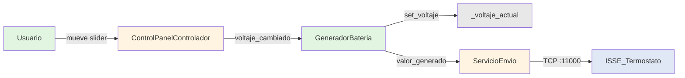

---

### ¿Por qué no incluir panel gráfico?

**Alternativas consideradas:**

1. **Con panel gráfico pyqtgraph** - Similar al simulador_temperatura
2. **Sin panel gráfico** - Solo valores numéricos (seleccionada)
3. **Gráfico simple de barra** - Indicador visual sin historial

**Decisión:** Opción 2 - Sin panel gráfico

**Justificación:**

- **Voltaje estático**: En modo manual, el voltaje no cambia hasta que el usuario mueve el slider
- **Sin valor histórico**: No hay variación temporal que justifique una gráfica de tendencia
- **Feedback suficiente**: El label numérico ("4.20 V") es más preciso y útil que una visualización gráfica
- **Economía de recursos**: Menos dependencias (no requiere pyqtgraph), UI más ligera

**Trade-offs:**

- ✅ **Ventajas**: UI más simple, sin dependencia pyqtgraph, menor consumo de recursos
- ⚠️ **Desventajas**: Sin validación visual de valores (no es necesario para voltaje estático)

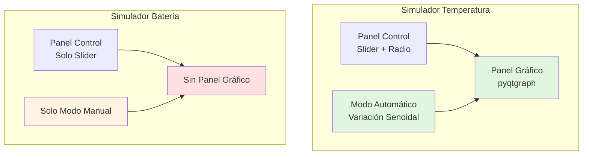

---

### ¿Por qué separar GeneradorBateria de ServicioEnvio?

**Alternativas consideradas:**

1. **Clase única SimuladorBateria** - Genera y envía en un solo componente
2. **Separación en capas** - Generador en dominio, ServicioEnvio en comunicación (seleccionada)

**Decisión:** Opción 2 - Separación en capas (siguiendo patrón de temperatura)

**Justificación:**

- **Consistencia arquitectónica**: Mismo patrón que simulador_temperatura facilita mantenimiento
- **Testing aislado**: Generador se prueba sin red (96% coverage)
- **Adherencia a SRP**: Generador solo gestiona voltaje, ServicioEnvio solo envía
- **Reutilización**: ServicioEnvio podría usarse con otros generadores futuros

**Trade-offs:**

- ✅ **Ventajas**: Alta testabilidad, bajo acoplamiento, consistencia con temperatura
- ⚠️ **Desventajas**: Mayor complejidad estructural que una clase única (justificado por testing)

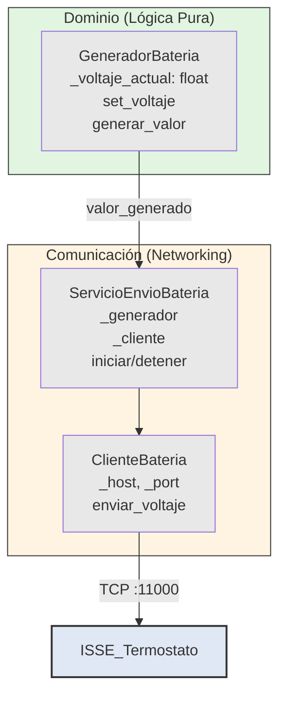

---

### ¿Por qué patrón Factory + Coordinator idéntico a temperatura?

**Alternativas consideradas:**

1. **Creación directa en run.py** - Instanciar componentes sin abstracción
2. **Solo Factory** - Factory sin Coordinator, señales en constructor
3. **Factory + Coordinator** - Separar creación de orquestación (seleccionada)

**Decisión:** Opción 3 - Factory + Coordinator (arquitectura de referencia)

**Justificación:**

- **Arquitectura de referencia**: Documentado en ADR-005 como patrón estándar del proyecto
- **Reutilización de concepto**: Mismo patrón mental para todos los simuladores
- **Testabilidad**: Factory facilita mocking, Coordinator centraliza señales
- **Mantenibilidad**: Cambios en orquestación solo afectan a Coordinator

**Trade-offs:**

- ✅ **Ventajas**: Consistencia entre productos, alta testabilidad, bajo acoplamiento
- ⚠️ **Desventajas**: Dos clases adicionales (overhead aceptable para 3 paneles MVC)

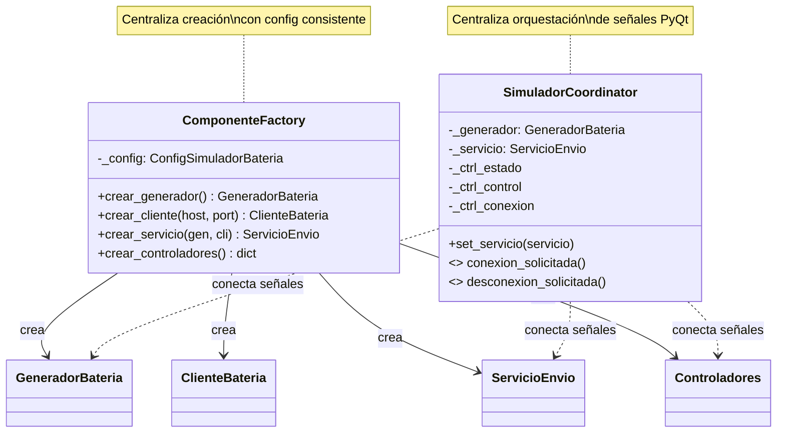

---

## Referencias

- [ESPECIFICACION_COMUNICACIONES.md](../../docs/ESPECIFICACION_COMUNICACIONES.md)
- [ADR-001: Separación Socket Clients](../../docs/ADR-001-separacion-socket-clients.md)
- [Reporte de Calidad de Diseño](reporte_calidad_diseno.md)
- [Plan de Tests Unitarios](plan_tests_unitarios.md)

---

**Versión:** 1.0
**Fecha:** 2026-01-16
**Estado:** Pre-release (Ready for v1.0)
