# Arquitectura del Simulador de Temperatura

## Visión General

El Simulador de Temperatura es un cliente TCP que genera valores de temperatura simulados y los envía al servidor ISSE_Termostato en el puerto 12000. Implementa una arquitectura en capas con patrones MVC, Factory y Coordinator.

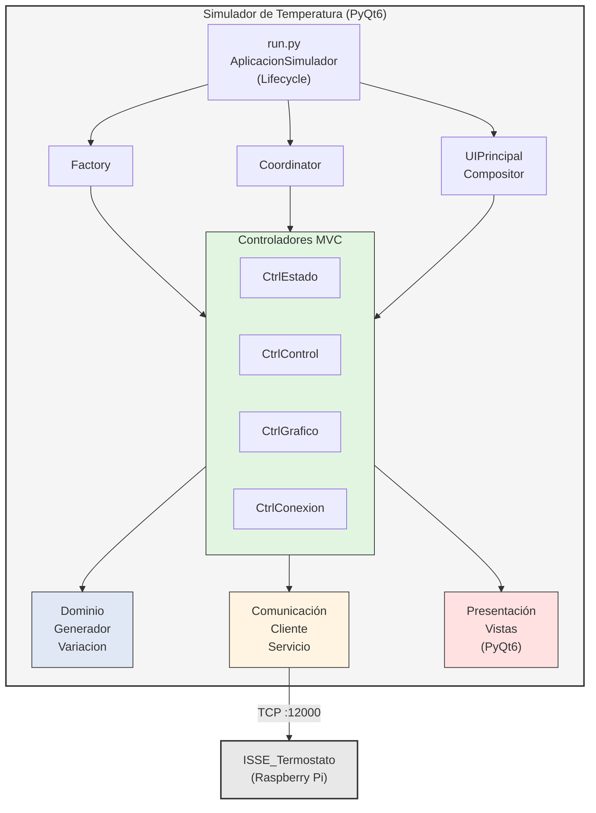

---

## Estructura de Módulos

```
simulador_temperatura/
├── run.py                          # Entry point + AplicacionSimulador
├── app/
│   ├── factory.py                  # ComponenteFactory
│   ├── coordinator.py              # SimuladorCoordinator
│   │
│   ├── configuracion/              # Capa de configuración
│   │   ├── config.py               # ConfigManager
│   │   └── constantes.py           # Valores por defecto
│   │
│   ├── dominio/                    # Capa de lógica de negocio
│   │   ├── estado_temperatura.py   # Modelo de datos
│   │   ├── variacion_senoidal.py   # Algoritmo de variación
│   │   └── generador_temperatura.py # Generador de valores
│   │
│   ├── comunicacion/               # Capa de comunicación TCP
│   │   ├── interfaces.py           # IClienteTemperatura (typing.Protocol)
│   │   ├── cliente_temperatura.py  # Cliente TCP
│   │   └── servicio_envio.py       # Integración gen+cliente
│   │
│   └── presentacion/               # Capa de presentación (UI)
│       ├── ui_compositor.py        # UIPrincipalCompositor
│       ├── control_temperatura.py  # Widget control (legacy)
│       ├── grafico_temperatura.py  # Widget gráfico (legacy)
│       ├── ui_principal.py         # Ventana principal (legacy)
│       │
│       └── paneles/                # Arquitectura MVC
│           ├── base.py             # ModeloBase, VistaBase, ControladorBase
│           ├── estado/             # Panel Estado
│           │   ├── modelo.py       # EstadoSimulacion
│           │   ├── vista.py        # PanelEstadoVista
│           │   └── controlador.py  # PanelEstadoControlador
│           ├── control_temperatura/ # Panel Control
│           │   ├── modelo.py       # ParametrosControl
│           │   ├── vista.py        # ControlTemperaturaVista
│           │   └── controlador.py  # ControlTemperaturaControlador
│           ├── grafico/            # Panel Gráfico
│           │   ├── modelo.py       # DatosGrafico
│           │   ├── vista.py        # GraficoTemperaturaVista
│           │   └── controlador.py  # GraficoControlador
│           └── conexion/           # Panel Conexión
│               ├── modelo.py       # ConfiguracionConexion
│               ├── vista.py        # PanelConexionVista
│               └── controlador.py  # PanelConexionControlador
│
├── tests/                          # Tests unitarios (283 tests)
├── quality/                        # Scripts de calidad
└── docs/                           # Documentación
```

---

## Patrones de Diseño

### 1. Factory Pattern

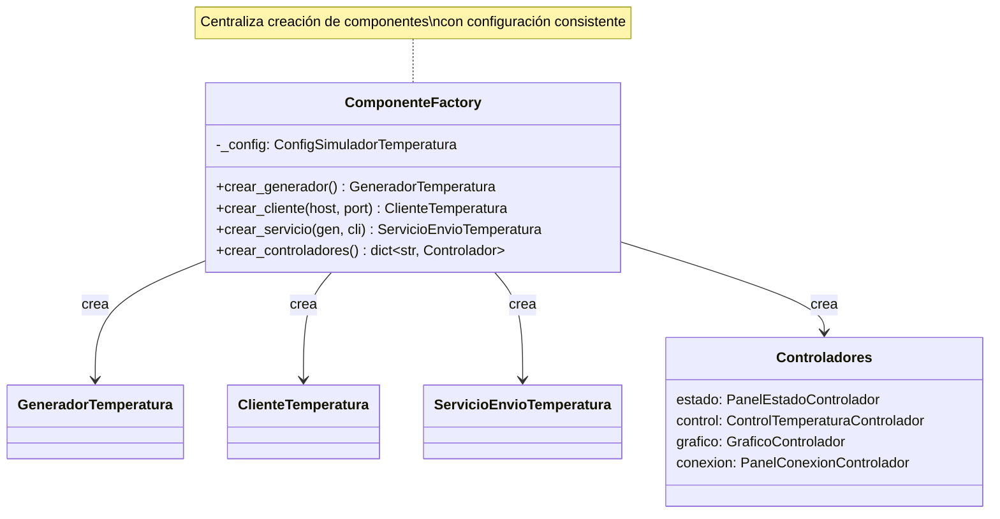

**Responsabilidad:** Centraliza la creación de todos los componentes, permitiendo configuración consistente y facilitando testing con mocks.

### 2. Coordinator Pattern

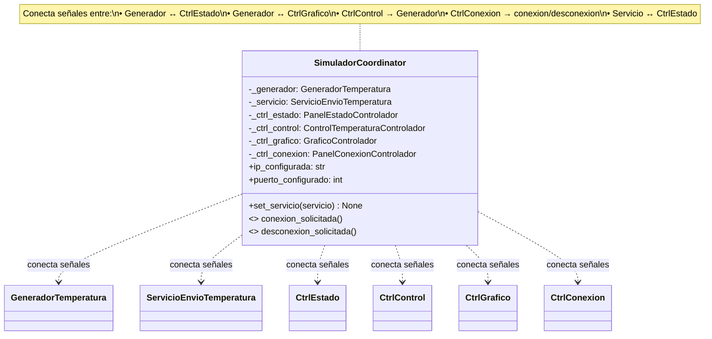

**Responsabilidad:** Gestiona todas las conexiones de señales PyQt6 entre componentes, desacoplando la lógica de conexión del ciclo de vida.

### 3. Compositor Pattern

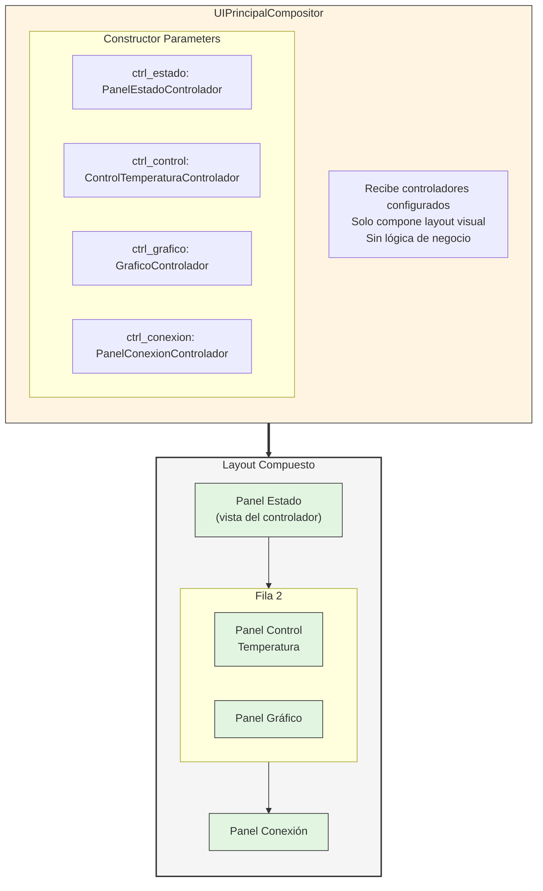

### 4. MVC Pattern (Model-View-Controller)

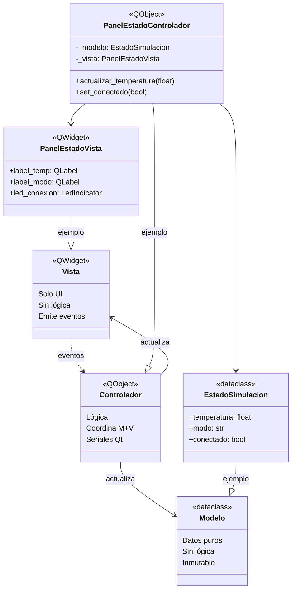

---

## Diagrama de Clases: Capa de Dominio

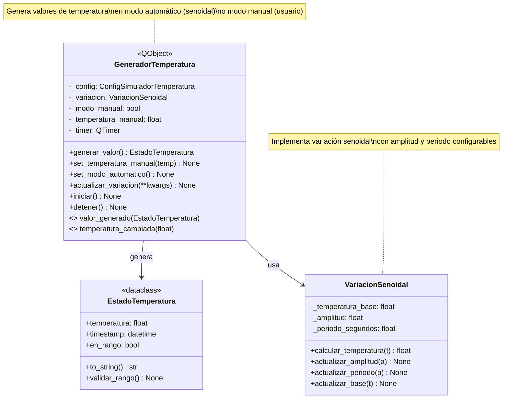

---

## Diagrama de Clases: Capa de Comunicación

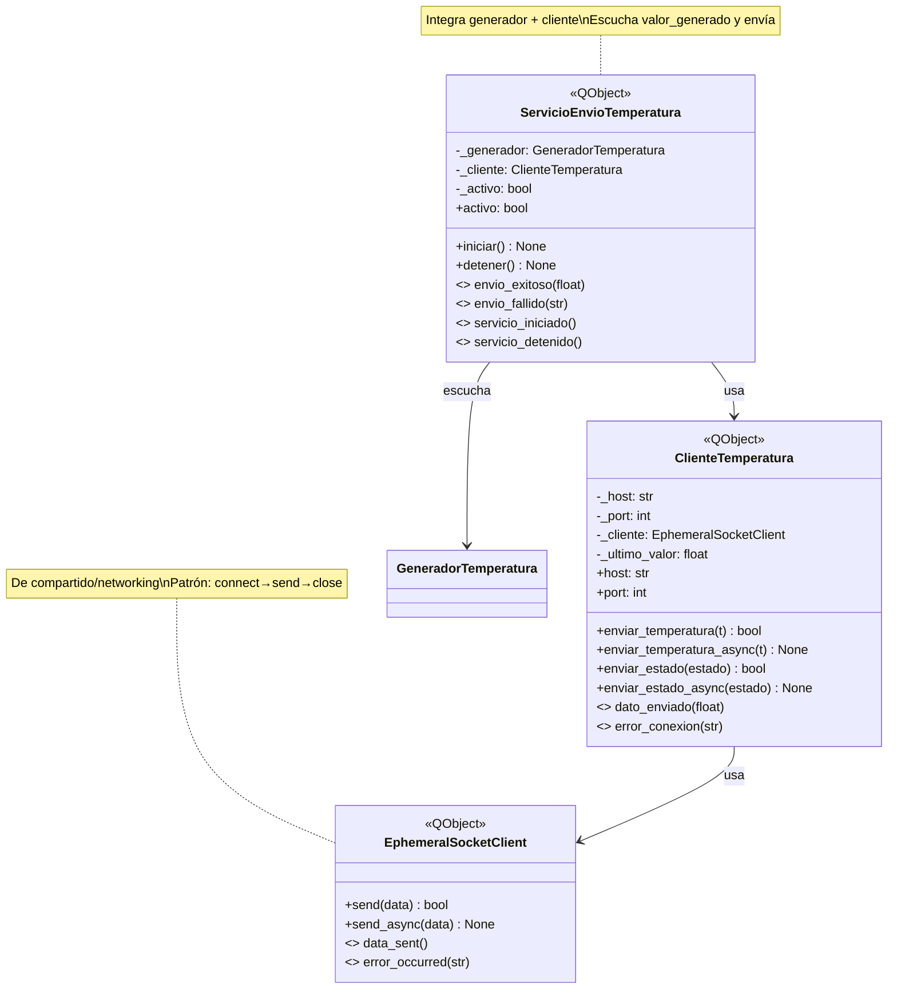

### Interfaz de comunicación (`interfaces.py`)

Define `IClienteTemperatura` como `typing.Protocol` con `@runtime_checkable`:

- `enviar_temperatura(temperatura: float) -> bool`
- `enviar_estado(estado: EstadoTemperatura) -> bool`

`ComponenteFactory.crear_cliente()` retorna `IClienteTemperatura`, permitiendo
sustitución transparente en tests sin herencia explícita (`ClienteTemperatura`
cumple el protocolo por duck typing).

---

## Diagrama de Clases: Capa de Presentación (MVC)

```mermaid
classDiagram
    class ModeloBase {
        <<ABC>>
        +to_dict() dict
        +from_dict(dict) ModeloBase
    }

    class VistaBase {
        <<QWidget>>
        +actualizar() None
    }

    class ControladorBase {
        <<QObject>>
        -_modelo: ModeloBase
        -_vista: VistaBase
        +vista: VistaBase
    }

    %% Panel Estado
    class EstadoSimulacion {
        <<dataclass>>
        +temperatura: float
        +modo: str
        +conectado: bool
    }

    class PanelEstadoVista {
        <<QWidget>>
        +lbl_temperatura: QLabel
        +lbl_modo: QLabel
        +led_conexion: LedIndicator
    }

    class PanelEstadoControlador {
        <<QObject>>
        +actualizar_temp(float) None
        +set_conectado(bool) None
    }

    %% Panel Control
    class ParametrosControl {
        <<dataclass>>
        +amplitud: float
        +periodo: float
        +temp_base: float
        +modo_manual: bool
    }

    class ControlTemperaturaVista {
        <<QWidget>>
        +sliders: QSlider[]
        +spinboxes: QSpinBox[]
        +radio_buttons: QRadioButton[]
    }

    class ControlTemperaturaControlador {
        <<QObject>>
        +on_amplitud(float) None
        +on_periodo(float) None
        +on_modo(bool) None
    }

    %% Panel Gráfico
    class DatosGrafico {
        <<dataclass>>
        +temperaturas: list~float~
        +tiempos: list~float~
        +max_puntos: int
    }

    class GraficoTemperaturaVista {
        <<QWidget>>
        +plot_widget: PlotWidget
        +curva: PlotCurveItem
    }

    class GraficoControlador {
        <<QObject>>
        +agregar_punto(float, float) None
        +limpiar() None
    }

    %% Herencia
    EstadoSimulacion --|> ModeloBase
    PanelEstadoVista --|> VistaBase
    PanelEstadoControlador --|> ControladorBase

    ParametrosControl --|> ModeloBase
    ControlTemperaturaVista --|> VistaBase
    ControlTemperaturaControlador --|> ControladorBase

    DatosGrafico --|> ModeloBase
    GraficoTemperaturaVista --|> VistaBase
    GraficoControlador --|> ControladorBase

    note for ModeloBase "Clases base en\napp/presentacion/paneles/base.py"
```

---

## Diagrama de Secuencia: Inicio de Aplicación

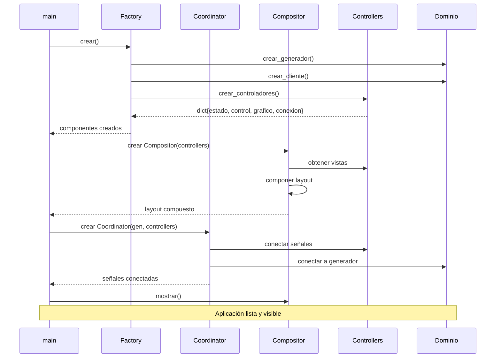

---

## Diagrama de Secuencia: Flujo de Conexión

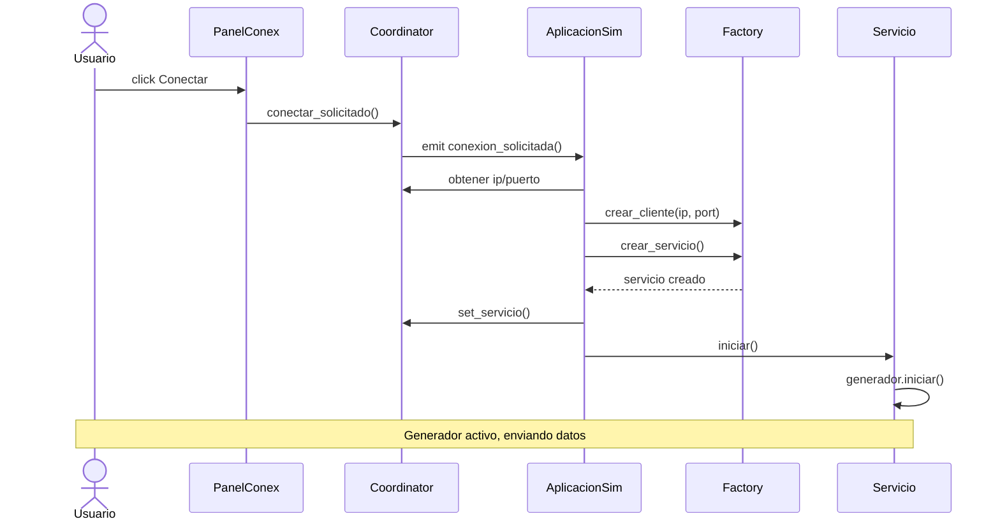

---

## Diagrama de Secuencia: Envío Automático

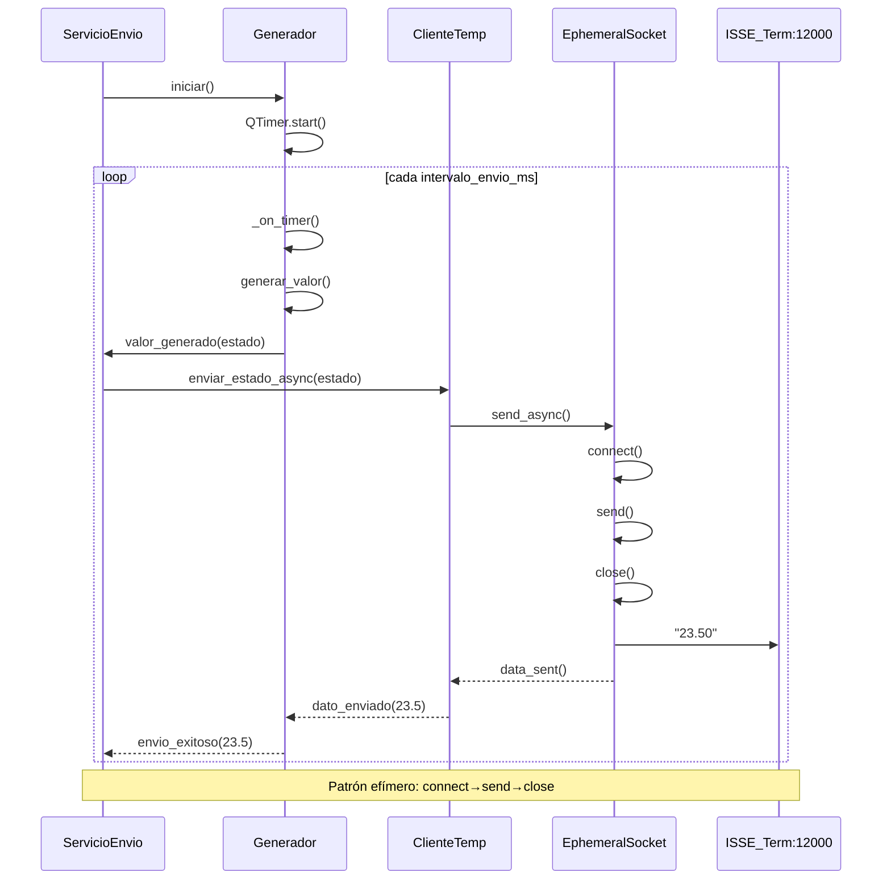

---

## Protocolo de Comunicación

### Formato del Mensaje

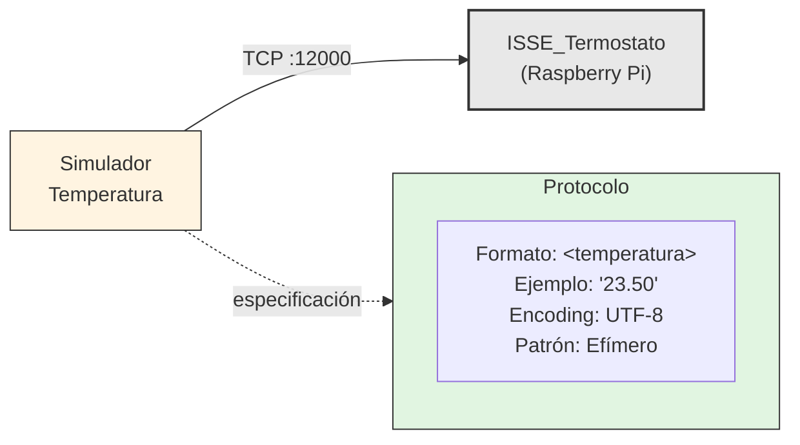

---

## Señales Qt (Observer Pattern)

| Componente | Señal | Parámetro | Descripción |
|------------|-------|-----------|-------------|
| `GeneradorTemperatura` | `valor_generado` | `EstadoTemperatura` | Nuevo valor generado |
| `GeneradorTemperatura` | `temperatura_cambiada` | `float` | Temperatura cambió |
| `ClienteTemperatura` | `dato_enviado` | `float` | Envío exitoso |
| `ClienteTemperatura` | `error_conexion` | `str` | Error de conexión |
| `ServicioEnvioTemperatura` | `envio_exitoso` | `float` | Dato enviado OK |
| `ServicioEnvioTemperatura` | `envio_fallido` | `str` | Error en envío |
| `SimuladorCoordinator` | `conexion_solicitada` | - | Usuario solicita conectar |
| `SimuladorCoordinator` | `desconexion_solicitada` | - | Usuario solicita desconectar |
| `ControlTemperaturaControlador` | `amplitud_cambiada` | `float` | Amplitud modificada |
| `ControlTemperaturaControlador` | `periodo_cambiado` | `float` | Período modificado |
| `PanelConexionControlador` | `conectar_solicitado` | - | Botón conectar pulsado |
| `PanelConexionControlador` | `desconectar_solicitado` | - | Botón desconectar pulsado |

---

## Dependencias entre Módulos

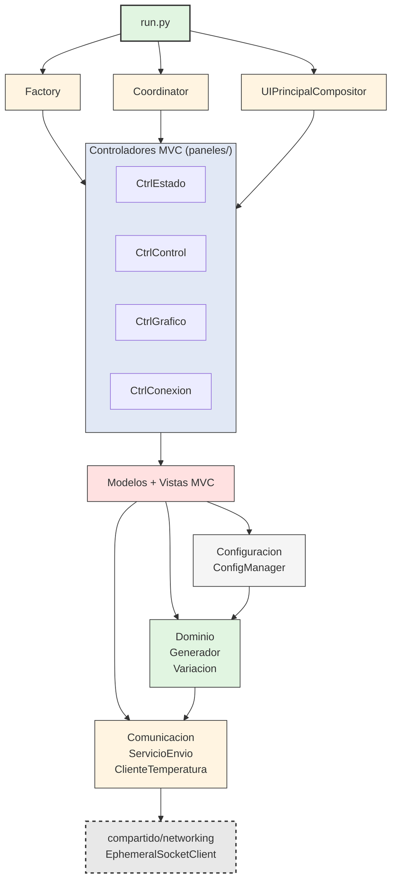

---

## Configuración de calidad (`pyproject.toml`)

```toml
[tool.designreviewer]
max_cbo = 10
max_method_lines = 50
max_lcom = 3
```

Justificación idéntica a `ux_termostato`: vistas PyQt, métodos `_setup_ui` procedurales,
y LCOM inflado por herencia PyQt. Ver `simulador_bateria` para detalles adicionales.

---

## Métricas de Calidad

| Métrica | Valor | Umbral | Estado |
|---------|-------|--------|--------|
| Complejidad Ciclomática | 1.36 | ≤ 10 | OK |
| Índice Mantenibilidad | 70.10 | > 20 | OK |
| Pylint Score | 9.52/10 | ≥ 8.0 | OK |
| Tests | 283 | - | Pasando |
| Archivos Python | 36 | - | - |
| Funciones | 319 | - | - |

---

## Tickets de Refactorización

### Fase 1: Eliminar Anti-patrones
| Ticket | Descripción | Estado |
|--------|-------------|--------|
| ST-50 | Crear método público `actualizar_variacion()` | Completado |
| ST-51 | Eliminar acceso a `generador._variacion` | Completado |

### Fase 2: Estructura MVC Base
| Ticket | Descripción | Estado |
|--------|-------------|--------|
| ST-52 | Crear clases base MVC | Completado |
| ST-53 | Migrar Panel Estado a MVC | Completado |
| ST-54 | Tests unitarios MVC | Completado |

### Fase 3: Migrar Paneles
| Ticket | Descripción | Estado |
|--------|-------------|--------|
| ST-55 | Panel Control Temperatura MVC | Completado |
| ST-56 | Panel Gráfico MVC | Completado |
| ST-57 | Panel Conexión MVC | Completado |

### Fase 4: Orquestación
| Ticket | Descripción | Estado |
|--------|-------------|--------|
| ST-58 | UIPrincipal como Compositor | Completado |
| ST-59 | Factory para crear componentes | Completado |
| ST-60 | Coordinator para señales | Completado |
| ST-61 | Simplificar AplicacionSimulador | Completado |

---

## Decisiones de Diseño

### ¿Por qué separar GeneradorTemperatura de ServicioEnvio?

**Alternativas consideradas:**

1. **Clase única SimuladorTemperatura** - Un componente monolítico que genera valores y los envía directamente
2. **Separación en capas** - Generador en dominio, ServicioEnvio en comunicación (seleccionada)

**Decisión:** Opción 2 - Separación en capas con responsabilidades únicas

**Justificación:**

- **Testing aislado**: El generador se puede probar sin dependencias de red
- **Reutilización**: ServicioEnvio puede usarse con otros generadores futuros
- **Adherencia a SRP**: Cada componente tiene una única razón para cambiar
- **Facilita modos de operación**: El modo automático/manual solo afecta al generador, no al envío

**Trade-offs:**

- ✅ **Ventajas**: Mayor testabilidad, bajo acoplamiento, alta cohesión
- ⚠️ **Desventajas**: Mayor complejidad estructural (más clases), coordinación vía signals (overhead mínimo de PyQt)

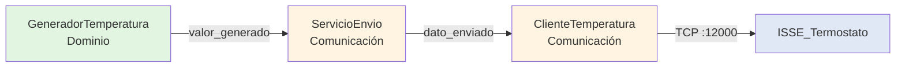

---

### ¿Por qué modo automático con variación senoidal?

**Alternativas consideradas:**

1. **Solo modo manual** - Usuario controla temperatura con slider (como simulador_bateria)
2. **Modo automático lineal** - Temperatura incrementa/decrementa linealmente
3. **Modo automático senoidal** - Variación sinusoidal parametrizable (seleccionada)

**Decisión:** Opción 3 - Variación senoidal con parámetros configurables

**Justificación:**

- **Simulación realista**: Las temperaturas ambientales varían de forma continua y cíclica
- **Testing exhaustivo**: Permite probar el comportamiento del termostato en condiciones dinámicas
- **Flexibilidad**: Amplitud y período son configurables en tiempo de ejecución
- **Compatibilidad**: Se mantiene modo manual para casos de prueba específicos

**Trade-offs:**

- ✅ **Ventajas**: Simulación más realista, testing automatizado, cubre más casos de uso
- ⚠️ **Desventajas**: Mayor complejidad que solo modo manual, requiere clase `VariacionSenoidal`

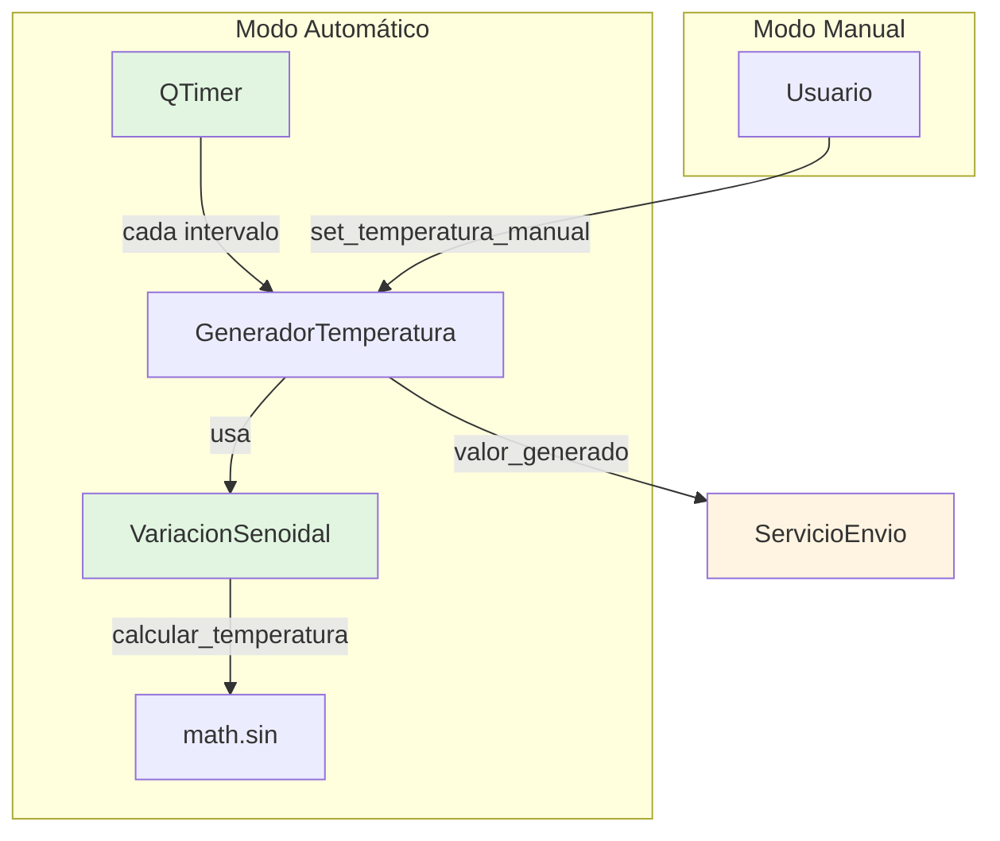

---

### ¿Por qué incluir panel gráfico con pyqtgraph?

**Alternativas consideradas:**

1. **Sin visualización gráfica** - Solo valores numéricos (como simulador_bateria)
2. **Gráfico matplotlib embebido** - Integración con matplotlib
3. **Gráfico pyqtgraph** - Biblioteca especializada para PyQt (seleccionada)

**Decisión:** Opción 3 - Panel gráfico con pyqtgraph

**Justificación:**

- **Debugging visual**: Facilita la detección de anomalías en la generación de valores
- **Validación de variación senoidal**: Permite verificar visualmente que la curva es correcta
- **Experiencia de usuario**: Mejora la UX del simulador durante desarrollo y testing
- **Rendimiento**: pyqtgraph es más eficiente que matplotlib para gráficos en tiempo real

**Trade-offs:**

- ✅ **Ventajas**: Mejor debugging, validación visual, integración nativa con PyQt
- ⚠️ **Desventajas**: Dependencia adicional (pyqtgraph), mayor complejidad UI

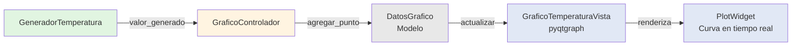

---

### ¿Por qué patrón Factory + Coordinator?

**Alternativas consideradas:**

1. **Creación directa en run.py** - Instanciar todos los componentes en el entry point
2. **Dependency Injection manual** - Pasar dependencias en constructores
3. **Factory + Coordinator** - Separar creación de configuración (seleccionada)

**Decisión:** Opción 3 - Factory para creación, Coordinator para orquestación

**Justificación:**

- **Consistencia**: Factory asegura que todos los componentes usen la misma configuración
- **Testabilidad**: Facilita mocking al centralizar la creación
- **Desacoplamiento**: Coordinator conecta señales sin que los componentes se conozcan entre sí
- **Mantenibilidad**: Cambios en configuración se hacen en un solo lugar

**Trade-offs:**

- ✅ **Ventajas**: Configuración consistente, testing simplificado, bajo acoplamiento
- ⚠️ **Desventajas**: Dos clases adicionales (Factory, Coordinator), indirección en creación

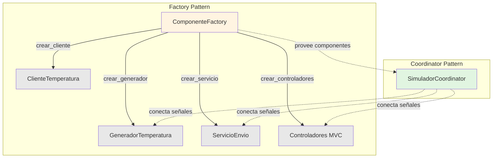

---

## Referencias

- [ESPECIFICACION_COMUNICACIONES.md](../../docs/ESPECIFICACION_COMUNICACIONES.md)
- [ADR-001: Separación Socket Clients](../../docs/ADR-001-separacion-socket-clients.md)
- [Informe de Calidad de Diseño](informe_calidad_diseno.md)
