# Arquitectura de UX Termostato

## Visión General

UX Termostato es un **cliente desktop sin estado** que simula el panel de control del termostato ISSE. Recibe estado del Raspberry Pi vía TCP y envía comandos de control. Implementa una arquitectura en capas con patrones MVC, Factory y Coordinator.

**Principio arquitectónico clave:** UX Desktop NO persiste configuración ni datos históricos. Es un cliente "tonto" que solo renderiza el estado recibido del RPi.

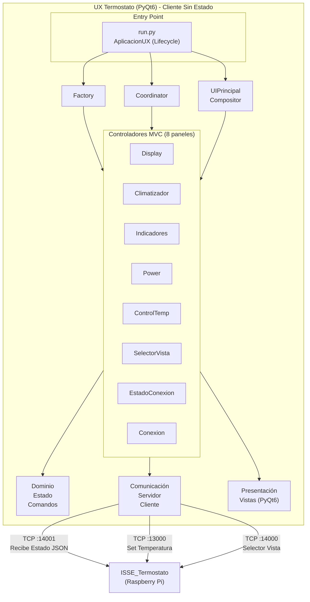

**Puertos de Comunicación:**
- **:13000** - Control Temperatura (aumentar | disminuir)
- **:14001** - Recibe Estado (JSON completo)
- **:14000** - Selector Vista (ambiente | deseada)

---

## Estructura de Módulos

```
ux_termostato/
├── run.py                          # Entry point + AplicacionUX
├── app/
│   ├── factory.py                  # ComponenteFactoryUX
│   ├── coordinator.py              # UXCoordinator
│   │
│   ├── configuracion/              # Capa de configuración
│   │   └── config.py               # ConfigUX (parseo de config.json)
│   │
│   ├── dominio/                    # Capa de lógica de negocio
│   │   ├── estado_termostato.py    # EstadoTermostato (dataclass)
│   │   └── comandos.py             # ComandoPower, ComandoSetTemp, etc.
│   │
│   ├── comunicacion/               # Capa de comunicación TCP bidireccional
│   │   ├── interfaces.py           # IServidorEstado, IClienteComandos (typing.Protocol)
│   │   ├── servidor_estado.py      # ServidorEstado (recibe JSON del RPi :14001)
│   │   └── cliente_comandos.py     # ClienteComandos (envía comandos :13000/:14000)
│   │
│   └── presentacion/               # Capa de presentación (UI)
│       ├── ui_principal.py         # Ventana principal (~100 líneas): facade de lifecycle puro
│       ├── ui_compositor.py        # UICompositor (ensambla layout)
│       │
│       └── paneles/                # Arquitectura MVC (8 paneles)
│           ├── display/            # Panel Display LCD
│           │   ├── modelo.py       # DisplayModelo (temperatura actual/deseada)
│           │   ├── vista.py        # DisplayVista (LCD QLCDNumber)
│           │   └── controlador.py  # DisplayControlador
│           ├── climatizador/       # Panel Climatizador
│           │   ├── modelo.py       # ClimatizadorModelo (calor/reposo/frío)
│           │   ├── vista.py        # ClimatizadorVista (3 indicadores)
│           │   └── controlador.py  # ClimatizadorControlador
│           ├── indicadores/        # Panel Indicadores de Alerta
│           │   ├── modelo.py       # IndicadoresModelo (LED sensor/batería)
│           │   ├── vista.py        # IndicadoresVista
│           │   └── controlador.py  # IndicadoresControlador
│           ├── power/              # Panel Power
│           │   ├── modelo.py       # PowerModelo (encendido/apagado)
│           │   ├── vista.py        # PowerVista (botón toggle)
│           │   └── controlador.py  # PowerControlador
│           ├── control_temp/       # Panel Control Temperatura
│           │   ├── modelo.py       # ControlTempModelo (botones +/-)
│           │   ├── vista.py        # ControlTempVista
│           │   └── controlador.py  # ControlTempControlador
│           ├── selector_vista/     # Panel Selector Vista (Sprint 2)
│           │   ├── modelo.py       # SelectorVistaModelo (ambiente/deseada)
│           │   ├── vista.py        # SelectorVistaVista (toggle)
│           │   └── controlador.py  # SelectorVistaControlador
│           ├── estado_conexion/    # Panel Estado Conexión (Sprint 2)
│           │   ├── modelo.py       # EstadoConexionModelo (conectado/desconectado)
│           │   ├── vista.py        # EstadoConexionVista (LED animado)
│           │   └── controlador.py  # EstadoConexionControlador
│           └── conexion/           # Panel Configuración IP/Puerto (Sprint 2)
│               ├── modelo.py       # ConexionModelo (IP, puerto)
│               ├── vista.py        # ConexionVista (input IP + puerto)
│               └── controlador.py  # ConexionControlador
│
├── tests/                          # Tests unitarios (cobertura 100%)
│   ├── features/                   # Escenarios BDD (Gherkin)
│   │   ├── US-001-ver-temperatura-ambiente.feature
│   │   ├── US-002-ver-estado-climatizador.feature
│   │   └── ...
│   ├── conftest.py                 # Fixtures pytest
│   └── test_*.py                   # Tests por componente
│
├── quality/                        # Scripts de calidad
└── docs/                           # Documentación
    ├── arquitectura.md             # Este documento
    ├── guia_uso.md
    ├── configuracion.md
    ├── historias/
    │   └── catalogo_historias.md   # 13 USs completadas
    └── informes/
        ├── informe_calidad_final.md
        └── informe_hallazgos.md
```

---

## Patrones de Diseño

### 1. Factory Pattern

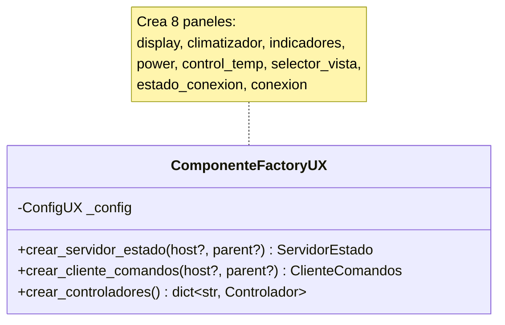

**Responsabilidad:** Centraliza la creación de todos los componentes, permitiendo configuración consistente y facilitando testing con mocks.

**Diferencia con simuladores:** Crea 8 paneles (vs 3-4 en simuladores) + comunicación bidireccional (servidor + cliente).

### 2. Coordinator Pattern

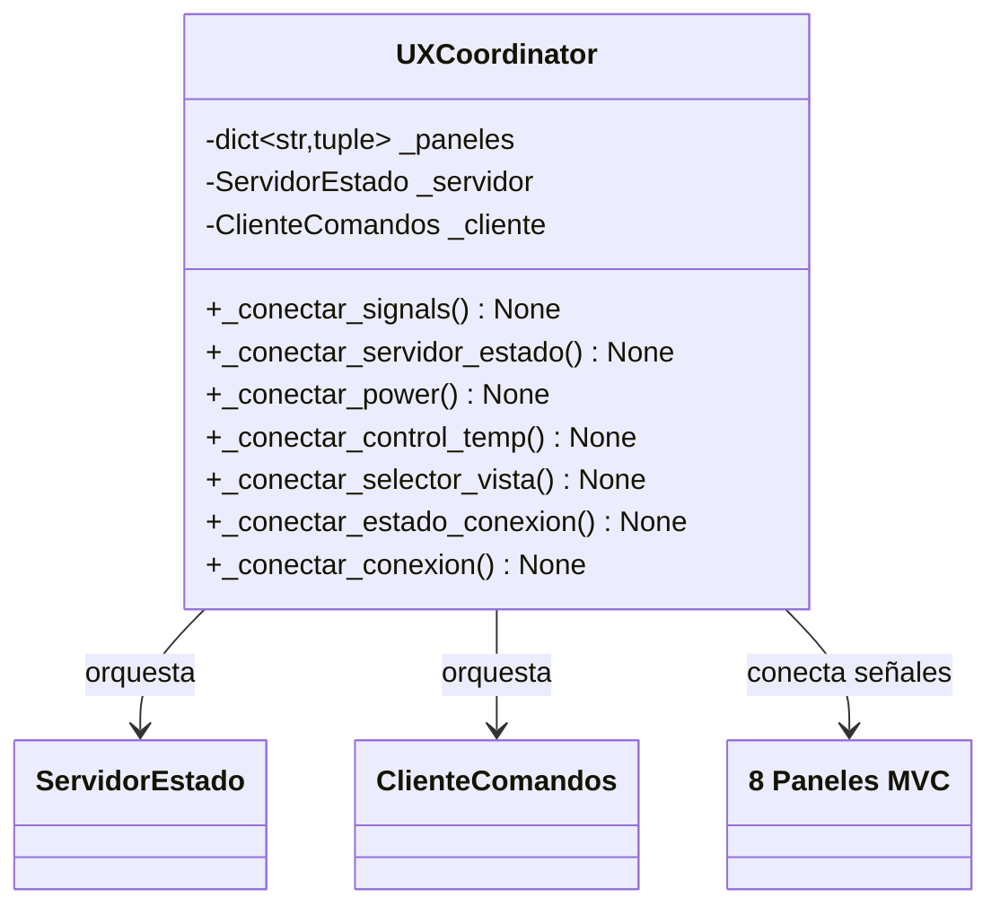

**Conexiones de señales:**
- ServidorEstado → Todos los paneles (actualización estado)
- Power → ControlTemp (habilitar/deshabilitar)
- ControlTemp → ClienteComandos (enviar aumentar/disminuir)
- SelectorVista → ClienteComandos (enviar ambiente/deseada)
- Conexion → ServidorEstado/ClienteComandos (configurar IP)
- ServidorEstado → EstadoConexion (LED conectado/desconectado)

**Responsabilidad:** Gestiona todas las conexiones de señales PyQt6 entre componentes, desacoplando la lógica de conexión del ciclo de vida.

**Diferencia con simuladores:** Orquesta comunicación bidireccional (recibe estado + envía comandos).

### 3. Compositor Pattern

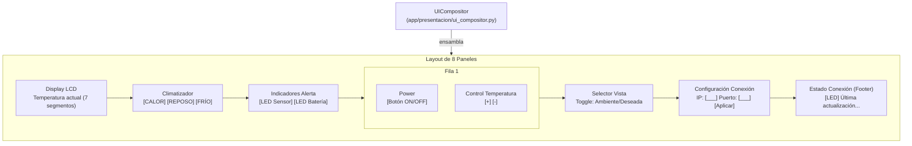

**Responsabilidad:** Ensambla las vistas de los 8 controladores en un layout visual, sin lógica de negocio.

### 4. MVC Pattern (Model-View-Controller)

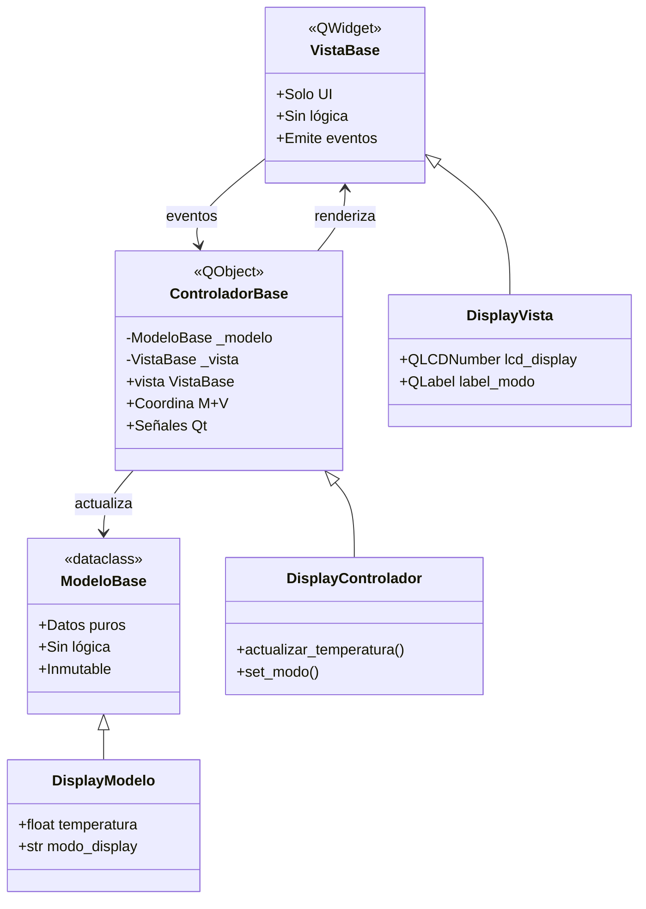

---

## Diagrama de Clases: Capa de Dominio

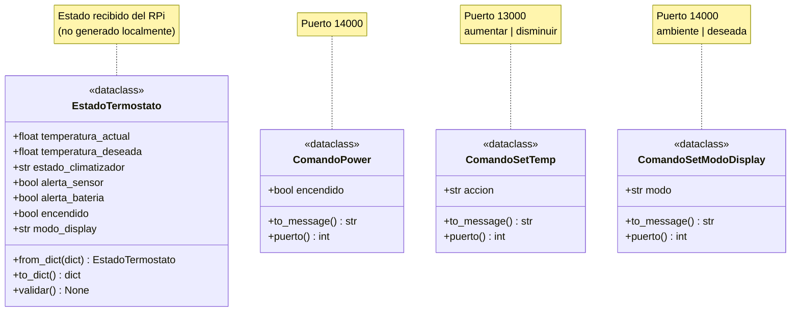

**Diferencias con simuladores:**
- EstadoTermostato representa el estado **recibido** del RPi (no generado localmente)
- Comandos representan las acciones del usuario hacia el RPi
- No hay generadores (UX solo renderiza, no simula)

---

## Diagrama de Clases: Capa de Comunicación

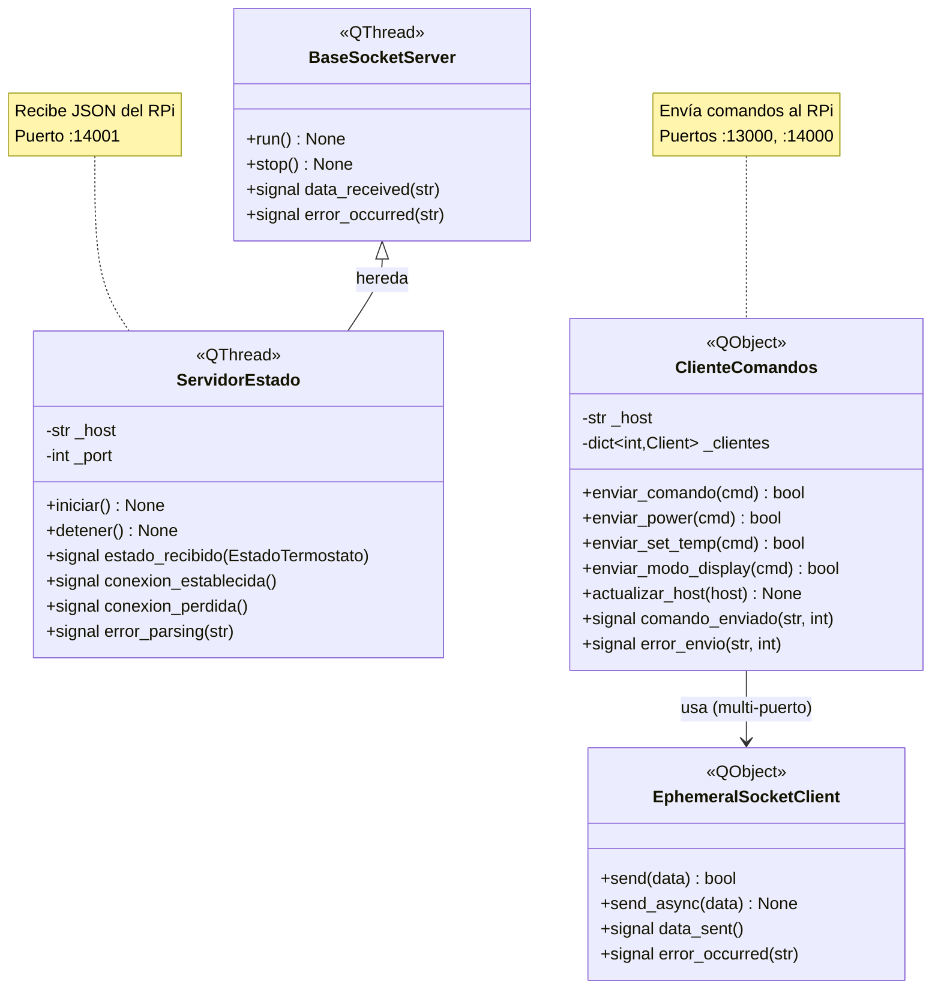

**Diferencias con simuladores:**
- **Comunicación bidireccional**: Servidor (recibe estado) + Cliente (envía comandos)
- **Servidor persistente**: BaseSocketServer con threading, escucha continuamente
- **Cliente multi-puerto**: Un EphemeralSocketClient por puerto (13000, 14000)
- **Protocolo JSON**: ServidorEstado parsea JSON a EstadoTermostato

### Interfaces de comunicación (`interfaces.py`)

Define contratos estructurales usando `typing.Protocol` con `@runtime_checkable`.
Se usa `Protocol` (no ABC) para evitar conflictos de metaclase con `QObject`.

- `IServidorEstado` — contrato para el servidor de estado TCP
  - `iniciar() -> bool`
  - `detener() -> None`
  - `esta_activo() -> bool`
- `IClienteComandos` — contrato para el cliente de comandos TCP
  - `enviar_comando(cmd: ComandoTermostato) -> bool`

`ComponenteFactoryUX.crear_servidor_estado()` y `crear_cliente_comandos()`
retornan estos tipos, permitiendo sustitución por mocks en tests.

---

## Diagrama de Clases: Capa de Presentación (8 Paneles MVC)

```mermaid
classDiagram
    %% Panel 1: Display
    class DisplayModelo {
        +float temperatura
        +str modo_display
    }
    class DisplayVista {
        +QLCDNumber lcd_display
        +QLabel label_modo
    }
    class DisplayControlador {
        +actualizar_temp()
        +set_modo()
    }

    %% Panel 2: Climatizador
    class ClimatizadorModelo {
        +str estado
    }
    class ClimatizadorVista {
        +QWidget ind_calor
        +QWidget ind_reposo
        +QWidget ind_frio
    }
    class ClimatizadorControlador {
        +actualizar_estado()
    }

    %% Panel 4: Power
    class PowerModelo {
        +bool encendido
    }
    class PowerVista {
        +QPushButton btn_power
    }
    class PowerControlador {
        +on_power_click()
        +set_encendido()
        +signal power_cambiado(bool)
    }

    %% Panel 5: Control Temperatura
    class ControlTempModelo {
        +bool habilitado
    }
    class ControlTempVista {
        +QPushButton btn_aumentar
        +QPushButton btn_disminuir
    }
    class ControlTempControlador {
        +on_aumentar_click()
        +on_disminuir_click()
        +signal aumentar_solicitado()
        +signal disminuir_solicitado()
    }

    note for DisplayControlador "Panel 1: Display LCD"
    note for ClimatizadorControlador "Panel 2: Climatizador"
    note for PowerControlador "Panel 4: Power"
    note for ControlTempControlador "Panel 5: Control Temp"
```

**Nota:** Se muestran 4 de los 8 paneles. Los otros 4 son:
- **Panel 3:** Indicadores (LED sensor/batería)
- **Panel 6:** Selector Vista (toggle ambiente/deseada)
- **Panel 7:** Estado Conexión (LED conectado/desconectado)
- **Panel 8:** Conexión (configuración IP/puerto)

> **Nota:** El panel `power` está incluido en los componentes pero **no se renderiza**
> en el layout (comentado en `UICompositor.crear_layout()`), ya que
> ISSE_Termostato no expone endpoint de encendido/apagado en la versión actual.

**Diferencias con simuladores:**
- **8 paneles** (vs 3-4 en simuladores): Mayor complejidad UI
- **Paneles pasivos**: Solo renderizan estado recibido (no generan datos)
- **Señales de comando**: Paneles emiten comandos hacia RPi (aumentar_solicitado, power_cambiado, etc.)

---

## Diagrama de Secuencia: Inicio de Aplicación

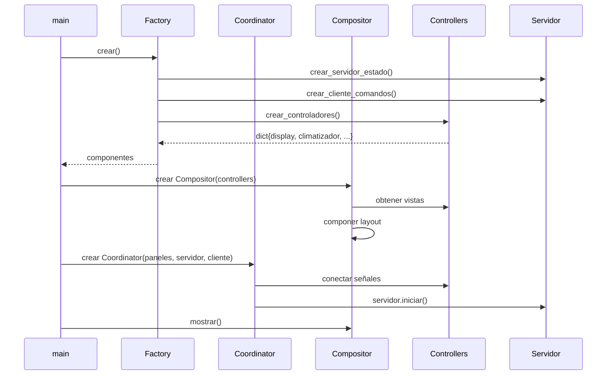

---

## Diagrama de Secuencia: Recepción de Estado del RPi

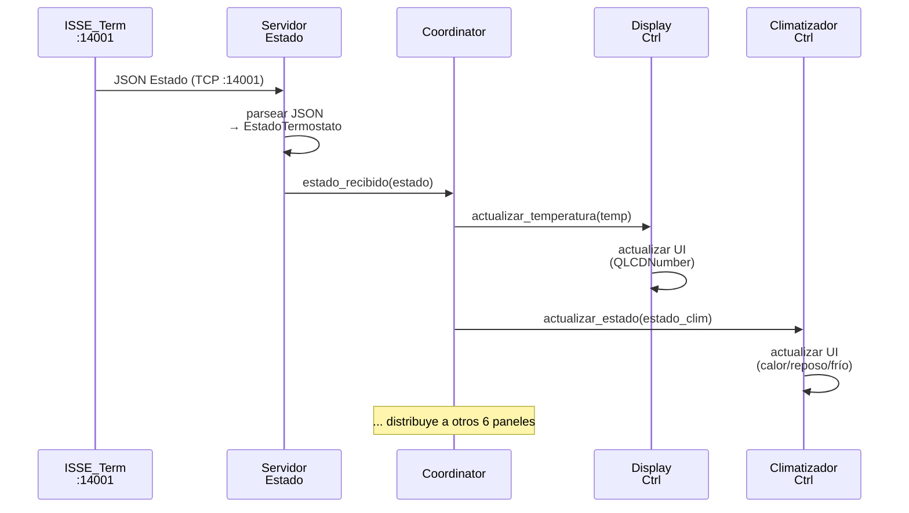

**Nota:** El ServidorEstado parsea JSON recibido del RPi y el Coordinator distribuye el EstadoTermostato a todos los 8 paneles simultáneamente.

---

## Diagrama de Secuencia: Envío de Comando al RPi

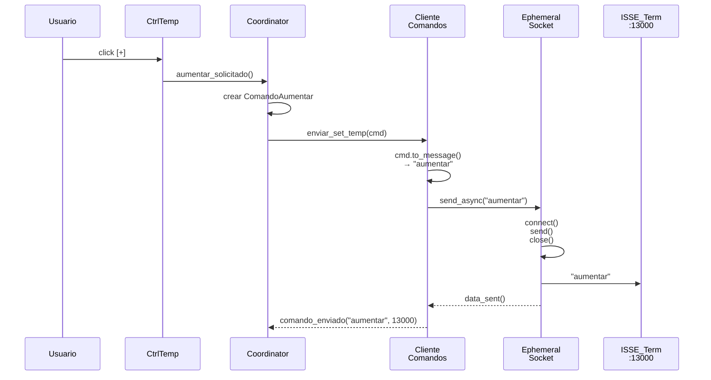

**Nota:** Cada comando se envía al puerto específico:
- ComandoSetTemp → Puerto 13000
- ComandoPower / ComandoSetModoDisplay → Puerto 14000

---

## Protocolo de Comunicación

### Puertos y Formatos

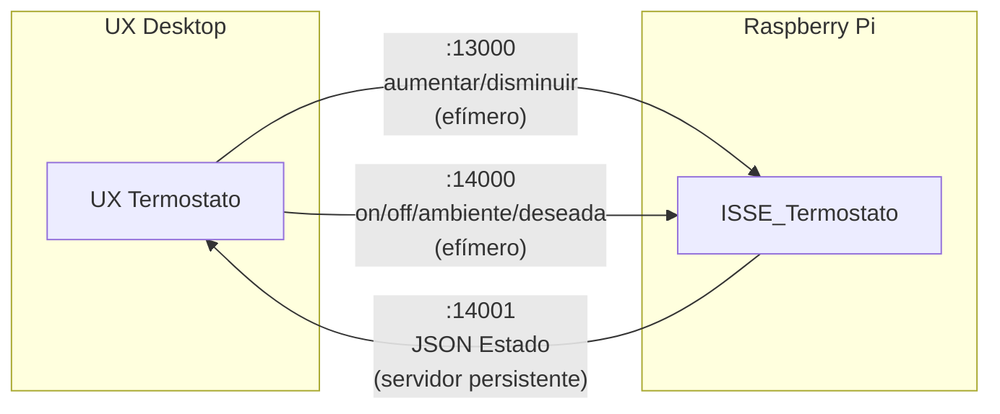

#### Recepción (Desktop ← RPi)

**Puerto:** 14001
**Formato:** JSON
**Patrón:** Servidor persistente (escucha continua)

```json
{
  "temperatura_actual": 23.5,
  "temperatura_deseada": 24.0,
  "estado_climatizador": "calor",
  "alerta_sensor": false,
  "alerta_bateria": false,
  "encendido": true,
  "modo_display": "ambiente"
}
```

#### Envío (Desktop → RPi)

**Puerto 13000:** Control Temperatura
- Formato: `"aumentar"` | `"disminuir"`
- Patrón: Efímero (conectar → enviar → cerrar)

**Puerto 14000:** Power + Selector Vista
- Formato: `"on"` | `"off"` | `"ambiente"` | `"deseada"`
- Patrón: Efímero (conectar → enviar → cerrar)

**Diferencia con simuladores:** UX recibe JSON complejo (no un solo float) y envía comandos a múltiples puertos.

---

## Señales Qt (Observer Pattern)

### Capa de Comunicación

| Componente | Señal | Parámetro | Descripción |
|------------|-------|-----------|-------------|
| `ServidorEstado` | `estado_recibido` | `EstadoTermostato` | Estado JSON parseado del RPi |
| `ServidorEstado` | `conexion_establecida` | - | Cliente RPi conectado |
| `ServidorEstado` | `conexion_perdida` | - | Cliente RPi desconectado |
| `ServidorEstado` | `error_parsing` | `str` | Error al parsear JSON |
| `ClienteComandos` | `comando_enviado` | `str, int` | Comando enviado OK (mensaje, puerto) |
| `ClienteComandos` | `error_envio` | `str, int` | Error al enviar (mensaje, puerto) |

### Capa de Presentación

| Componente | Señal | Parámetro | Descripción |
|------------|-------|-----------|-------------|
| `PowerControlador` | `power_cambiado` | `bool` | Usuario cambió encendido/apagado |
| `ControlTempControlador` | `aumentar_solicitado` | - | Usuario pulsó [+] |
| `ControlTempControlador` | `disminuir_solicitado` | - | Usuario pulsó [-] |
| `SelectorVistaControlador` | `modo_cambiado` | `str` | Usuario cambió ambiente/deseada |
| `ConexionControlador` | `config_cambiada` | `str, int` | Usuario cambió IP/puerto |

---

## Dependencias entre Módulos

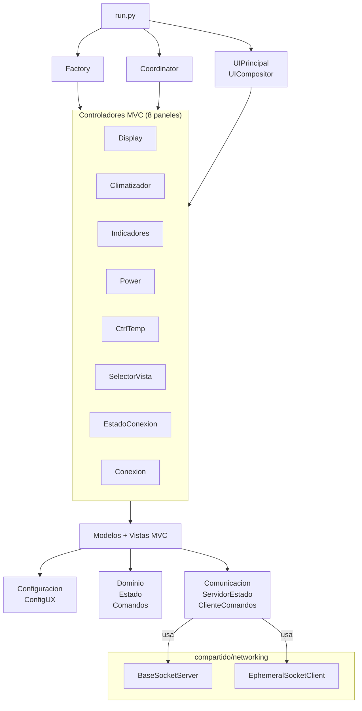

**Diferencias con simuladores:**
- **Comunicación bidireccional**: BaseSocketServer (recibe) + EphemeralSocketClient (envía)
- **Sin generadores**: Dominio solo tiene dataclasses (estado + comandos)
- **8 paneles** vs 3-4 en simuladores

---

## Métricas de Calidad

### Sprint 1 (Paneles Display, Climatizador, Indicadores, Power, ControlTemp)

| Panel | Tests | Coverage | Pylint | CC | MI | Diseño |
|-------|-------|----------|--------|----|----|--------|
| Display | 17 | 100% | 10.00 | 1.75 | 89.45 | 9.5/10 |
| Climatizador | 19 | 100% | 10.00 | 1.33 | 92.67 | 9.8/10 |
| Indicadores | 11 | 99% | 9.66 | 1.67 | 88.33 | 9.2/10 |
| Power | 14 | 100% | 10.00 | 1.50 | 90.00 | 9.5/10 |
| ControlTemp | 24 | 100% | 10.00 | 1.58 | 75.43 | 9.0/10 |

### Sprint 2 (Paneles SelectorVista, EstadoConexion, Conexion)

| Panel | Tests | Coverage | Pylint | CC | MI | Diseño |
|-------|-------|----------|--------|----|----|--------|
| SelectorVista | 18 | 100% | 9.76 | 1.47 | 91.38 | 9.0/10 |
| EstadoConexion | 15 | 100% | 9.89 | 1.75 | 90.32 | 8.8/10 |
| Conexion | 22 | 100% | 9.67 | 1.72 | 94.84 | 9.5/10 |

### Sprint 3 (Arquitectura - Dominio, Comunicación, Integración)

| Componente | Tests | Coverage | Pylint | CC | MI | Diseño |
|------------|-------|----------|--------|----|----|--------|
| Dominio | 22 | 100% | 10.00 | 1.00 | 100.00 | 10.0/10 |
| Comunicación | 34 | 95% | 10.00 | 1.85 | 96.00 | 9.8/10 |
| Factory + Coordinator | 49 | 99% | 10.00 | 1.56 | 86.09 | 9.5/10 |
| Compositor + Principal | N/A | 100% | 9.88 | 1.50 | 88.00 | 9.0/10 |

### Consolidado Global

| Métrica | Valor | Umbral | Estado |
|---------|-------|--------|--------|
| **Tests Totales** | 245+ | - | ✅ Pasando |
| **Coverage Global** | ~99% | ≥ 95% | ✅ Excelente |
| **Pylint Promedio** | 9.88/10 | ≥ 8.0 | ✅ Sobresaliente |
| **CC Promedio** | 1.56 | ≤ 10 | ✅ Excelente |
| **MI Promedio** | 90.25 | > 20 | ✅ Sobresaliente |
| **Calidad Diseño** | 9.4/10 | - | ✅ Excelente |

**Conclusión:** UX Termostato cumple y supera todos los quality gates del proyecto. Métricas superiores a los simuladores en promedio (CC más bajo, MI más alto, cobertura 99%).

---

## Configuración de calidad (`pyproject.toml`)

Umbrales calibrados para DesignReviewer:

```toml
[tool.designreviewer]
max_cbo = 10           # vistas PyQt acoplan widgets inevitablemente
max_method_lines = 50  # _setup_ui es proceduralmente largo por naturaleza
max_lcom = 3           # clases MVC tienen grupos de métodos naturalmente separados
```

Justificación de valores:
- **CBO ≤ 10**: Las vistas PyQt heredan de QWidget y usan múltiples widgets hijos.
- **method_lines ≤ 50**: Los métodos `_setup_ui` y `_ensamblar_layout` son
  proceduralmente largos por diseño (construcción declarativa de UI).
- **LCOM ≤ 3**: Las clases MVC separan naturalmente grupos de métodos
  (modelo, vista, señales). La herencia PyQt infla el LCOM.

---

## Historias de Usuario Implementadas

**Total:** 13 USs completadas, 48 puntos de historia

### Sprint 1 - Paneles Base (5 USs, 16 pts)

- ✅ **US-001:** Ver temperatura ambiente (3 pts) - Panel Display LCD
- ✅ **US-002:** Ver estado climatizador (5 pts) - Panel Climatizador
- ✅ **US-003:** Ver indicadores de alerta (2 pts) - Panel Indicadores
- ✅ **US-004:** Aumentar temperatura (3 pts) - Panel ControlTemp
- ✅ **US-005:** Disminuir temperatura (3 pts) - Panel ControlTemp
- ✅ **US-006:** Refactorizar panel ControlTemp (6 pts fusionados US-004/005)
- ✅ **US-007:** Encender termostato (3 pts) - Panel Power

### Sprint 2 - Paneles Avanzados (3 USs, 8 pts)

- ✅ **US-011:** Cambiar vista display (3 pts) - Panel SelectorVista
- ✅ **US-013:** Configurar IP Raspberry (3 pts) - Panel Conexion
- ✅ **US-015:** Ver estado conexión (2 pts) - Panel EstadoConexion

### Sprint 3 - Arquitectura e Integración (5 USs, 23 pts)

- ✅ **US-020:** Capa de Dominio (5 pts) - EstadoTermostato + Comandos
- ✅ **US-021:** Capa de Comunicación (5 pts) - ServidorEstado + ClienteComandos
- ✅ **US-022:** Factory + Coordinator (5 pts) - ComponenteFactoryUX + UXCoordinator
- ✅ **US-023:** Compositor UI (3 pts) - UICompositor
- ✅ **US-024:** Ventana Principal (5 pts) - UIPrincipal
- ✅ **US-025:** Entry Point (5 pts) - run.py + AplicacionUX

**Estado:** ✅ Producto completado (100% funcionalidad MVP)

---

## Comparación con Simuladores

| Aspecto | Simuladores | UX Termostato |
|---------|-------------|---------------|
| **Rol** | Cliente generador de datos | Cliente renderizador de estado |
| **Comunicación** | Unidireccional (envía) | Bidireccional (recibe + envía) |
| **Puertos TCP** | 1 puerto (envío) | 3 puertos (1 recibe, 2 envían) |
| **Protocolo** | Float simple | JSON complejo + comandos string |
| **Dominio** | Generador + Variación | Estado (dataclass) + Comandos |
| **Comunicación** | Cliente efímero | Servidor persistente + Cliente efímero |
| **Paneles MVC** | 3-4 paneles | 8 paneles |
| **Persistencia** | No (cliente sin estado) | No (cliente sin estado) |
| **Tests** | ~275 | ~245 |
| **Coverage** | ~96% | ~99% |
| **Pylint** | 9.52-9.94 | 9.88 |
| **CC** | 1.36-1.40 | 1.56 |
| **MI** | 70-81 | 90.25 |
| **Arquitectura** | MVC + Factory/Coordinator | MVC + Factory/Coordinator ✅ Mismo patrón |

**Conclusión:** UX Termostato es arquitectónicamente consistente con los simuladores (mismo patrón MVC + Factory/Coordinator), pero con mayor complejidad funcional (8 paneles, comunicación bidireccional, protocolo JSON).

---

## Principio Arquitectónico Clave

### UX Desktop es un Cliente Sin Estado

**¿Qué significa?**

- **NO persiste configuración localmente:** La IP del RPi se puede cambiar en runtime, pero no se guarda entre sesiones.
- **NO almacena datos históricos:** No hay logs, no hay métricas, no hay historial de temperaturas.
- **Estado es efímero:** El estado pertenece al RPi. Si se pierde la conexión, UX no tiene estado previo.

**¿Por qué?**

- **Single Source of Truth:** El RPi es el único dueño del estado del termostato.
- **Simplifica arquitectura:** No hay persistencia, no hay sincronización, no hay conflictos.
- **Testing más simple:** Tests no dependen de estado previo (idempotencia).
- **Escalabilidad:** Múltiples UX pueden conectarse al mismo RPi sin conflictos.

**Implicaciones:**

- Si el RPi se reinicia, UX simplemente muestra el nuevo estado.
- Si UX se reinicia, vuelve a conectarse y recibe el estado actual del RPi.
- No hay configuración `.env` para UX (toda config viene del RPi o es runtime).

---

## Decisiones de Diseño

### ¿Por qué comunicación bidireccional (ServidorEstado + ClienteComandos)?

**Alternativas consideradas:**

1. **Solo cliente efímero** - Similar a simuladores (envía datos, no recibe)
2. **Cliente persistente bidireccional** - Una sola conexión TCP para envío y recepción
3. **Servidor + Cliente separados** - Servidor persistente recibe, cliente efímero envía (seleccionada)

**Decisión:** Opción 3 - Separación de responsabilidades con servidor persistente + cliente efímero

**Justificación:**

- **Protocolo asimétrico**: RPi envía estado JSON continuamente (push), pero recibe comandos ocasionales (pull)
- **Servidor persistente para estado**: Escucha continuamente en puerto 14001 sin overhead de reconexión
- **Cliente efímero para comandos**: Comandos son eventos poco frecuentes (clicks de usuario), no requieren conexión permanente
- **Separación de puertos**: Comandos se envían a diferentes puertos (13000, 14000) según tipo, cliente multi-puerto es más flexible
- **Reutilización de compartido**: Servidor usa `BaseSocketServer`, cliente usa `EphemeralSocketClient` (ya probados en simuladores)

**Trade-offs:**

- ✅ **Ventajas**: Menor latencia para recepción de estado, menor overhead para comandos, separación clara de responsabilidades
- ⚠️ **Desventajas**: Mayor complejidad arquitectónica (2 componentes vs 1), gestión de threading para servidor

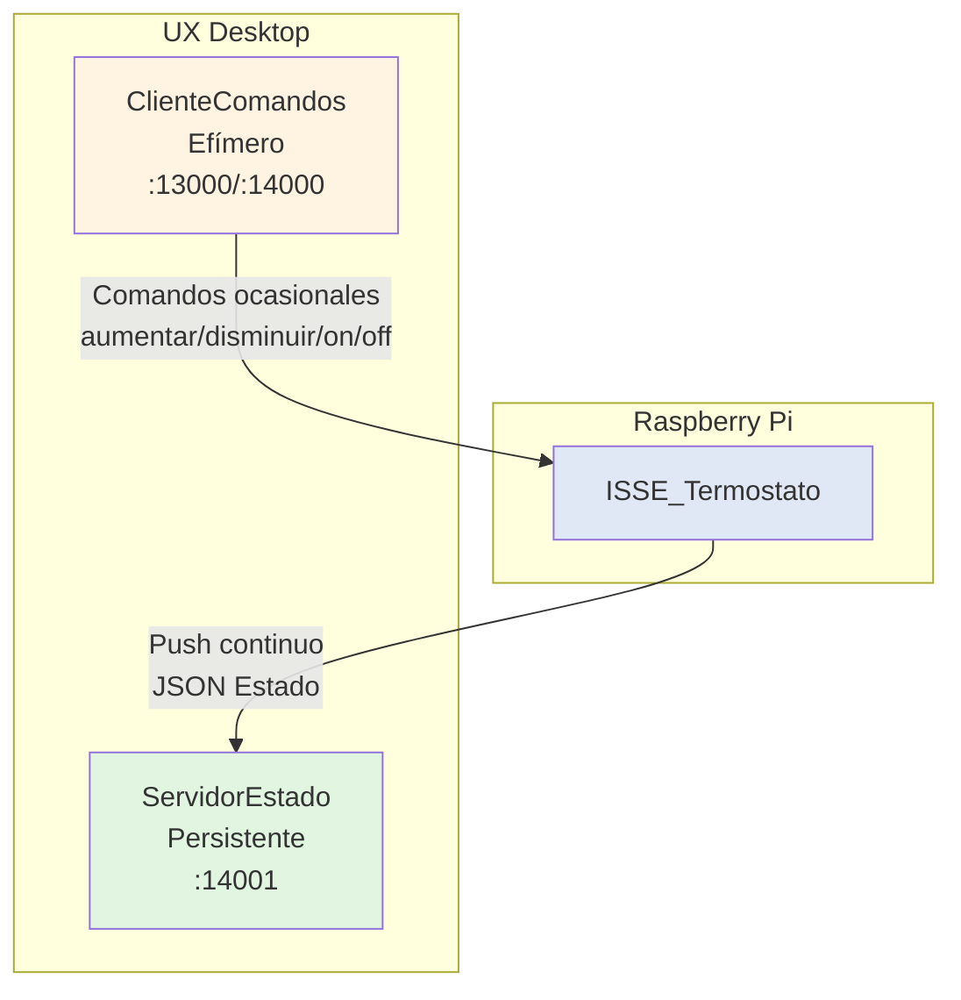

---

### ¿Por qué UX es cliente sin estado?

**Alternativas consideradas:**

1. **Cliente con estado** - Persiste configuración IP, histórico de temperaturas, logs
2. **Cliente sin estado** - Solo renderiza estado recibido del RPi (seleccionada)
3. **Híbrido** - Persiste configuración IP pero no datos históricos

**Decisión:** Opción 2 - Cliente sin estado total (efímero)

**Justificación:**

- **Single Source of Truth**: El RPi es el único dueño del estado del termostato, UX solo lo visualiza
- **Simplifica arquitectura**: Sin persistencia local, sin sincronización, sin conflictos de estado
- **Testing más simple**: Tests son idempotentes (no dependen de estado previo guardado)
- **Escalabilidad**: Múltiples instancias de UX pueden conectarse al mismo RPi sin conflictos
- **Consistencia con objetivo**: UX es un panel de control **virtual**, no un controlador real con memoria

**Trade-offs:**

- ✅ **Ventajas**: Arquitectura más simple, sin archivos de configuración local, sin DB/persistencia, tests más simples
- ⚠️ **Desventajas**: Usuario debe reconfigurar IP del RPi cada vez que reinicia UX (mitigado: IP viene de config.json por defecto)

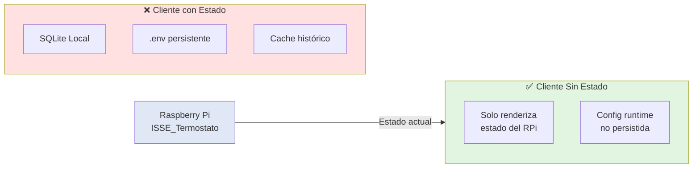

**Implicaciones:**

- Si el RPi se reinicia → UX muestra el nuevo estado recibido
- Si UX se reinicia → Reconecta al RPi y recibe estado actual
- No hay `.env` para UX (toda config viene de `config.json` en repo o es runtime)
- Sin logs persistentes, sin histórico de temperaturas, sin cache

---

### ¿Por qué separar dominio/comunicación/presentación?

**Alternativas consideradas:**

1. **Arquitectura monolítica** - Todo en un solo módulo `ux_termostato.py`
2. **Separación UI/Backend** - Solo separar presentación del resto
3. **Separación en 3 capas** - Dominio, Comunicación, Presentación (seleccionada)

**Decisión:** Opción 3 - Separación estricta en capas (siguiendo patrón de simuladores)

**Justificación:**

- **Consistencia arquitectónica**: UX sigue el mismo patrón MVC + Factory/Coordinator que simuladores (ADR-005)
- **Testing aislado**:
  - **Dominio**: Se testea sin PyQt ni red (dataclasses puros)
  - **Comunicación**: Se testea sin UI (mocking de sockets)
  - **Presentación**: Se testea con QApplication aislado (mocking de comunicación)
- **Reutilización**: `EstadoTermostato` puede usarse en otros contextos (API REST, CLI)
- **Mantenibilidad**: Cada capa tiene responsabilidad única (SRP), fácil de modificar

**Trade-offs:**

- ✅ **Ventajas**: Alta testabilidad (99% coverage), bajo acoplamiento, alta cohesión, adherencia a SOLID
- ⚠️ **Desventajas**: Mayor complejidad estructural (más archivos), necesita Coordinator para conectar capas

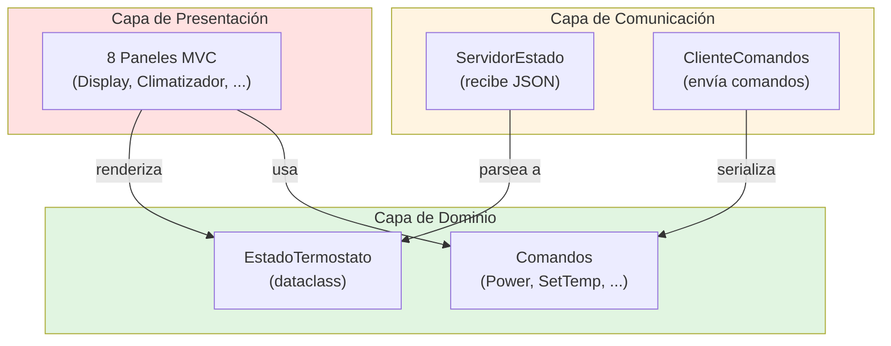

**Comparación con simuladores:**

| Capa | Simuladores | UX Termostato |
|------|-------------|---------------|
| **Dominio** | Generador + VariacionSenoidal | EstadoTermostato + Comandos |
| **Comunicación** | ClienteTCP efímero (envía) | ServidorTCP persistente (recibe) + ClienteTCP efímero (envía) |
| **Presentación** | 3-4 paneles MVC | 8 paneles MVC |

**Conclusión:** La separación en capas permite testing exhaustivo (99% coverage, 245+ tests), alta calidad de diseño (9.4/10) y consistencia arquitectónica con el resto del proyecto.

---

## Referencias

- [Especificación de Comunicaciones](../../docs/spec_001_comunicaciones.md)
- [ADR-005: Arquitectura de Referencia Simuladores](../../docs/adr_005_arquitectura_referencia_simuladores.md) - UX sigue el mismo patrón
- [Compartido: Networking Guide](../../compartido/docs/networking_guide.md)
- [Catálogo de Historias de Usuario](historias/catalogo_historias.md)
- [Informe de Calidad Final](informes/informe_calidad_final.md)
- [Informe de Hallazgos](informes/informe_hallazgos.md)

---

**Versión:** 1.0
**Fecha:** 2026-02-01
**Estado:** Producción (v1.0 completado)
**Autor:** Claude Sonnet 4.5 + Victor Valotto
